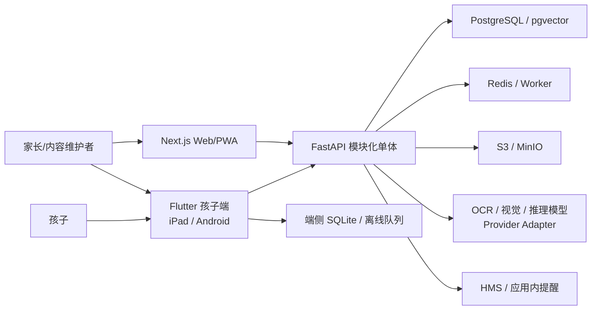
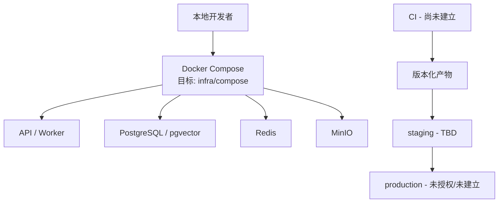

# ARCHITECTURE.md — 家庭 AI 学习助手

## 文档信息

- 状态：`DRAFT（v1.0 目标架构；P0 家庭/孩子/设备合成切片已实现）`
- Owner：`TBD（技术负责人确认）`
- 最后更新：`2026-07-12`
- 设计基线：`家庭AI学习助手_架构设计_v1.0.docx`
- 相关决策：`DECISIONS.md`（ADR-0001～0009 已 Accepted；ADR-0009 固定 Learning 持久化依赖）

## 1. 架构目标

- 业务能力：支撑家庭/孩子、每日任务、数学单题捕获、AI 分步辅导、错题与复习、家长周报和多端离线同步。
- 质量属性优先级：儿童安全与隐私 > 数据正确性/可靠性 > 可审计与可替换性 > 可用性 > 性能 > 成本。
- 规模假设：P0/P1 先服务单一或少量家庭；用户数、峰值 RPS、图片量、AI 调用量和数据保留规模均为 `TBD`，应在原型测量后写入容量模型。
- 主要约束：复用四类现有设备；华为端不依赖 GMS；模块化单体起步；OpenAPI/Schema 契约优先；离线可用；模型可替换；儿童数据最小化；未授权教材/题库不入库。

当前实现状态：P0 健康端点、Household-scoped ChildProfile/Device 与 P1 Task/StudySession/Attempt/SyncBatch API、OpenAPI 增量、Flutter 待同步队列边界、本地 PostgreSQL migration 和 Learning 事务仓储已实现；真实认证、Profile/Device 持久化、SQLite 落盘及其余领域仍为目标设计。

## 2. 系统上下文

信任边界：

1. 儿童/家长设备与 API 之间是互联网/本地网络边界，所有身份、输入和文件均不可信。
2. API 与 AI Provider、对象存储、推送服务之间是第三方/基础设施边界，需最小权限、超时、重试、成本和数据最小化控制。
3. 家庭之间是强授权边界；任何跨 Household 访问都是高危事件。
4. 本地、staging、production 是独立环境边界，禁止真实数据和凭据向低环境复制。

## 3. 组件与责任

| 组件 | 目标路径/服务 | 责任 | 数据所有权 | 上游/下游 | 状态 |
| --- | --- | --- | --- | --- | --- |
| 孩子端 | `apps/child_flutter` | 今日任务、学习会话、拍题、分步提示 UI、SQLite、离线队列 | 端侧缓存和待同步操作；服务端数据不是本地主真相 | OpenAPI SDK、相机、API | 合同消费演示；真实认证/离线未实现 |
| Web/PWA | `apps/web` | 家长、内容维护、Windows 首版体验 | 仅 UI 状态；业务事实来自 API | OpenAPI SDK、API | 合成孩子档案消费演示；认证未实现 |
| API/BFF | `services/api` | 鉴权、家庭边界、业务编排、契约实现 | PostgreSQL 中 Learning 业务事实 | 客户端、数据层、Worker、AI | 健康 + 合成 Profile/Device API；Learning 可切换 PostgreSQL 仓储；真实认证未实现 |
| Identity/Profile | `services/api` 内模块 | Household、User、ChildProfile、Device 和权限 | 身份、家庭归属、设备凭证 | API、所有领域模块 | 合成 principal + 内存仓储；非生产认证 |
| Plan/Task/Session | `services/api` 内模块 | 计划、任务、会话、Attempt 和同步合并 | 学习任务与过程记录 | 客户端、Report、Mistake | PostgreSQL 事务仓储、Alembic schema、反向授权/幂等/并发测试已实现；SQLite 未实现 |
| Capture | `services/api` 内模块 | 签名上传、OCR、结构化、置信度和人工校正 | Capture 元数据；文件在对象存储 | 对象存储、AI Provider、Tutor | 未创建 |
| Tutor | `services/api` 内模块 | Provider 路由、Tutor Policy、提示层级、Schema 校验、成本控制 | TutorTurn、模型/Prompt/Policy 版本和审计 | Capture、AI Provider、Mistake | 未创建 |
| Mistake/Mastery/Report | `services/api` 内模块 | 错因、知识点、复习调度、掌握度快照、周报 | MistakeRecord、ReviewSchedule、MasterySnapshot、WeeklyReport | Session/Tutor、家长端 | 未创建 |
| Notification | `services/api` 内模块 | 应用内提醒和可替换推送适配器 | 通知状态 | Report/Task、HMS | 未创建 |
| 跨端契约 | `packages/contracts` | OpenAPI、AI JSON Schema、生成 SDK | 接口/Schema 的唯一事实来源 | API、Flutter、Web、evals | 健康 + Profile/Device + Learning 0.3 合同；SDK 生成器实现待选择 |
| AI 评测 | `evals` | 固定样本与质量/安全/延迟/成本回归 | 合成或脱敏评测数据 | Tutor、CI | 占位边界；无评测集 |
| 本地基础设施 | `infra/compose` | PostgreSQL、Redis、MinIO、API/Worker 本地编排 | 本地合成数据 | 开发/集成测试 | PostgreSQL 16.10 已启动用于 migration/integration；Redis/MinIO 未启动 |
| ADR | `docs/adr` | 不可逆或跨模块决策记录 | 架构决策历史 | `DECISIONS.md` | ADR-0001～0009 Accepted |

模块间禁止直接绕过业务接口修改其他模块表。模块化单体内部边界和依赖方向需在 P0 代码结构中验证。

## 4. 关键数据流

### 4.1 任务、作答与离线同步

1. 家长通过 Web/手机创建任务，API 校验 Household 权限后写入 PostgreSQL。
2. 孩子端同步今日任务到 SQLite，开始 StudySession；断网时将 Attempt、状态变化和上传意图写入追加队列。
3. 重连后客户端按顺序提交，写接口携带 `idempotency-key`；Attempt/AuditEvent 追加写，任务状态使用服务端版本号检测/合并冲突。
4. API 返回逐项结果；失败项保留可重试和用户可理解状态，不静默丢弃或用最后写入覆盖历史。

- 信任边界：设备令牌、客户端时间、离线事件和幂等键均不可信，服务端必须验证家庭、设备、Schema 和版本。
- 一致性：学习事实追加写；派生状态可重算；任务状态使用显式版本/冲突策略。
- 失败处理：局部失败不清空队列；认证失效要求家长恢复；永久 Schema 错误进入可诊断失败状态。
- 幂等/重试：同一幂等键 + 等价请求返回同一业务结果；同键不同载荷拒绝并审计；采用有界指数退避。

### 4.2 拍题与 AI 分步辅导

1. 客户端请求短期签名 URL，校验文件类型/大小后上传单题图片。
2. Capture 模块调用 OCR/视觉 Provider，将结果转换为版本化 JSON Schema；低置信度先返回人工校正。
3. Tutor 模块按 Tutor Policy 选择模型和提示级别，注入最少必要上下文并调用 Provider Adapter。
4. 输出通过 Schema、安全和成本校验后写入 TutorTurn/AuditEvent，再返回孩子端；失败时降级、重试或请求校正。
5. 完成后将确定的错因/知识点候选交给 Mistake 模块；未经验证的模型回答不得成为标准答案或掌握度事实。

- 信任边界：图片、OCR 文本、模型输出和第三方错误均不可信。
- 一致性：原始业务记录与模型派生结论分离；所有派生记录带模型/Prompt/Policy/Schema 版本。
- 失败处理：Provider 超时/限流可切换低风险替代或暂停 AI；绝不丢失已保存作答。
- 幂等/重试：Capture 和 Tutor 请求使用业务幂等键；Provider 重试必须避免重复计费/重复写入。

### 4.3 错题、复习与家长周报

1. 完成的 Session、Attempt 和 TutorTurn 产生带证据的 MistakeRecord 与知识点关联。
2. ReviewSchedule 根据批准的策略生成复习入口；P2 的 MasterySnapshot 是可重算派生数据。
3. WeeklyReport 聚合时间窗口内的投入、完成率、薄弱点、复习建议和异常，并保留到源记录的引用。
4. 家长端按 Household 权限读取；生成失败时显示数据截止时间和缺失原因，不用模型猜测填充。

- 信任边界：聚合和模型摘要必须以授权后的家庭数据为输入。
- 一致性：报告为版本化快照，可从源记录重算；源记录删除后按保留政策处理派生数据。
- 失败处理：部分数据缺失时标记异常，不发布无法追溯的结论。
- 幂等/重试：周报按 Household + 时间窗口 + 版本唯一，重复生成覆盖同一草稿或创建显式新版本。

## 5. 接口与事件

| 接口/事件 | Producer | Consumer | 目标契约位置 | 兼容策略 | SLO |
| --- | --- | --- | --- | --- | --- |
| `/households/{id}/children`、`/households/{id}/devices` | API | Flutter/Web | `packages/contracts/openapi.yaml` | P0.2 增量；写请求幂等；破坏性变化显式版本化 | `TBD` |
| `/plans`、`/tasks`、`/sessions` | API | Flutter/Web | `packages/contracts/openapi` | 写请求幂等；状态枚举只增不改 | `TBD` |
| `/captures` | API | Flutter/Web | OpenAPI + 上传 Schema | 元数据版本化；签名 URL 短期有效 | `TBD` |
| `/tutor/hints` | API | Flutter | OpenAPI + `packages/contracts/schemas` | Prompt/Policy/Schema 独立版本；未知字段兼容 | `TBD` |
| `/mistakes`、`/reviews`、`/reports` | API | Flutter/Web | `packages/contracts/openapi` | 报告快照版本化 | `TBD` |
| `/content`、`/admin` | API | Web | `packages/contracts/openapi` | 高权限接口分离并审计 | `TBD` |
| 同步事件批次 | Flutter | API | `packages/contracts/schemas` | 每事件有 ID/版本/幂等键；追加新事件类型 | `TBD` |
| AuditEvent | 所有服务端模块 | 审计/可观测性 | `packages/contracts/schemas` | 稳定事件名；字段按敏感级别控制 | `TBD` |

契约目录和结构检查已建立；SDK 生成器、兼容检查命令和真实认证适配器仍在 `ADR-0002`/`ADR-0005` 的 Proposed 审批范围内。

## 6. 数据架构

| 数据域 | 存储 | 主键/分区 | 保留策略 | 备份/恢复 | 敏感级别 |
| --- | --- | --- | --- | --- | --- |
| Household/User/ChildProfile/Device | PostgreSQL（目标）；本轮内存合成仓储 | UUID；全部业务行含 Household 边界 | 账户期 + 批准的删除策略；精确期限 `TBD` | `TBD` | Confidential/Restricted |
| Plan/Task/Session/Attempt | PostgreSQL | UUID；Attempt 追加写 | 学习记录期限 `TBD` | `TBD` | Confidential |
| Capture 元数据 | PostgreSQL | Capture UUID | 与图片策略联动 | `TBD` | Confidential |
| 单题图片 | S3/MinIO | 随机对象键，不含儿童身份 | 默认短期；具体期限 `TBD` | 默认不做长期业务备份，待安全决策 | Restricted |
| TutorTurn/AI 审计 | PostgreSQL | UUID + 版本字段 | 原始敏感内容最小化；期限 `TBD` | `TBD` | Confidential |
| Mistake/Review/Mastery/Report | PostgreSQL | UUID；报告按时间窗口/版本 | 与源记录/家庭删除保持一致 | `TBD` | Confidential |
| 缓存/队列 | Redis | 非业务主键 | 短期 TTL；可重建 | 不作为恢复源 | Internal/Confidential |
| 知识检索向量 | PostgreSQL/pgvector | KnowledgePoint/内容版本 | 按内容授权和版本 | `TBD` | Internal；含家庭内容时为 Confidential |
| 端侧离线数据 | SQLite | 本地 UUID/同步 ID | 完成同步后按最短必要周期清理 | 不作为服务端备份 | Restricted（设备侧） |

数据库迁移规则：使用版本化迁移；先扩展、再迁移、最后收缩；兼容旧客户端和正在同步的离线事件；迁移前后验证备份/恢复；生产禁止不可逆 DDL 与应用版本同时无保护发布。P0 需选择迁移工具并写 ADR/测试。

## 7. 非功能设计

### 可靠性

- SLO/SLA：`TBD（staging 有基线后由产品/技术 Owner 批准）`。
- 降级策略：AI 不可用时保留任务/作答和手工记录；OCR 低置信度转人工校正；推送不可用转应用内提醒；报告失败显示数据截止时间。
- 灾难恢复：RPO/RTO 当前 `TBD`，任何生产部署前必须完成备份恢复演练。

### 性能与容量

- 延迟目标：任务/会话 API、上传、OCR、首个提示和周报生成的预算均为 `TBD`，需用 P0/P1 原型建立基线。
- 峰值负载：`TBD`；首版按少量家庭设计，不提前拆微服务。
- 扩容方式：先优化模块化单体和 Worker；只有某模块有独立扩容/隔离证据时通过 ADR 拆分。

### 安全

- 认证授权：家长账户 + 家庭空间；孩子 PIN/设备令牌；每个资源访问检查 Household；管理员/内容操作独立授权与审计。
- 密钥：环境注入，生产使用批准的密钥管理器；本地只使用无权限测试凭据和脱敏 `.env.example`。
- 加密：所有非本地传输 TLS；数据库、对象存储、备份和设备安全存储的静态加密方案 `TBD（生产前批准）`。
- 审计：登录/设备、家庭权限、任务状态、Capture、Tutor、导出/删除、内容/管理和配置/策略变更均记录稳定事件。

### 可观测性

- 日志：结构化事件；携带 trace/request、household/child 不可逆标识、模块和结果，不记录原始题目/图片/令牌。
- 指标：请求量/错误/延迟、队列、同步冲突、OCR 校正率、AI Schema/安全失败、token/成本、周报和删除状态。
- Trace：OpenTelemetry 贯穿 API、Worker、数据层和 AI Provider；前端关联 ID 不包含敏感信息。
- 告警：跨家庭授权失败、记录丢失/冲突激增、AI 安全/Schema 失败、成本异常、备份/删除失败。阈值 `TBD`。

## 8. 部署拓扑

- local：Docker Compose 与合成数据已创建；PostgreSQL 16.10 已用于 Learning migration/integration，非 production 环境。
- staging：用于契约、迁移、AI eval、设备、成本告警和恢复验证；访问方式 `TBD`。
- production：当前不部署。云平台、域名、区域、网络、密钥和发布方式均 `TBD`，需 ADR 与 `RUNBOOK.md`。

## 9. 架构边界与禁止模式

- 禁止客户端直接访问数据库、对象存储长期凭据或 AI Provider 密钥。
- 禁止以 Redis、pgvector、客户端 SQLite 或模型输出作为业务事实来源。
- 禁止在多个客户端手工复制契约类型；必须从同一 OpenAPI/JSON Schema 生成或验证。
- 禁止业务模块直接依赖某一 AI 厂商响应；必须通过 Provider Adapter 和 Tutor Policy。
- 禁止“最后写入覆盖”离线学习历史；Attempt/AuditEvent 追加写，状态冲突显式处理。
- 禁止未经 Household 授权的数据读取、缓存键或对象路径；禁止管理员能力混入儿童设备令牌。
- 禁止将未授权教材/题库、真实儿童数据、图片、密钥或生产转储提交到仓库/评测集。
- 禁止在无真实负载证据时提前拆微服务或引入复杂基础设施。

## 10. 技术债与演进

| 项目 | 当前影响 | 触发改造的阈值 | 目标方向 | 跟踪 |
| --- | --- | --- | --- | --- |
| 核心领域多数未实现 | 任务/会话、Capture、Tutor、离线与生产路径不可运行 | P1 实现前 | 按已起草 ADR 的审批和后续 TODO 分阶段实现 | `TODO-007`～`TODO-010` |
| 核心技术/安全决策未批准 | 不能将工具链、身份、数据或部署作为长期基线 | 实现对应边界前 | 具名 Owner 审批 ADR-0001～0008 | `TODO-002` |
| 无已接受 ADR | 设计选择缺少可追溯批准和替代方案 | 开始实现核心边界前 | 至少覆盖模块化单体、契约、离线同步、AI 与儿童数据 | `DECISIONS.md` |
| SLO、容量、RPO/RTO、成本阈值未知 | 无法设置告警和发布门槛 | staging 建立并获得基线 | 用测量值批准目标 | `TODO-004` |
| 数据保留/法域未决 | 真实儿童数据和生产部署被阻塞 | 任何真实数据进入前 | 完成安全/法务决策和删除/备份策略 | `TODO-005` |
| DOCX 在当前渲染环境缺少中文字体 | 本地 PNG 视觉审阅缺字，但 OOXML 文本完整 | 需要发布/维护设计稿时 | 嵌入/安装适用中文字体或输出经验证 PDF | `TODO-006` |
