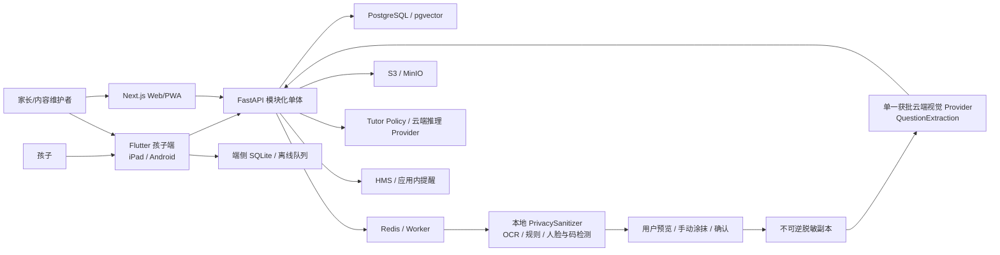
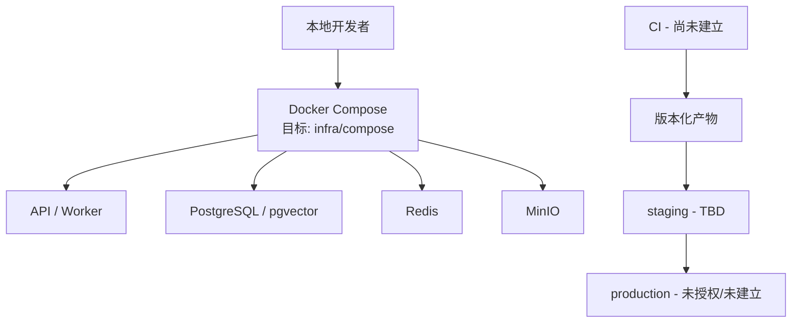

# ARCHITECTURE.md — 家庭 AI 学习助手

## 文档信息

- 状态：`DRAFT（v1.0 目标架构；P0 家庭/孩子/设备合成切片已实现）`
- Owner：`TBD（技术负责人确认）`
- 最后更新：`2026-07-15`
- 设计基线：`家庭AI学习助手_架构设计_v1.0.docx`
- 相关决策：`DECISIONS.md`（ADR-0001～0011、0013～0017 已 Accepted；ADR-0012 已被 ADR-0015 替代。ADR-0017 已替代 ADR-0005 的孩子 PIN/设备凭证默认方案和 ADR-0016 的 HMAC 认证部分；NewAPI 决策继续有效）

## 1. 架构目标

- 业务能力：支撑家庭/孩子、每日任务、数学单题捕获、AI 分步辅导、错题与复习、家长周报和多端离线同步。
- 质量属性优先级：儿童安全与隐私 > 数据正确性/可靠性 > 可审计与可替换性 > 可用性 > 性能 > 成本。
- 规模假设：P0/P1 先服务单一或少量家庭；用户数、峰值 RPS、图片量、AI 调用量和数据保留规模均为 `TBD`，应在原型测量后写入容量模型。
- 主要约束：复用四类现有设备；华为端不依赖 GMS；模块化单体起步；OpenAPI/Schema 契约优先；离线队列保留学习记录，但图片解析依赖网络；模型可替换；原图不外发；儿童数据最小化；未授权教材/题库不入库。

当前实现状态：P0 健康端点、Household-scoped ChildProfile/Device 与 P1 Task/StudySession/Attempt/SyncBatch/Capture API、local/CI 家长删除孩子档案 API、OpenAPI `0.5.0` 增量、Flutter 待同步队列边界、八份本地 PostgreSQL migration、Learning/Capture/OCR/ImageAnalysis 事务仓储、私有 MinIO 上传签发/服务端确认（含对象实际 SHA-256）和过期对象清理器、按 Household/Child 原子认领的 Capture 对象级联删除编排、家长保存/立即删除图片入口、PaddleOCR 模型构建期 SHA-256 供应链和预置目录 Adapter、普通/公式 OCR 按模式分流、OCR 边界有界读取/图片容器头校验/完整像素解码/无 EXIF 规范化重编码/临时文件执行/文本与公式结果纯解析、候选结果人工确认门、local/CI 幂等 OCR 入队/PostgreSQL 行锁队列/单次 Dispatcher、Provider-neutral PrivacySanitizer 核心、OCR/规则隐私信号、五份 ADR-0015/ Tutor Schema、6-case PrivacySanitizer 与 3-case Tutor synthetic eval、receipt-only ImageAnalysis ledger/API、校正 Capture 绑定的 offline Tutor hints API 和 Flutter 本地脱敏预览/手动涂抹/确认后脱敏 PNG+哈希上传顺序已实现。该代码仍保留已被 ADR-0015 替代的“本地完整 OCR 解析”路线；真实视觉检测器、云视觉/Tutor Adapter、单 Provider 外发门禁和临时脱敏副本清理尚未实现。Redis/外部 Worker、真实认证、Profile/Device 持久化、生产数据库/派生对象/备份删除仍未完成。

现状修订（2026-07-15）：上面的实现清单是历史快照，当前还包括第九份迁移 `0009_question_extraction`、自用 HMAC Bearer、NewAPI Adapter、ImageAnalysis queued/blocked worker 和未确认 QuestionExtraction 读取接口。当前仍未完成人工确认生成 `VerifiedQuestion`、临时脱敏副本清理、实际 NewAPI 联调、Profile/Device 生产持久化和备份删除。

认证目标修订（2026-07-15）：ADR-0017 已接受，下一项 P0 将以 PostgreSQL `Account`/`AuthSession`、Argon2id 密码哈希和可撤销不透明会话替换静态 HMAC Bearer。该方案尚未实现；当前运行时代码、Web 环境注入和 Flutter 构建参数仍使用 HMAC Bearer，必须按 PLAN-0007 分阶段迁移，不得把目标方案描述成现状。

## 2. 系统上下文

信任边界：

1. 儿童/家长设备与 API 之间是互联网/本地网络边界，所有身份、输入和文件均不可信。
2. 原图与 `PrivacySanitizer` 在家庭控制边界内；原图、对象键和 MinIO URL 不得跨越到云端。只有安全门禁通过并由用户确认的不可逆脱敏副本可以进入第三方边界。
3. API 与云视觉/Tutor Provider、对象存储、推送服务之间是第三方/基础设施边界，需最小权限、单 Provider、超时、有界重试、成本和数据最小化控制。
4. 家庭之间是强授权边界；任何跨 Household 访问都是高危事件。
5. 本地、staging、production 是独立环境边界，禁止真实数据和凭据向低环境复制。

## 3. 组件与责任

| 组件 | 目标路径/服务 | 责任 | 数据所有权 | 上游/下游 | 状态 |
| --- | --- | --- | --- | --- | --- |
| 孩子端 | `apps/child_flutter` | 今日任务、学习会话、拍题/相册选择、分步提示 UI、SQLite、离线队列 | 端侧缓存和待同步操作；服务端数据不是本地主真相 | `image_picker`、Capture API、API | 横屏学习桌、拍题输入、OCR 确认与分数思考提示第 1/2/3 张 UI 原型已实现；`CaptureApiClient` 已覆盖 SHA-256、预签名 PUT、服务端确认、幂等 OCR 入队、Job 轮询和人工确认/纠正，并由显式 `STUDY_CAPTURE_SESSION_ID` 调试开关接入页面；当前仍由构建参数注入 HMAC Bearer，孩子账号登录与平台安全存储会话列入 PLAN-0007；离线 SQLite 未实现 |
| Web/PWA | `apps/web` | 家长登录、孩子账号管理、内容维护、Windows 首版体验 | 仅 UI 状态；业务事实来自 API | OpenAPI SDK、API | 简洁明亮的 children/tasks/devices 学习概览已实现；当前仍由服务端环境注入 HMAC Bearer。PLAN-0007 将增加首次改密、登录/退出和孩子账号创建/停用/重置页面 |
| API/BFF | `services/api` | 鉴权、家庭边界、业务编排、契约实现 | PostgreSQL 中 Learning 业务事实 | 客户端、数据层、Worker、AI | 健康 + 合成 Profile/Device API；Learning/Capture/ImageAnalysis 可切换 PostgreSQL 仓储；当前自用 HMAC Bearer 已实现，账号密码与会话尚未实现 |
| Identity/Profile | `services/api` 内模块 | Household、Account、AuthSession、ChildProfile、Device 和权限 | 身份、家庭归属、密码哈希、可撤销会话 | API、所有领域模块 | 当前为合成 principal + HMAC Bearer；ADR-0017 已接受，目标 PostgreSQL 账号、Argon2id、会话撤销和强制首次改密列入 PLAN-0007 |
| Plan/Task/Session | `services/api` 内模块 | 计划、任务、会话、Attempt 和同步合并 | 学习任务与过程记录 | 客户端、Report、Mistake | PostgreSQL 事务仓储、Alembic schema、反向授权/幂等/并发测试已实现；SQLite 未实现 |
| Capture / PrivacySanitizer | `services/api` 内模块 | 受限媒体声明、签名上传、单题裁剪、本地元数据清除、OCR/规则敏感标签定位、实色遮挡；客户端脱敏预览/手动涂抹/哈希生成；ImageAnalysis queued/blocked job；NewAPI 结构化解析和人工校正 | Capture/脱敏/解析状态与追加校正；原图/脱敏副本在私有 MinIO；未确认题目结构在 PostgreSQL | 对象存储、NewAPI Provider、Tutor | 当前已实现旧本地 OCR 回滚路线、安全读取/实际 SHA-256 核验/生命周期基础、PrivacySanitizer 核心/规则信号、Bearer、ImageAnalysis ledger、0009 提取持久化和可恢复 NewAPI worker；真实视觉检测器、人工确认接口、脱敏副本删除演练和实际 NewAPI 联调仍未实现，提取结果不得冒充 VerifiedQuestion |
| Tutor | `services/api` 内模块 | 只消费人工确认的 `VerifiedQuestion`，执行 Provider 路由、Tutor Policy、提示层级、Schema 校验和成本控制 | TutorTurn、模型/Prompt/Policy 版本和审计 | Capture、AI Provider、Mistake | 已创建无 Provider 的 `offline-tutor-policy.v1` 纯规则降级，1～3 级提示/0 元/不回显答案；NewAPI 图片 Adapter 不等于 Tutor Provider，持久化 TutorTurn/人工确认接口/生产审计未实现 |
| Mistake/Mastery/Report | `services/api` 内模块 | 错因、知识点、复习调度、掌握度快照、周报 | MistakeRecord、ReviewSchedule、MasterySnapshot、WeeklyReport | Session/Tutor、家长端 | 未创建 |
| Notification | `services/api` 内模块 | 应用内提醒和可替换推送适配器 | 通知状态 | Report/Task、HMS | 未创建 |
| 跨端契约 | `packages/contracts` | OpenAPI、AI JSON Schema、生成 SDK | 接口/Schema 的唯一事实来源 | API、Flutter、Web、evals | 健康 + Profile/Device + Learning/Capture/OCR `0.5.0` 合同已实现；ADR-0015 新 Schema 和 SDK 生成器未实现 |
| AI 评测 | `evals` | 固定样本与质量/安全/延迟/成本回归 | 合成或脱敏评测数据 | Tutor、CI | 旧本地 OCR、PrivacySanitizer 与 offline Tutor Policy synthetic eval 已实现；云视觉和云 Tutor eval 未实现 |
| 本地基础设施 | `infra/compose` | PostgreSQL、Redis、MinIO、API/Worker 本地编排 | 本地合成数据 | 开发/集成测试 | PostgreSQL 16.10 与 MinIO 已启动用于 migration/integration；Redis 未启动 |
| ADR | `docs/adr` | 不可逆或跨模块决策记录 | 架构决策历史 | `DECISIONS.md` | ADR-0001～0011、0013～0017 Accepted；ADR-0012 Superseded；ADR-0017 认证目标待实现 |

模块间禁止直接绕过业务接口修改其他模块表。模块化单体内部边界和依赖方向需在 P0 代码结构中验证。

## 4. 关键数据流

### 4.0 账号初始化、登录与孩子账号管理（ADR-0017 目标，尚未实现）

1. 仅在空账号库的本机首次启动中创建 `admin/admin123456`，密码只以 Argon2id 哈希落库并标记 `must_change_password=true`；该引导账号不得重复创建。
2. 引导凭据只允许从 loopback 登录。首次改密前，服务端仅开放当前账号、改密和退出接口，其他家庭数据接口统一返回稳定的 `password_change_required`。
3. 家长改密成功后撤销所有引导会话并签发新的可撤销会话；Web 使用 `HttpOnly`、`SameSite=Lax` Cookie 和 CSRF 防护，不把长期令牌写入前端环境。
4. `parent_admin` 在 Web 内创建、停用、启用或重置同一 Household 的孩子账号，每个 `child` 账号必须绑定一个 `ChildProfile`；高风险管理操作要求 10 分钟内重新验证家长密码。
5. 孩子在 Flutter 使用账号密码登录；客户端只在 Keychain/Android Keystore 保存不透明会话值。服务端每次按会话、角色、Household 和 ChildProfile 绑定授权。
6. 登出、改密、账号停用或重置立即撤销相关会话。忘记唯一管理员密码只允许在服务器本机通过受审计恢复命令处理，不提供短信、邮箱、社交登录、OIDC 或 MFA。

迁移期间可临时保留显式 `legacy_bearer` 兼容开关，但不得作为新安装默认值；切换顺序、会话兼容和回滚以 PLAN-0007 为准。

### 4.1 任务、作答与离线同步

以下为目标数据流；第 3 步的 MinIO 上传签发与服务端对象确认（包括声明内容 SHA-256 与实际对象字节核验）已经实现。当前旧路线第 4 步仍运行 ADR-0012 的本地完整 OCR 输入规范化、普通/公式执行、`LocalOcrJob`、候选结果和人工确认；新路线已完成本地 PrivacySanitizer 核心/规则信号、ImageAnalysis ledger、0009 提取持久化、可开关 NewAPI worker，以及 Flutter 侧脱敏预览、手动涂抹和确认后只上传脱敏副本的顺序；Provider 未启用时状态明确为 blocked，不读取或外发图片。真实视觉检测器、人工确认接口、临时副本清理和实际 NewAPI 联调仍未完成。Flutter 调试默认仍使用内存队列，需显式切换 PostgreSQL 才连接持久化 Worker。

1. 家长通过 Web/手机创建任务，API 校验 Household 权限后写入 PostgreSQL。
2. 孩子端同步今日任务到 SQLite，开始 StudySession；断网时将 Attempt、状态变化和上传意图写入追加队列。
3. Capture 上传由 API 在授权后创建 `upload_pending` 元数据并签发私有 MinIO 的短期预签名 URL；客户端不持有存储密钥，API 读取对象 MIME/大小确认后才转入 `needs_correction`。
4. 目标路线由本地 PrivacySanitizer 生成不可逆脱敏副本，用户确认后由单一获批云视觉 Provider 产生 `QuestionExtraction`；任何结果必须人工确认形成 `VerifiedQuestion`，低置信度或失败保留重新裁剪、手动涂抹或手工录入路径。
5. 重连后客户端按顺序提交，写接口携带 `idempotency-key`；Attempt/AuditEvent 追加写，任务状态使用服务端版本号检测/合并冲突。
6. API 返回逐项结果；失败项保留可重试和用户可理解状态，不静默丢弃或用最后写入覆盖历史。

- 信任边界：账号输入、会话值、客户端时间、离线事件和幂等键均不可信，服务端必须验证会话、家庭、角色、孩子绑定、Schema 和版本。
- 一致性：学习事实追加写；派生状态可重算；任务状态使用显式版本/冲突策略。
- 失败处理：局部失败不清空队列；认证失效要求家长恢复；永久 Schema 错误进入可诊断失败状态。
- 幂等/重试：同一幂等键 + 等价请求返回同一业务结果；同键不同载荷拒绝并审计；采用有界指数退避。

### 4.2 拍题与 AI 分步辅导

1. 客户端请求短期签名 URL，校验文件类型/大小后上传单题图片；原图只进入家庭控制的私有 MinIO。
2. PrivacySanitizer 有界读取原图，清除元数据；本地 OCR 只定位敏感标签/文本框，并结合规则、人脸、二维码/条形码检测，用实色块生成重新编码的脱敏副本。
3. 客户端展示脱敏预览；用户可重新裁剪或手动涂抹。服务端把确认动作绑定到脱敏副本不可逆哈希；`safe_to_upload=false` 或未确认时禁止外发。
4. 云视觉 Adapter 只向单一获批 Provider 发送脱敏字节和最少上下文，返回固定 `QuestionExtraction` Schema。不得发送原图、MinIO URL、对象键或敏感 OCR 文本，不得自动跨 Provider 重试。
5. 孩子或家长确认/校正 `QuestionExtraction` 后形成 `VerifiedQuestion`；Provider 原始响应和未确认提取结果都不是业务事实。
6. Tutor 模块只接收 `VerifiedQuestion`，按 Tutor Policy 选择模型和提示级别，注入最少匿名上下文并调用 Provider Adapter。
7. Tutor 输出通过 Schema、安全和成本校验后写入 TutorTurn/AuditEvent，再返回孩子端；完成后把有证据的错因/知识点候选交给 Mistake 模块。

- 信任边界：图片、OCR 框、脱敏判断、用户确认、云视觉/Tutor 输出和第三方错误均不可信；每一跳单独校验。
- 一致性：原始业务记录与模型派生结论分离；所有派生记录带模型/Prompt/Policy/Schema 版本。
- 失败处理：脱敏失败回到裁剪/涂抹/手工录入；云视觉超时/限流只允许同一 Provider 至多一次有界重试或暂停，切换 Provider 需家长明确确认；绝不丢失已保存作答。
- 幂等/重试：Capture、脱敏确认、ImageAnalysis 和 Tutor 请求使用业务幂等键；Provider 重试必须绑定同一脱敏哈希，避免重复外发、重复计费/重复写入。

### 4.3 错题、复习与家长周报

1. 完成的 Session、Attempt 和 TutorTurn 产生带证据的 MistakeRecord 与知识点关联。
2. ReviewSchedule 根据批准的策略生成复习入口；P2 的 MasterySnapshot 是可重算派生数据。
3. WeeklyReport 聚合时间窗口内的投入、完成率、薄弱点、复习建议和异常，并保留到源记录的引用。
4. 家长端按 Household 权限读取；生成失败时显示数据截止时间和缺失原因，不用模型猜测填充。

- 信任边界：聚合和模型摘要必须以授权后的家庭数据为输入。
- 一致性：报告为版本化快照，可从源记录重算；源记录删除后按保留政策处理派生数据。
- 失败处理：部分数据缺失时标记异常，不发布无法追溯的结论。
- 幂等/重试：周报按 Household + 时间窗口 + 版本唯一，重复生成覆盖同一草稿或创建显式新版本。

## 5. 接口与事件

| 接口/事件 | Producer | Consumer | 目标契约位置 | 兼容策略 | SLO |
| --- | --- | --- | --- | --- | --- |
| `/households/{id}/children`、`/households/{id}/devices` | API | Flutter/Web | `packages/contracts/openapi.yaml` | P0.2 增量；写请求幂等；破坏性变化显式版本化 | `TBD` |
| `/plans`、`/tasks`、`/sessions` | API | Flutter/Web | `packages/contracts/openapi` | 写请求幂等；状态枚举只增不改 | `TBD` |
| `/captures`、目标 `/privacy-sanitizations`、`/image-analysis-jobs` | API | Flutter/Web | OpenAPI + 图片/脱敏/提取 Schema | 现有 OCR 合同保持原义；新状态/端点只做兼容增量；签名 URL 短期有效；确认绑定脱敏哈希 | `TBD` |
| `/tutor/hints` | API | Flutter | OpenAPI + `packages/contracts/schemas` | Prompt/Policy/Schema 独立版本；未知字段兼容 | `TBD` |
| `/mistakes`、`/reviews`、`/reports` | API | Flutter/Web | `packages/contracts/openapi` | 报告快照版本化 | `TBD` |
| `/content`、`/admin` | API | Web | `packages/contracts/openapi` | 高权限接口分离并审计 | `TBD` |
| 同步事件批次 | Flutter | API | `packages/contracts/schemas` | 每事件有 ID/版本/幂等键；追加新事件类型 | `TBD` |
| AuditEvent | 所有服务端模块 | 审计/可观测性 | `packages/contracts/schemas` | 稳定事件名；字段按敏感级别控制 | `TBD` |

契约目录和结构检查已建立；SDK 生成器、兼容检查命令和 ADR-0017 账号/会话契约尚未实现，具体接口和错误码将在 PLAN-0007 第一阶段以向后兼容增量锁定。

## 6. 数据架构

| 数据域 | 存储 | 主键/分区 | 保留策略 | 备份/恢复 | 敏感级别 |
| --- | --- | --- | --- | --- | --- |
| Household/Account/AuthSession/ChildProfile/Device | PostgreSQL（目标）；当前 Profile/Device 为内存合成、认证为无撤销 HMAC | UUID；全部业务行含 Household 边界；会话只存 SHA-256 摘要 | 账号期 + 批准的删除策略；会话最长 30 天并可即时撤销；其他精确期限 `TBD` | `TBD` | Confidential/Restricted |
| Plan/Task/Session/Attempt | PostgreSQL | UUID；Attempt 追加写 | 学习记录期限 `TBD` | `TBD` | Confidential |
| Capture 元数据 | PostgreSQL | Capture UUID | 与图片策略联动 | `TBD` | Confidential |
| 单题图片 | 私有 MinIO / S3 Adapter | 随机对象键，不含儿童身份 | 原图 24 小时；旧 OCR/后续脱敏处理失败最多 7 天；裁剪题目 30 天，家长可保存/删除 | 默认不做长期业务备份，备份擦除待真实数据前确定 | Restricted |
| 临时脱敏副本 | 私有 MinIO 临时对象或受控内存 | 随机对象键 + 不可逆哈希，不含儿童身份 | 云端响应后立即删除；失败最多 24 小时；不可长期保存 | 不进入业务备份 | Restricted |
| TutorTurn/AI 审计 | PostgreSQL | UUID + 版本字段 | 原始敏感内容最小化；期限 `TBD` | `TBD` | Confidential |
| Mistake/Review/Mastery/Report | PostgreSQL | UUID；报告按时间窗口/版本 | 与源记录/家庭删除保持一致 | `TBD` | Confidential |
| 缓存/队列 | Redis | 非业务主键 | 短期 TTL；可重建 | 不作为恢复源 | Internal/Confidential |
| 知识检索向量 | PostgreSQL/pgvector | KnowledgePoint/内容版本 | 按内容授权和版本 | `TBD` | Internal；含家庭内容时为 Confidential |
| 端侧离线数据 | SQLite | 本地 UUID/同步 ID | 完成同步后按最短必要周期清理 | 不作为服务端备份 | Restricted（设备侧） |

数据库迁移规则：使用版本化迁移；先扩展、再迁移、最后收缩；兼容旧客户端和正在同步的离线事件；迁移前后验证备份/恢复；生产禁止不可逆 DDL 与应用版本同时无保护发布。P0 需选择迁移工具并写 ADR/测试。

## 7. 非功能设计

### 可靠性

- SLO/SLA：`TBD（staging 有基线后由产品/技术 Owner 批准）`。
- 降级策略：AI 不可用时保留任务/作答和手工记录；脱敏不确定时阻断外发并支持重新裁剪/手动涂抹/手工录入；云视觉低置信度转人工校正；推送不可用转应用内提醒；报告失败显示数据截止时间。
- 灾难恢复：RPO/RTO 当前 `TBD`，任何生产部署前必须完成备份恢复演练。

### 性能与容量

- 延迟目标：任务/会话 API、上传、本地脱敏、云视觉解析、首个提示和周报生成的预算均为 `TBD`，需用 P0/P1 原型建立基线。
- 峰值负载：`TBD`；首版按少量家庭设计，不提前拆微服务。
- 扩容方式：先优化模块化单体和 Worker；只有某模块有独立扩容/隔离证据时通过 ADR 拆分。

### 安全

- 认证授权：目标为家长/孩子账号密码 + 可撤销会话；密码使用 Argon2id，Web 使用 HttpOnly Cookie + CSRF，Flutter 使用平台安全存储；每个资源访问检查 Household/角色/孩子绑定，管理员操作重新验证并审计。当前 HMAC Bearer 仅是待迁移实现事实。
- 密钥：环境注入，生产使用批准的密钥管理器；本地只使用无权限测试凭据和脱敏 `.env.example`。
- 加密：所有非本地传输 TLS；数据库、对象存储、备份和设备安全存储的静态加密方案 `TBD（生产前批准）`。
- 审计：登录/设备、家庭权限、任务状态、Capture、Tutor、导出/删除、内容/管理和配置/策略变更均记录稳定事件。

### 可观测性

- 日志：结构化事件；携带 trace/request、household/child 不可逆标识、模块和结果，不记录原始题目/图片/令牌。
- 指标：请求量/错误/延迟、队列、同步冲突、脱敏检测/阻断/手动涂抹率、云视觉校正率、AI Schema/安全失败、单 Provider 路由、token/成本、临时副本/周报和删除状态。
- Trace：OpenTelemetry 贯穿 API、Worker、数据层和 AI Provider；前端关联 ID 不包含敏感信息。
- 告警：跨家庭授权失败、记录丢失/冲突激增、AI 安全/Schema 失败、成本异常、备份/删除失败。阈值 `TBD`。

## 8. 部署拓扑

- local：Docker Compose 与合成数据已创建；PostgreSQL 16.10 已用于 Learning migration/integration，非 production 环境。Compose 不固定 CPU 架构：Linux amd64 镜像保留锁定 Paddle OCR/模型，Apple Silicon 默认构建 Linux arm64 调试镜像并运行 API、迁移和 NewAPI worker；因 PaddlePaddle 3.3.1 没有 Linux aarch64 wheel，ARM 容器不具备旧本地 OCR 能力，完整 Paddle 调试需使用 macOS 原生进程或 amd64 模拟。
- staging：用于契约、迁移、AI eval、设备、成本告警和恢复验证；访问方式 `TBD`。
- production：当前不部署。云平台、域名、区域、网络、密钥和发布方式均 `TBD`，需 ADR 与 `RUNBOOK.md`。

## 9. 架构边界与禁止模式

- 禁止客户端直接访问数据库、对象存储长期凭据或 AI Provider 密钥。
- 禁止以 Redis、pgvector、客户端 SQLite 或模型输出作为业务事实来源。
- 禁止在多个客户端手工复制契约类型；必须从同一 OpenAPI/JSON Schema 生成或验证。
- 禁止业务模块直接依赖某一 AI 厂商响应；必须通过 Provider Adapter 和 Tutor Policy。
- 禁止将原图、MinIO URL、对象键或敏感 OCR 文本发送到云端；禁止未确认/低置信度脱敏副本外发，禁止把同一图片自动广播给多个 Provider。
- 禁止把本地 OCR 输出当作最终题目结构，或让 Tutor 直接消费图片/未确认的 `QuestionExtraction`。
- 禁止“最后写入覆盖”离线学习历史；Attempt/AuditEvent 追加写，状态冲突显式处理。
- 禁止未经 Household 授权的数据读取、缓存键或对象路径；禁止管理员能力混入孩子账号/会话。
- 禁止将未授权教材/题库、真实儿童数据、图片、密钥或生产转储提交到仓库/评测集。
- 禁止在无真实负载证据时提前拆微服务或引入复杂基础设施。

## 10. 技术债与演进

| 项目 | 当前影响 | 触发改造的阈值 | 目标方向 | 跟踪 |
| --- | --- | --- | --- | --- |
| 核心领域多数未实现 | 任务/会话、Capture、Tutor、离线与生产路径不可运行 | P1 实现前 | 按已起草 ADR 的审批和后续 TODO 分阶段实现 | `TODO-007`～`TODO-010` |
| ADR-0015/0016 新路线仍在联调阶段 | 当前代码保留本地 PaddleOCR 回滚路线；新 ImageAnalysis 可在 NewAPI 开启时排队、worker 可持久化未确认提取，但人工确认、临时副本生命周期和实际 Provider 联调仍未完成 | 自用真实图片进入 NewAPI 前 | 完成人工确认接口、删除演练、synthetic NewAPI 联调和失败重试/监控，兼容旧 OCR Job | `TASK-0006`、`TODO-008` |
| ADR-0017 账号密码目标未实现 | 当前 Web/Flutter/API 仍依赖长期 HMAC Bearer，不能撤销单个会话，也没有登录、首次改密或孩子账号管理 | `TASK-0006` 完成或 Owner 明确暂停后 | 按 PLAN-0007 增加 Account/AuthSession、Argon2id、受限引导账号、Web/Flutter 登录并移除默认 HMAC | `TODO-012`、`PLAN-0007` |
| 核心技术/安全决策已批准、部分未实现 | 实现仍须锁定 SDK/运行时、验证安全与成本 | 接入对应边界前 | ADR-0001～0011、0013～0017；实现依赖须另行审查 | `TASK-0006`、`TODO-005`、`TODO-012` |
| SLO、容量、RPO/RTO、成本阈值未知 | 无法设置告警和发布门槛 | staging 建立并获得基线 | 用测量值批准目标 | `TODO-004` |
| 数据保留/法域未决 | 真实儿童数据和生产部署被阻塞 | 任何真实数据进入前 | 完成安全/法务决策和删除/备份策略 | `TODO-005` |
| DOCX 在当前渲染环境缺少中文字体 | 本地 PNG 视觉审阅缺字，但 OOXML 文本完整 | 需要发布/维护设计稿时 | 嵌入/安装适用中文字体或输出经验证 PDF | `TODO-006` |
