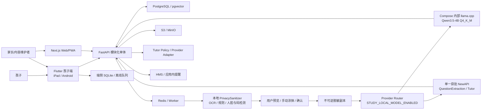
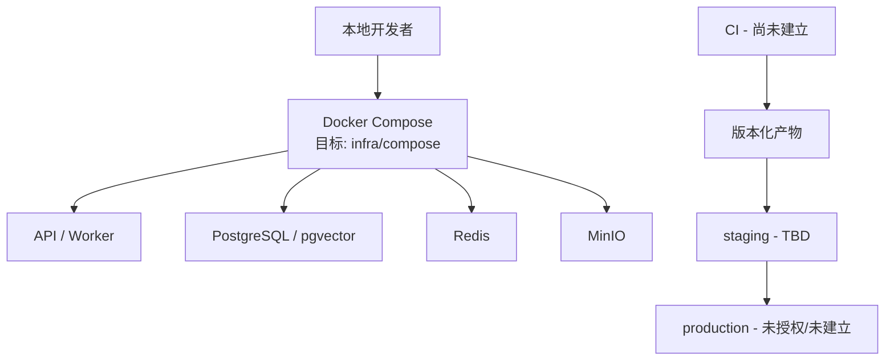

# ARCHITECTURE.md — 家庭 AI 学习助手

## 文档信息

- 状态：`DRAFT（v1.0 目标架构；P0 家庭/孩子/设备合成切片已实现）`
- Owner：`TBD（技术负责人确认）`
- 最后更新：`2026-07-29`
- 设计基线：`家庭AI学习助手_架构设计_v1.0.docx`
- 相关决策：`DECISIONS.md`（ADR-0001～0011、0013～0018、0020～0023 已 Accepted，ADR-0019 Proposed；ADR-0012 已被 ADR-0015 替代。ADR-0017 已替代 ADR-0005 的孩子 PIN/设备凭证默认方案和 ADR-0016 的 HMAC 认证部分；NewAPI 决策继续有效）

## 1. 架构目标

- 业务能力：以数学为首科，支撑家庭/孩子、教材与知识范围、错题捕获/详细讲解、错题本/到期复习、可解释今日任务、家长周报和多端同步。
- 质量属性优先级：儿童安全与隐私 > 数据正确性/可靠性 > 可审计与可替换性 > 可用性 > 性能 > 成本。
- 规模假设：P0/P1 先服务单一或少量家庭；用户数、峰值 RPS、图片量、AI 调用量和数据保留规模均为 `TBD`，应在原型测量后写入容量模型。
- 主要约束：复用四类现有设备；华为端不依赖 GMS；模块化单体起步；OpenAPI/Schema 契约优先；离线队列保留学习记录，但图片解析依赖网络；模型可替换；Capture 原图不外发，教材仅允许家长声明无个人信息后的有界页级派生图进入单一 Provider；儿童数据最小化；未授权教材/题库不入库。

历史实现基线（已由下方 2026-07-16 修订覆盖）：P0 健康端点、Household-scoped ChildProfile/Device 与 P1 Task/StudySession/Attempt/SyncBatch/Capture API、local/CI 家长删除孩子档案 API、OpenAPI `0.5.0` 增量、Flutter 待同步队列边界、八份早期本地 PostgreSQL migration、Learning/Capture/OCR/ImageAnalysis 事务仓储、私有 MinIO 上传签发/服务端确认（含对象实际 SHA-256）和过期对象清理器、按 Household/Child 原子认领的 Capture 对象级联删除编排、PaddleOCR 模型构建期 SHA-256 供应链和 Provider-neutral PrivacySanitizer 核心已实现；该历史快照不再描述当前认证和 VerifiedQuestion 状态。

现状修订（2026-07-17）：当前迁移已到 `0015_child_data_export`，包含 PostgreSQL Profile/Learning/Capture/Identity/VerifiedQuestion/TutorTurn/Report/Export；Flutter 使用 SQLite 持久化待同步 Attempt。Ubuntu Compose 运行 API/Web/ImageAnalysis/DataLifecycle worker，并完成 NewAPI synthetic 大图与 PostgreSQL/MinIO 恢复验收；真实视觉检测器和最终设备回归仍未完成。

认证实现修订（2026-07-16）：ADR-0017 已进入实现验收。API 以 PostgreSQL `Account`/`AuthSession`、Argon2id 密码哈希和可撤销不透明会话作为唯一认证机制；HMAC、Demo Header、静态 Web Token 和 Web 免登录开关已删除。Web 使用 Cookie/CSRF；Flutter 在登录前验证并持久化服务端地址，地址变更先清理旧会话，新会话使用平台安全存储。认证审计仅写稳定事件名、家庭/资源 UUID 和时间。

Web 孩子管理修订（2026-08-16）：PLAN-0013 的孩子管理聚合已实现并部署 Ubuntu：家长通过一个幂等命令创建 ChildProfile 与唯一 child Account，列表返回联合视图，删除档案同时清理 child Account；首页支持 query 选择当前孩子并按孩子过滤任务/周报。认证与档案仍保持物理分表；隔离 Chromium 已验证双孩子聚合创建、学科差异与 query 切换，真实 PostgreSQL/设备验收仍待完成。

产品主线修订（2026-07-24）：ADR-0023/PLAN-0018 已在本地及 Ubuntu `0025` 将 PDF 文本抽取降为辅助信息，新增私有原页、多模态页级分析、全书知识图谱、家长批准和知识点任务。真实 PDF/Provider/设备和发布质量门槛未完成。

英语插件修订（2026-07-29）：ADR-0025 在 Flutter 登录后增加学科选择，并在 FastAPI 模块化单体内新增独立 EnglishPractice 设置/摘要仓储、Policy、Provider Adapter 和 WebSocket 中继。App 只发送 Bearer Session 与 PCM16 分片；Provider Key/URL 留在服务端边界。当前只有 `disabled` 和显式测试 `fake`，不包含 Gemini Adapter，默认部署锁定。

多学科/语文修订（2026-08-15）：ADR-0027 将孩子档案、教材 Material/Snapshot 和学科导航扩展为显式 `math/chinese`；迁移把既有教材回填为数学，跨学科不得按相同哈希复用。语文采用独立版本化 ContentItem/AnswerSpec、追加写 Attempt 和 ReviewItem，评分是服务端 `chinese-score.v1` 纯函数，孩子合同不返回答案规范，也不调用 AI。数学 VerifiedQuestion/MistakeRecord/ReviewSchedule 主线保持不变；英语继续使用 ADR-0025 的独立设置、同意和 Provider 门禁，并在产品顺序上排最后。

古诗内容门禁修订（2026-08-29/30）：语文教材 Provider 的 `poem` 分类只是页级候选，不能直接成为孩子内容。API 以版本化公共领域目录验证规范化标题、至少两句连续题干/答案和每个可见选项，只有家长已审核且全部门禁通过的候选才能编译为相邻句题；读取和提交路径再次执行相同校验。同一 Snapshot 重发时先把旧派生题标为 `retired`，再恢复或生成有效题，不删除既有 Attempt/Review。Flutter 不把页面初始化时取得的内容视为持续有效，每次打开古诗抽查前重新读取 API；当前结果为空或失败时阻断，不回退进程内旧题。目录未收录、标题相似但诗句不连续、儿歌、童谣、现代韵文及其干扰项均失败关闭。

家长首页修订（2026-08-30）：首页不再请求或展示语文技能报告卡片，语文 `skill-report` API 保留给兼容性、导出或后续专用页面使用。首页调用开放错题的 `due_only=true` 后，再按 `Asia/Shanghai` 自然日过滤，仅展示当天到期项目；昨天以前逾期的开放错题仍是学习事实，不因首页隐藏而删除，并继续从学习记录/复习入口访问。数据清理必须独立于 UI 发布，经明确作用域、备份和隔离恢复后执行。

实时英语数据流：`Flutter 前台按住说话 → API Session/孩子/同意/配额门禁 → 20/40 ms PCM16 中继 → 单一获批 Provider Adapter → 24 kHz PCM 播放`。PostgreSQL 只保存设置与摘要指标；音频、完整转写、Provider 消息和恢复缓存均不持久化。应用后台、权限撤销、账号切换、Session 撤销、空闲或断线立即停止录音并关闭通道。

## 2. 系统上下文

信任边界：

1. 儿童/家长设备与 API 之间是互联网/本地网络边界，所有身份、输入和文件均不可信。
2. Capture 原图与 `PrivacySanitizer` 在家庭控制边界内；Capture 原图、对象键和 MinIO URL 不得跨越到云端，只有安全门禁通过并由用户确认的不可逆脱敏副本可以进入第三方边界。教材分析是独立边界：家长确认清洁电子教材不含个人信息后，服务端只发送最多 4 页一批的有界页级派生图/辅助文字，不发送 PDF 对象、对象键或存储 URL。
3. API 与云视觉/Tutor Provider、Compose 内部本地模型、对象存储、推送服务之间是第三方/基础设施边界，需最小权限、单 Provider、超时、有界重试、成本和数据最小化控制。`STUDY_LOCAL_MODEL_ENABLED=true` 时所有当前 Adapter 请求只进入本地模型，不自动回退云端；关闭时才读取 NewAPI 云端配置。
4. 家庭之间是强授权边界；任何跨 Household 访问都是高危事件。
5. 本地、staging、production 是独立环境边界，禁止真实数据和凭据向低环境复制。

## 3. 组件与责任

| 组件 | 目标路径/服务 | 责任 | 数据所有权 | 上游/下游 | 状态 |
| --- | --- | --- | --- | --- | --- |
| 孩子端 | `apps/child_flutter` | 学科/数学三入口、语文确定性练习、锁定英语入口、拍题、SQLite/待同步 | 端侧缓存和待同步操作；答案规范与服务端数据不是本地主真相 | `image_picker`、Capture/Learning/Chinese API | 数学闭环与语文首个句子/阅读纵向切片已实现；真实设备、语文完整复习和内容验收待完成 |
| Web/PWA | `apps/web` | 家长登录、统一孩子管理、多孩子选择、PDF 教材上传、审核/发布、任务建议、周报和导出 | 仅选择/草稿编辑状态；业务事实来自 API | OpenAPI SDK、API | 登录态/跨家庭/双孩子隔离 Chromium E2E 已实现；真实 PDF/NewAPI、Ubuntu 真实账号浏览器待完成 |
| API/BFF | `services/api` | 鉴权、家庭边界、业务编排、契约实现 | PostgreSQL 中 Profile/Learning/Identity 业务事实 | 客户端、数据层、Worker、AI | Compose 默认使用 PostgreSQL 事务仓储和 password 会话认证 |
| Identity/Profile | `services/api` 内模块 | Household、Account、AuthSession、ChildProfile、Device、孩子管理聚合和权限 | 身份、家庭归属、密码哈希、可撤销会话 | API、所有领域模块 | 认证、事务仓储、原子聚合和唯一约束已实现；隔离 Chromium 登录态/跨家庭/双孩子通过，真实 PostgreSQL 浏览器与设备待完成 |
| Curriculum/Content | `services/api` 内模块 + parser/analysis worker | PDF 授权/私有上传、文字辅助解析、PDFium 私有页图、NewAPI 页批次理解、全书知识图谱和家长批准 | 原件、页图元数据、页级分析、知识点与版本 | Web、Tutor、Task、Mistake | 本地 `0025` 已实现；Provider 失败/Schema 或来源越界会进入 failed，批准前不能发布 |
| Plan/Task/Session | `services/api` 内模块 | 全量错题/批准知识点排序、来源受限云端规划、家长审批、任务/会话/Attempt | 学习任务与过程记录 | 客户端、Curriculum、Report、Mistake、NewAPI | 不再从页文字正则抽题；具体题来自批准知识点，视觉题携带描述和受鉴权来源页 |
| Capture / PrivacySanitizer | `services/api` 内模块 | 受限媒体、API 有界流式上传、本地脱敏/手动涂抹；ImageAnalysis、NewAPI 结构化和人工确认 | Capture/脱敏/解析状态；图片在私有 MinIO；Extraction/VerifiedQuestion 在 PostgreSQL | 对象存储、NewAPI Provider、Tutor | 已实现 Session 鉴权流式上传、安全读取/实际 SHA-256、提取/确认和生命周期，并部署 Ubuntu；当前 Provider HTTP `402` 阻断真实 Extraction，自动视觉检测器尚未完成 |
| Tutor | `services/api` 内模块 | 只消费 VerifiedQuestion；按练习/复习/错题讲解模式执行 Policy、教材 grounding、Schema、确定性校验和成本控制 | 追加写 TutorTurn、Policy/Prompt/模型和来源版本 | Capture、Curriculum、AI Provider、Mistake | 由统一路由选择 `local_qwen` 或 `newapi`；答案/重复/题意门禁失败时回退题型相关本地提示；L3 完整步骤/答案/验算已实现；本地模型质量/成本验收待完成 |
| Mistake/Review/Report | `services/api` 内模块 | 错题证据、错因、讲解引用、确定性复习调度、周报聚合 | MistakeRecord、ReviewSchedule、复习 Attempt 和报告 | Session/Tutor/Curriculum、家长端 | `0017`、错题创建/到期查询/复习和基础 Web/Flutter 调用已实现；完整 AttemptEvidence 绑定、完整 UI 和教材依据待完成 |
| Notification | `services/api` 内模块 | 应用内提醒和可替换推送适配器 | 通知状态 | Report/Task、HMS | 未创建 |
| 跨端契约 | `packages/contracts` | OpenAPI、AI JSON Schema、生成 SDK | 接口/Schema 的唯一事实来源 | API、Flutter、Web、evals | `0.11.0` 增加私有教材原页、知识图谱、知识点引用和视觉题上下文；SDK 生成器未实现 |
| AI 评测 | `evals` | 固定样本与质量/安全/延迟/成本回归 | 合成或脱敏评测数据 | Tutor、CI | OCR、PrivacySanitizer、Tutor Policy 和真实 NewAPI synthetic 大图已实现；自动视觉检测器 eval 待其实现后补充 |
| 本地基础设施 | `infra/compose` | PostgreSQL、Redis、MinIO、API/Web/Worker 和可切换 llama.cpp/Qwen 服务编排 | 单家庭自用数据与本地模型缓存 | 开发/自托管 | Ubuntu 完整栈、迁移、生命周期 worker、备份和隔离恢复已验证；本地模型首次下载/质量验收待完成 |
| ADR | `docs/adr` | 不可逆或跨模块决策记录 | 架构决策历史 | `DECISIONS.md` | ADR-0001～0011、0013～0018、0020～0028 Accepted；ADR-0019 Proposed；替代关系见决策索引 |

模块间禁止直接绕过业务接口修改其他模块表。模块化单体内部边界和依赖方向需在 P0 代码结构中验证。

## 4. 关键数据流

### 4.0 账号初始化、登录与孩子账号管理（ADR-0017 实现状态）

1. 仅在空账号库的本机首次启动中创建 `admin/admin123456`，密码只以 Argon2id 哈希落库并标记 `must_change_password=true`；该引导账号不得重复创建。
2. 项目 Owner 已授权引导凭据从受信家庭局域网首次登录。首次改密前，服务端仅开放当前账号、改密和退出接口，其他家庭数据接口统一返回稳定的 `password_change_required`；默认凭据不得暴露到公网。
3. 家长改密成功后撤销所有引导会话并签发新的可撤销会话；Web 使用 `HttpOnly`、`SameSite=Lax` Cookie 和 CSRF 防护，不把长期令牌写入前端环境。
4. `parent_admin` 在 Web 内创建、停用、启用或重置同一 Household 的孩子账号，每个 `child` 账号必须绑定一个 `ChildProfile`；高风险管理操作要求 10 分钟内重新验证家长密码。
5. 孩子在 Flutter 使用账号密码登录；客户端只在 Keychain/Android Keystore 保存不透明会话值。服务端每次按会话、角色、Household 和 ChildProfile 绑定授权。
6. 登出、改密、账号停用或重置立即撤销相关会话。忘记唯一管理员密码只允许在服务器本机通过受审计恢复命令处理，不提供短信、邮箱、社交登录、OIDC 或 MFA。

Compose 只启用账号密码/会话认证，不存在 legacy 认证开关。PostgreSQL/浏览器 E2E/真实设备和恢复验收以 PLAN-0008 为准。

PLAN-0013 的目标聚合不改变上述认证边界：家长通过一个带幂等键的命令同时提交档案字段、用户名和初始密码；API 在一个数据库事务中创建 `ChildProfile` 与 `Account`，任何冲突或校验失败整体回滚。管理读模型将姓名、年级、用户名和账号状态组合返回，但永不返回密码、哈希或会话值。现有 `accounts(child_id, household_id)` 复合外键继续保护 Household，数据审计清理重复绑定后再增加一个档案最多一个 child Account 的唯一约束。

### 4.0.1 家长多孩子工作台（PLAN-0013 目标）

1. Web 从 URL 中的显式 `child_id`、已保存且仍获授权的最近选择、稳定排序后的首个孩子依次确定当前孩子；孩子被删除/失权时清除旧选择，零孩子时展示创建入口。
2. Web/API 使用同一个当前 `child_id` 并行加载孩子档案、当日任务和周报；任务必须在服务端按孩子过滤，不能读取全家庭学习明细后只做前端隐藏。
3. 家庭孩子总数是 Household 级指标；设备在尚无孩子绑定关系时也是 Household 级指标。两者不得因选择器变化或被标成当前孩子专属数据。
4. 服务端不信任查询参数/Cookie；每次仍按 Session、角色、Household 和 ChildProfile 绑定授权。家长可切换本家庭孩子，孩子账号只能访问自己的绑定档案。

当前 `apps/web/src/app/page.tsx` 优先使用 URL 的 `?child=` 并回退到稳定排序后的首个孩子，按同一孩子作用域加载任务、周报和到期错题；2026-08-16 隔离 Chromium 已验证双孩子 `?child=` 切换，真实 PostgreSQL/设备仍待完成。

### 4.1 任务、作答与离线同步

本地/Ubuntu `0.9.0` 数据流已收敛为 App 携带 Session 向 API 原始流上传，API 通过内部地址写入私有 MinIO，并在完成后做声明/实际 SHA-256 和完整图片校验；Ubuntu 已部署至 `0020_answer_evidence`。正式 OpenAPI 不暴露预签名 URL。其余路线仍保留 ADR-0012 的本地完整 OCR 输入规范化、普通/公式执行和 `LocalOcrJob`；默认视觉路线已完成 PrivacySanitizer 规则信号、ImageAnalysis/Extraction/VerifiedQuestion、单一 NewAPI synthetic live、派生对象清理、可信 TutorTurn，以及 Flutter 脱敏预览/手动涂抹/确认后上传。Provider 未启用时状态明确为 blocked，不读取或外发图片。Flutter 生产路径使用 PostgreSQL 服务端事实和 SQLite 端侧待同步队列；真实自动视觉检测器仍未完成。

1. 家长通过 Web/手机创建任务，API 校验 Household 权限后写入 PostgreSQL。
2. 孩子端同步今日任务到 SQLite，开始 StudySession；断网时将 Attempt、状态变化和上传意图写入追加队列。
3. Capture 目标上传由 App 携带 Session 和幂等键调用单一 API；API 在读取字节前验证 Household/角色/孩子/StudySession，随后分块限制大小、增量哈希、校验 MIME/文件头/尺寸/像素/完整解码，并通过内部 S3 Adapter 写入 staging 对象；全部成功后返回已确认 Capture，失败中止或删除 staging。当前 `0.8.0` 的预签名 URL + 确认流程是待迁移事实。
4. 目标路线由本地 PrivacySanitizer 生成不可逆脱敏副本，用户确认后由单一获批云视觉 Provider 产生 `QuestionExtraction`；任何结果必须人工确认形成 `VerifiedQuestion`，低置信度或失败保留重新裁剪、手动涂抹或手工录入路径。
5. 重连后客户端按顺序提交，写接口携带 `idempotency-key`；Attempt/AuditEvent 追加写，任务状态使用服务端版本号检测/合并冲突。
6. API 返回逐项结果；失败项保留可重试和用户可理解状态，不静默丢弃或用最后写入覆盖历史。

任务约束补充（本地 `0.17.0` / `0036_task_session_progress`）：`StudySession.next_exercise_index` 是服务端跨设备恢复事实，Attempt 只能按单步、不可回退地推进；孩子端只在本机 SQLite 保存同一范围的辅助位置并取两者较大值。任务创建按 Household/Child/日期加事务锁限制每天 3 个非撤销任务；未来日期只能只读，过期日期可补做。家长撤销将 Task 和活动 Session 置为 `revoked`，后续 Attempt/完成拒绝，撤销释放该日期名额。Ubuntu 尚未部署这轮变更。

- 信任边界：账号输入、会话值、客户端时间、离线事件和幂等键均不可信，服务端必须验证会话、家庭、角色、孩子绑定、Schema 和版本。
- 一致性：学习事实追加写；派生状态可重算；任务状态使用显式版本/冲突策略。
- 失败处理：局部失败不清空队列；认证失效要求家长恢复；永久 Schema 错误进入可诊断失败状态。
- 幂等/重试：同一幂等键 + 等价请求返回同一业务结果；同键不同载荷拒绝并审计；采用有界指数退避。

### 4.2 拍题与 AI 分步辅导

1. 客户端携带可撤销 Session 只向 API 上传单题图片；API 有界流式校验并通过内部地址写入家庭控制的私有 MinIO，客户端不接触对象存储 URL/对象键，MinIO `9000` 不向 LAN 暴露。
2. PrivacySanitizer 有界读取原图，清除元数据；本地 OCR 只定位敏感标签/文本框，并结合规则、人脸、二维码/条形码检测，用实色块生成重新编码的脱敏副本。
3. 客户端展示脱敏预览；用户可重新裁剪或手动涂抹。服务端把确认动作绑定到脱敏副本不可逆哈希；`safe_to_upload=false` 或未确认时禁止外发。
4. 云视觉 Adapter 只向单一获批 Provider 发送脱敏字节和最少上下文，返回固定 `QuestionExtraction` Schema。不得发送原图、MinIO URL、对象键或敏感 OCR 文本，不得自动跨 Provider 重试。
5. 孩子或家长确认/校正 `QuestionExtraction` 后形成 `VerifiedQuestion`；Provider 原始响应和未确认提取结果都不是业务事实。
6. Tutor 模块只接收 `VerifiedQuestion`，按 Tutor Policy 选择模型和提示级别，注入最少匿名上下文并调用 Provider Adapter。
7. Tutor 输出通过 Schema、安全和成本校验后写入 TutorTurn/AuditEvent，再返回孩子端；完成后把有证据的错因/知识点候选交给 Mistake 模块。

- 信任边界：图片、OCR 框、脱敏判断、用户确认、云视觉/Tutor 输出和第三方错误均不可信；每一跳单独校验。
- 一致性：原始业务记录与模型派生结论分离；所有派生记录带模型/Prompt/Policy/Schema 版本。
- 失败处理：脱敏失败回到裁剪/涂抹/手工录入；云视觉超时/限流只允许同一 Provider 至多一次有界重试或暂停，切换 Provider 需家长明确确认；绝不丢失已保存作答。
- 幂等/重试：Capture、脱敏确认、ImageAnalysis 和 Tutor 请求使用业务幂等键；Provider 重试必须绑定同一脱敏哈希，避免重复外发、重复计费/重复写入。

### 4.3 教材导入与知识发布（ADR-0020；PLAN-0016 / ADR-0021 Accepted）

1. 当前首版以孩子作用域的授权 PDF 上传代表 Assignment，记录数学、学期、年级、教材版本、来源声明和 SHA-256；完整 Assignment 实体后续补齐。
2. Web/OpenAPI/API 已成对收缩为 PDF-only；既有非 PDF 对象只保留用于兼容/删除，不得解析或发布。
3. ADR-0021 的隔离 worker 生成页级辅助文字；无文字层页面也保留并标记文字完整度为 0，不再阻断后续视觉理解。加密/危险或超限 PDF 继续失败/隔离。
4. ADR-0023 使用 pypdfium2 逐页有界渲染私有 JPEG；每批最多 4 页图像和辅助文字交给单一 NewAPI，严格 Schema 形成页级观察，再以来源键归纳全书章节/知识点。原件、对象键和 MinIO URL 不外发。
5. 家长在原页旁审核全书摘要、知识点、目标、先修关系、页码和练习，批准后才允许发布；Provider/Schema/页码/练习键校验失败不得形成可批准知识。
4. 解析器只产生带页码来源和版本的草稿；材料内容被当作不可信数据，不能改变系统 Prompt 或执行其中指令。家长审核发布不可变 `CurriculumSnapshot` 后，Tutor/Task 才能消费。
5. 材料更新生成新版本；既有 Mistake/TutorTurn 保持原 Snapshot 引用。删除或撤销授权时按引用/保留策略停用新检索，不静默改写历史。

- 信任边界：导入文件、元数据、解析文本、章节/知识点和模型建议均不可信；每一阶段按 Schema/权限/来源校验。
- 一致性：原材料、解析草稿、已发布 Snapshot 分离；只有家长发布事实可成为知识依据。
- 失败处理：解析失败保留可重试状态和人工录入/修正，不把部分结果发布为完整教材。
- 幂等/重试：文件 SHA-256、版本和业务幂等键共同去重；worker 有界重试，发布操作不可重复创建不同事实。

### 4.4 错题讲解、复习、任务与家长周报（ADR-0020 / PLAN-0016 实现）

1. 错题讲解沿用 Capture → VerifiedQuestion，但拍摄引导要求尽量同时包含题目和孩子答题区。QuestionExtraction 扩展独立作答区/步骤候选和 `answer_state=worked|blank|unclear|answer_area_missing`，用户确认/修正后才形成 AttemptEvidence。
2. `worked` 分支优先定位第一个可验证错误步骤；`blank` 且已确认的分支记录 `no_approach` 并允许从题意/知识点开始完整讲解。`unclear` 或 `answer_area_missing` 不得自动当空白，只能重拍或手工确认后继续。
3. Tutor 检索当前 CurriculumSnapshot，输出带知识点/来源、匹配作答状态的逐步过程和校验结果。低置信、错版、超纲、来源缺失或确定性校验失败进入家长复核。
4. 通过门禁后由一个服务端 closeout 幂等事务创建/复用 MistakeRecord 和 ReviewSchedule，再完成 StudySession；`needs_review` 旧会话只转换为待补全候选，不推断不存在的错误答案、空白状态或知识点。
5. 复习优先读取到期队列；当天无到期项时孩子可显式提前复习全部开放错题。每题加载实际 VerifiedQuestion、隐藏历史答案并提交新的 ReviewAttempt；服务端用已批准答案/规则判定后，ReviewPolicy v2 才按 `1/3/7/14/30` 天确定性晋级/重置。
6. TaskRecommendation 在家庭边界遍历全部开放错题和最新已发布 Snapshot 的已批准知识点/练习，确定性匹配并统计薄弱频次；只把最多 30 个来源候选交给 NewAPI 规划。模型只能返回来源键、日期/时长和说明，服务端解析回批准原题并执行未知来源、来源覆盖、到期当天和每日 3 项门禁；默认经家长批准才转换成 Task。
7. WeeklyReport 聚合时间窗口内的任务、错题、复习和 Tutor 事实并保留源引用；失败时显示数据截止时间和缺失原因，不用模型猜测填充。

- 信任边界：错误分类、知识匹配、Tutor 输出、Review 派生状态和推荐都不可信；必须以授权后的发布知识和追加写学习事实为输入。
- 一致性：MistakeRecord 引用确认题目/已确认 AttemptEvidence（有作答或空白）；ReviewSchedule/报告/推荐可重算，不能覆盖 Attempt/TutorTurn/审批事实。
- 失败处理：讲解失败仍保留错题候选；复习/推荐失败不删除既有记录或制造任务；无 Provider 时允许手工讲解/复习。
- 幂等/重试：错题创建、复习提交、建议生成/批准和报告均有业务幂等边界；同键不同载荷拒绝并审计。

### 4.5 Tutor 渐进提示（PLAN-0017 实现）

1. L1 的稳定语义是“看懂题意/定位疑点”：blank 拆已知与所求，worked 指出首个需要检查的位置；只给一个聚焦问题和下一步动作。
2. L2 的稳定语义是“找到方法”：必须引用同一会话 L1，并多披露一个方法关系、图示/算式骨架或修正第一步；不得只是换词重复。
3. L3 才是完整过程；在 guided/review 未先作答，或 VerifiedQuestion/AttemptEvidence 未确认时不得返回最终答案。
4. Tutor Hint Schema/Turn 记录 `hint_goal`、`builds_on_turn_id`、`revealed_elements`、`child_action`、`answer_exposure` 和知识来源；服务端验证层级连续、同一题/会话和披露边界。
5. NewAPI 启用时 L1/L2 只传已确认题目/作答文字、实际 L1 和最小已发布教材片段；输出通过答案泄露、重复、递进结构和题意相关校验。Provider 失败或校验不通过时回退题型化确定性模板；不能为了返回内容而跳过模式、教材、计算或答案泄露门禁。

## 5. 接口与事件

| 接口/事件 | Producer | Consumer | 目标契约位置 | 兼容策略 | SLO |
| --- | --- | --- | --- | --- | --- |
| `/households/{id}/children`、孩子管理聚合、`/households/{id}/devices` | API | Flutter/Web | `packages/contracts/openapi.yaml` | 孩子聚合创建必须单事务/幂等；现有分离写入的兼容和收缩由 PLAN-0013 在 OpenAPI 差异中确认 | `TBD` |
| `/curriculum-assignments`、`/materials`、`/material-parse-jobs`、`/curriculum-snapshots` | API/worker | Web、Tutor、Task | OpenAPI + 内容解析 Schema | 原材料/解析草稿/发布版本分离；写请求幂等；已发布 Snapshot 不可变；精确路径以 PLAN-0016 实施差异为准 | `TBD` |
| `/task-recommendations`、`/tasks`、`/sessions` | API | Flutter/Web | `packages/contracts/openapi` | 推荐与 Task 分离；审批/写请求幂等；来源/策略版本只增不改 | `TBD` |
| `/captures`、目标单一流式上传、`/privacy-sanitizations`、`/image-analysis-jobs` | API | Flutter/Web | OpenAPI + 图片/脱敏/提取 Schema | ADR-0018 以预发布破坏性版本删除 `upload_url`/独立确认；API/App 成对升级；上传幂等并确认绑定脱敏哈希 | `TBD` |
| `/tutor`（guided/review/mistake_explanation） | API | Flutter | OpenAPI + `packages/contracts/schemas` | mode/Prompt/Policy/Schema/Snapshot 独立版本；L2 绑定 L1；完整讲解要求 VerifiedQuestion + 已确认 `worked` 或 `blank` | `TBD` |
| `/mistakes`、`mistake-closeout`、`/reviews/due`、`/reviews/{id}/attempts`、`/reports` | API | Flutter/Web | `packages/contracts/openapi` | closeout 原子/幂等；Attempt/ReviewAttempt 追加写；Review/报告按 policy 版本化；精确路径以实施差异为准 | `TBD` |
| `/content`、`/admin` | API | Web | `packages/contracts/openapi` | 高权限接口分离并审计 | `TBD` |
| 同步事件批次 | Flutter | API | `packages/contracts/schemas` | 每事件有 ID/版本/幂等键；追加新事件类型 | `TBD` |
| AuditEvent | 所有服务端模块 | 审计/可观测性 | `packages/contracts/schemas` | 稳定事件名；字段按敏感级别控制 | `TBD` |

契约目录和结构检查已建立；SDK 生成器和自动兼容检查命令仍未固定。本地 `0.17.0` / `0036_task_session_progress` 在既有数学/英语合同上增加服务端任务位置、容量/未来日期/撤销保护；Ubuntu 仍为 `0.16.0` / `0035_chinese_poem_skill`。本地与 Ubuntu 已在既有合同上增加 subject-aware 教材、语文内容/Attempt、古诗抽查和看图写话独立入口。数学任务的确认作答和终态事件由端侧 SQLite 按范围隔离并在联网后有序重放；图片上传继续保持单一 Session 流式操作。

## 6. 数据架构

| 数据域 | 存储 | 主键/分区 | 保留策略 | 备份/恢复 | 敏感级别 |
| --- | --- | --- | --- | --- | --- |
| Household/Account/AuthSession/ChildProfile/Device | PostgreSQL | UUID；全部业务行含 Household 边界；孩子账号复合外键绑定档案，PLAN-0013 目标增加每档案最多一个 child Account 的唯一约束；会话只存 SHA-256 摘要 | 账号期 + 批准的删除策略；会话最长 30 天并可即时撤销 | PostgreSQL custom dump 已完成隔离恢复演练 | Confidential/Restricted |
| CurriculumAssignment/Material/Ingestion/Snapshot/Knowledge | PostgreSQL + 私有对象存储 | UUID + Household/Child/Subject/版本；材料随机对象键；Snapshot 发布后不可变 | 原材料/解析草稿/已发布知识精确期限 `TBD`；撤销授权后停止新检索 | 必须纳入 PostgreSQL/对象一致备份与恢复 | Internal/Confidential；教材原文受版权控制 |
| Plan/TaskRecommendation/Task/Session/Attempt | PostgreSQL | UUID；Attempt/审批事实追加写，Task 保存来源/策略 | 学习记录期限 `TBD`；被拒建议可按短期策略清理 | `TBD` | Confidential |
| MistakeRecord/ReviewSchedule | PostgreSQL | UUID + Household/Child；错题引用 VerifiedQuestion/Attempt/Snapshot；Review 带 policy version | 开放错题及其题目持续保留；已解决且超过 180 天的错题/派生复习链路由生命周期 worker 分批清理 | PostgreSQL 备份恢复 | Confidential |
| Capture 元数据 | PostgreSQL | Capture UUID | 与图片策略联动 | `TBD` | Confidential |
| 单题图片 | 私有 MinIO / S3 Adapter | 随机对象键，不含儿童身份 | 原图 24 小时；旧 OCR/后续脱敏处理失败最多 7 天；裁剪题目 30 天，家长可保存/删除 | 默认不做长期业务备份，备份擦除待真实数据前确定 | Restricted |
| 临时脱敏副本 | 私有 MinIO 临时对象或受控内存 | 随机对象键 + 不可逆哈希，不含儿童身份 | 云端响应后立即删除；失败最多 24 小时；不可长期保存 | 不进入业务备份 | Restricted |
| VerifiedQuestion/TutorTurn | PostgreSQL | UUID + Household/Child + 版本字段；TutorTurn 追加写 | 详细内容固定 180 天；仍被开放错题引用时保护，其他业务事实不随本策略删除 | PostgreSQL custom dump 已恢复验证 | Confidential |
| AI/AuditEvent 审计 | PostgreSQL | UUID + 稳定事件/最小字段 | 不在 ADR-0026 清理范围；正式期限仍为 `TBD` | PostgreSQL custom dump 已恢复验证 | Confidential |
| Mistake/Review/Mastery/Report | PostgreSQL | UUID；报告按时间窗口聚合 | 与源记录/家庭删除保持一致 | PostgreSQL custom dump 已恢复验证 | Confidential |
| 家庭数据导出 | PostgreSQL JSONB 快照 | UUID + Household/Child；幂等重放返回同一快照 | 24 小时后生命周期 worker 删除；孩子删除级联 | 不作为长期归档 | Restricted |
| 缓存/队列 | Redis | 非业务主键 | 短期 TTL；可重建 | 不作为恢复源 | Internal/Confidential |
| 知识检索向量 | PostgreSQL/pgvector | KnowledgePoint/内容版本 | 按内容授权和版本 | `TBD` | Internal；含家庭内容时为 Confidential |
| 端侧离线数据 | SQLite | 本地 UUID/同步 ID | 完成同步后按最短必要周期清理 | 不作为服务端备份 | Restricted（设备侧） |

数据库迁移规则：使用版本化迁移；先扩展、再迁移、最后收缩；兼容旧客户端和正在同步的离线事件；迁移前后验证备份/恢复；生产禁止不可逆 DDL 与应用版本同时无保护发布。P0 需选择迁移工具并写 ADR/测试。

## 7. 非功能设计

### 可靠性

- SLO/SLA：`TBD（staging 有基线后由产品/技术 Owner 批准）`。
- 降级策略：AI 不可用时保留任务/作答和手工记录；脱敏不确定时阻断外发并支持重新裁剪/手动涂抹/手工录入；云视觉低置信度转人工校正；推送不可用转应用内提醒；报告失败显示数据截止时间。
- 灾难恢复：PostgreSQL custom dump + MinIO 快照已完成隔离恢复演练；RPO/RTO 仍需 Owner 按实际家庭可接受窗口批准。

### 性能与容量

- 延迟目标：任务/会话 API、上传、本地脱敏、云视觉解析、首个提示和周报生成的预算均为 `TBD`，需用 P0/P1 原型建立基线。
- 峰值负载：`TBD`；首版按少量家庭设计，不提前拆微服务。
- 扩容方式：先优化模块化单体和 Worker；只有某模块有独立扩容/隔离证据时通过 ADR 拆分。

### 安全

- 认证授权：Compose 只使用家长/孩子账号密码 + 可撤销会话；密码使用 Argon2id，Web 使用 HttpOnly Cookie + CSRF，Flutter 使用平台安全存储；每个资源访问检查 Household/角色/孩子绑定。
- 密钥：环境注入，生产使用批准的密钥管理器；本地只使用无权限测试凭据和脱敏 `.env.example`。
- 加密：所有非本地传输 TLS；数据库、对象存储、备份和设备安全存储的静态加密方案 `TBD（生产前批准）`。
- 审计：登录/设备、家庭权限、任务状态、Capture、Tutor、导出/删除、内容/管理和配置/策略变更均记录稳定事件。

### 可观测性

- 日志：结构化事件；携带 trace/request、household/child 不可逆标识、模块和结果，不记录原始题目/图片/令牌。
- 指标：请求量/错误/延迟、队列、同步冲突、脱敏检测/阻断/手动涂抹率、云视觉校正率、AI Schema/安全失败、单 Provider 路由、token/成本、临时副本/周报和删除状态。
- Trace：OpenTelemetry 贯穿 API、Worker、数据层和 AI Provider；前端关联 ID 不包含敏感信息。
- 告警：跨家庭授权失败、记录丢失/冲突激增、AI 安全/Schema 失败、成本异常、备份/删除失败。阈值 `TBD`。

## 8. 部署拓扑

- local：Docker Compose 与合成数据已创建；PostgreSQL 16.10 已用于 Learning migration/integration，非 production 环境。Compose 不固定 CPU 架构：Linux amd64 镜像保留锁定 Paddle OCR/模型，Apple Silicon 默认构建 Linux arm64 调试镜像并运行 API、迁移和 NewAPI worker；因 PaddlePaddle 3.3.1 没有 Linux aarch64 wheel，ARM 容器不具备旧本地 OCR 能力，完整 Paddle 调试需使用 macOS 原生进程或 amd64 模拟。
- staging：用于契约、迁移、AI eval、设备、成本告警和恢复验证；访问方式 `TBD`。
- production：当前不部署。云平台、域名、区域、网络、密钥和发布方式均 `TBD`，需 ADR 与 `RUNBOOK.md`。

## 9. 架构边界与禁止模式

- 禁止客户端直接访问数据库、对象存储长期凭据或 AI Provider 密钥。
- 禁止以 Redis、pgvector、客户端 SQLite 或模型输出作为业务事实来源。
- 禁止在多个客户端手工复制契约类型；必须从同一 OpenAPI/JSON Schema 生成或验证。
- 禁止业务模块直接依赖某一 AI 厂商响应；必须通过 Provider Adapter 和 Tutor Policy。
- 禁止本地模型开关打开时存在隐式云端回退或业务模块绕过统一 Provider 路由；本地模型服务不得发布宿主/LAN 推理端口。
- 禁止将 Capture 原图、MinIO URL、对象键或敏感 OCR 文本发送到云端；禁止未确认/低置信度脱敏副本外发，禁止把同一图片自动广播给多个 Provider。教材页派生图只能按 ADR-0023 的无个人信息声明、单 Provider、4 页批次和输入上限外发。
- 禁止把本地 OCR 输出当作最终题目结构，或让 Tutor 直接消费图片/未确认的 `QuestionExtraction`。
- 禁止“最后写入覆盖”离线学习历史；Attempt/AuditEvent 追加写，状态冲突显式处理。
- 禁止未经 Household 授权的数据读取、缓存键或对象路径；禁止管理员能力混入孩子账号/会话。
- 禁止将未授权教材/题库、真实儿童数据、图片、密钥或生产转储提交到仓库/评测集。
- 禁止让未审核材料、解析草稿、无来源知识点或文档中的指令进入 Tutor/任务 Prompt。教材理解是单独批准的边界：只发送最多 4 页有界页图/辅助文字给单一 Provider，不发送 PDF 文件、对象键、存储 URL、其他孩子材料或个人批注；Tutor/推荐仍不得发送整本教材。
- 禁止在没有 VerifiedQuestion 和已确认作答状态时使用完整错题讲解模式；确认空白可从头讲解，但不得将 `unclear/answer_area_missing` 自动当空白。禁止用模型输出直接判定永久掌握、修改复习到期或无审核下发 AI 新编题。
- 禁止在无真实负载证据时提前拆微服务或引入复杂基础设施。

## 10. 技术债与演进

| 项目 | 当前影响 | 触发改造的阈值 | 目标方向 | 跟踪 |
| --- | --- | --- | --- | --- |
| 教材驱动错题主线仍待发布验收 | Ubuntu 已接通 closeout、ReviewAttempt、PDF 私有原页/多模态知识图谱、批准知识来源、孩子原页和 L1/L2 递进；隔离认证 Chromium 已通过，真实 118 页 PDF、设备/Provider、教材浏览器流程和质量/成本 eval 尚未完成 | 数学首科进入家庭日常使用前 | 完成设备/E2E、固定 eval、备份恢复/删除和成本门槛 | `TODO-016`～`TODO-020`、`ADR-0020～0023` |
| ADR-0015/0016 新路线仍在联调阶段 | 当前代码保留本地 PaddleOCR 回滚路线；ImageAnalysis 可在 NewAPI 开启时排队、worker 可持久化未确认提取，人工确认和成功/失败派生对象清理已实现，实际 Provider 联调仍未完成 | 自用真实图片进入 NewAPI 前 | 完成真实视觉检测器、NewAPI 联调、失败重试/监控和备份演练，兼容旧 OCR Job | `TODO-008` |
| ADR-0017 已进入实现验收 | API/Web/Flutter/Compose 已接入 Account/AuthSession、Argon2id、受限引导账号、Cookie/CSRF、孩子账号管理、Flutter 登录前服务地址配置和安全存储；PostgreSQL/浏览器/iPad/备份验收仍未执行 | 自用 Compose 或真实设备切换前 | 完成迁移往返、E2E、真实设备会话生命周期和恢复演练；旧 HMAC/Demo 客户端必须升级 | `TODO-012`、`PLAN-0008` |
| Web 暴露账号/档案分离且首页固定首个孩子 | 家长需先建档案再绑定账号；两个孩子时首页任务/周报无法选择，易误解数据作用域 | 自用多孩子正式使用前 | 单事务孩子聚合、旧数据审计/唯一约束、首页当前孩子选择和端到端授权过滤 | `TODO-015`、`PLAN-0013` |
| 核心技术/安全/产品决策已批准、部分未实现 | 实现仍须锁定 SDK/运行时、材料处理依赖并验证安全/质量/成本 | 接入对应边界前 | 按 DECISIONS.md；ADR-0018/0020 实现与 ADR-0019 确认仍待后续 | `TODO-005`、`TODO-014`～`TODO-019` |
| SLO、容量、RPO/RTO、成本阈值未知 | 无法设置告警和发布门槛 | staging 建立并获得基线 | 用测量值批准目标 | `TODO-004` |
| 数据保留/法域未决 | 真实儿童数据和生产部署被阻塞 | 任何真实数据进入前 | 完成安全/法务决策和删除/备份策略 | `TODO-005` |
| DOCX 在当前渲染环境缺少中文字体 | 本地 PNG 视觉审阅缺字，但 OOXML 文本完整 | 需要发布/维护设计稿时 | 嵌入/安装适用中文字体或输出经验证 PDF | `TODO-006` |
