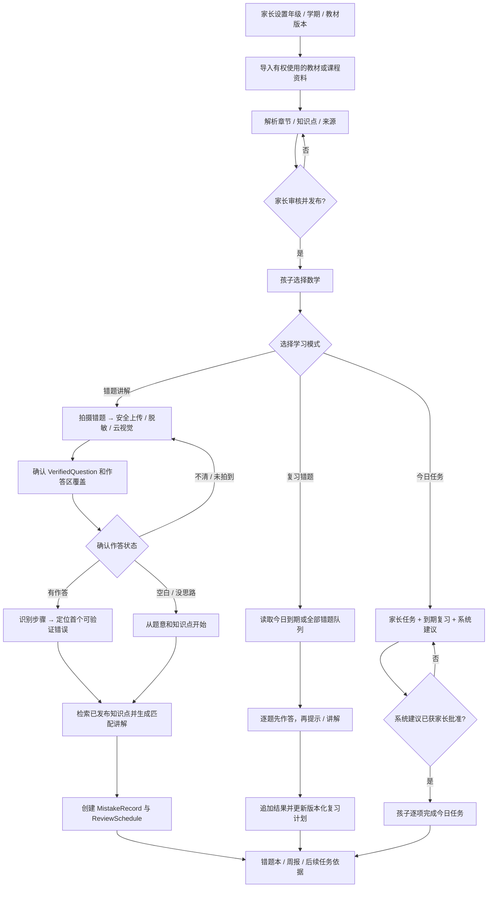

# PRD.md — 家庭 AI 学习助手 P1 MVP

## 文档信息

- PRD ID：`PRD-001`
- 状态：`DRAFT（来源为 v1.0 设计稿，待产品 Owner 审批）`
- Owner：`TBD（项目发起人/家长代表确认）`
- 技术负责人：`TBD`
- 创建/更新：`2026-07-23`
- 关联任务：`TODO-003`（P0 家庭/孩子/设备纵向切片）、`TODO-012` / `PLAN-0007`（账号密码认证）、`TODO-015` / `PLAN-0013` / `ADR-0019（Proposed）`（统一孩子管理与多孩子工作台）、`PLAN-0014` / `PLAN-0016` / `PLAN-0017` / `PLAN-0018` / `ADR-0020`～`ADR-0023` / `TODO-016`～`TODO-020`（教材驱动数学错题学习主线）、`PLAN-0019` / `ADR-0024（Accepted）`（多家庭会话、唯一超级管理员、家长自有孩子与公开教材复用）
- 设计来源：`家庭AI学习助手_架构设计_v1.0.docx`

## 1. 摘要

为小学阶段家庭构建可复用现有设备、可自托管、模型可替换的 AI 学习助手。数学是首个学科，产品以“家庭教材范围 → 错题采集与讲解 → 错题沉淀 → 到期复习 → 今日任务”为主线：家长发布孩子当前学期的教材/知识范围，孩子围绕错题获得有来源、适龄且可校验的详细讲解，再通过逐题复习形成掌握证据；家长通过任务与周报理解进展。

## 2. 问题与证据

### 用户问题

- 孩子使用通用 AI 时容易直接获得答案，缺少逐步思考、错因记录和复习闭环。
- 家长难以把多设备上的任务、练习过程和长期变化组织成可理解的反馈。
- 专用学习机有新增硬件成本、封闭内容/模型和数据控制不足的问题。
- 家庭网络和设备条件不稳定，学习记录不能依赖持续在线。

### 当前证据

- 产品/技术设计明确了四类现有设备、P0/P1/P2 分工、核心领域和发布门槛。
- 家庭已有 iPad mini 6、Windows 笔记本、iPhone 11 和华为 nova 9，可用于真实设备验证。
- 竞品方向参考设计稿列出的好未来公开材料；具体在售型号、价格和能力在正式竞品结论前仍需复核。
- Ubuntu 自用 Compose 运行 API `0.11.0`/迁移 `0028`；已支持多家庭会话作用域、实例唯一超级管理员、家长自有孩子和显式公开教材复用。现有能力包含拍题讲解原子沉淀错题、实际题目复习与 ReviewAttempt、PDF-only 私有原页预览、分批多模态页面理解、整本知识图谱/家长批准、题意相关云端 L1/L2，以及基于全部开放错题与已批准教材练习的来源受限任务规划。真实多家庭/NewAPI/PDF/iPad/浏览器验收仍未完成，不能把本地自动化结果描述成完整产品验收。

## 3. 目标与非目标

### 目标

- 孩子在 iPad 主端独立完成一次数学学习会话，必要时获得 1～3 级渐进提示而不是直接答案。
- 家长通过 Web/手机创建或调整任务，并查看可追溯的周报、错因和复习建议。
- 家长为每个孩子设置年级、学期和教材版本，导入家庭有权使用的一份或多份教材/课程文档；每份教材独立审核、发布、查看和删除，已发布教材共同构成本学期学习范围。同一 Household 的多个孩子上传相同已授权 PDF 时可复用私有原件，但审核、发布、知识图谱、任务和学习事实必须独立。
- 孩子端以“学科 → 数学 → 错题讲解 / 复习错题 / 今日任务”为主导航，一次只进行一种学习模式。
- 错题讲解在题目和孩子作答状态人工确认后，可以提供完整、适龄的解题过程：完整解答可靠匹配当前孩子已批准知识图谱中的具体点时，只使用该点的目标、先修范围和来源页允许的方法并显示教材依据；无匹配时仍提供适龄基础方法的完整解答，但不显示或伪造教材来源、知识点和超前方法。有作答时针对错步，确认空白时从头讲解；随后仅在原子 closeout 已建立错题/复习计划后提示完成并返回学习桌。
- 复习默认按到期错题逐题过关；今日任务可由家长安排或系统依据到期错题/薄弱知识点提出建议，系统建议默认需家长批准。
- 家长通过本地账号密码登录 Web，首次使用必须修改初始化密码，并可为每个孩子创建、禁用或重置独立账号。
- 孩子端在登录前可配置并持久化自托管服务端地址；更换地址不得复用旧服务端会话。
- 单题拍照支持裁切、本地隐私脱敏、用户确认和云端多模态结构化解析；原图不外发，只有不可逆脱敏副本可发送给单一获批 Provider，解析结果必须人工确认。
- 断网时会话、作答和上传队列不丢失，恢复联网后安全、幂等同步。
- AI、Prompt/Policy、延迟、成本和关键结果可审计，模型供应商可替换。
- 家庭可以导出和删除数据，儿童图片采用最短必要保留。
- 家长工作台直接显示到期复习题目；完整学习记录进入独立页面，默认最近 30 个上海自然日并支持选择 180 天窗口内的单日。

### 非目标

- 不做全学段课程、直播课、完整排课、多学校/教师组织架构或海量版权题库。
- 不做整页作业全自动批改或全科 OCR。
- 不提供无限自由聊天、普通任务/复习中未作答的拍题搜答案、公开排名、社交榜单或儿童实时监控。错题讲解模式中，已确认有作答可针对错步完整讲解，已确认空白视为没有思路并允许从头讲解；普通任务/复习仍先作答、再提示。
- P1 不交付 Windows 原生客户端或 Python 游戏化模块。语文按 PLAN-0030 先交付显式学科开关、版本化原创/授权内容、确定性评分和追加写复习事实，不复用数学 Prompt 或把 AI 输出当标准答案；英语排在语文之后，只保留 ADR-0025 的锁定可见、供应商中立、有界口语插件框架，真实 Provider 未获合规批准前不开放。
- 不承诺专用学习机的护眼、手写硬件或商业内容生态能力。
- 单家庭自用阶段不接入短信、邮箱、社交登录、OIDC 或 MFA，也不提供公网自助注册/找回密码。

## 4. 用户与场景

### 当前 Web 交付边界（2026-07-28）

- 家长 Web 以孩子管理、教材上传/知识图谱审核、逐题记录和复习反馈为主，不再展示任务创建、任务推荐、手工小节补充或“今日安排”。既有任务和推荐记录保留，不改变孩子端错题讲解与复习闭环。
- “家庭权限”是仅实例级 `super_admin` 可见和可访问的独立导航。超级管理员可开通“新家庭 + 首个普通家长”，并删除没有所属孩子的普通家长；该删除要求重新验证当前密码，普通家长和孩子无法读取或调用该能力。
- 工作台的待复习区域必须显示具体题干和到期日；“学习记录”是独立导航，默认近 30 天、可按单日筛选，不再把完整逐题详情堆叠在首页。

| 用户角色 | 触发条件 | 期望行为 | 成功结果 |
| --- | --- | --- | --- |
| 小学生 | 开始今日数学任务 | 查看单一当前任务、作答、拍题或请求提示 | 能独立完成会话，过程和结果不因断网丢失 |
| 小学生 | 家长已分配孩子账号 | 用账号密码登录孩子端并在会话失效时重新登录 | 只看到绑定给自己的任务和记录 |
| 小学生 | 脱敏或云端解析置信度不足 | 重新裁剪/手动涂抹敏感区域，或修改题目结构 | 安全确认后继续学习，敏感图片和错误内容不静默外发/入库 |
| 家长/监护人 | 首次打开自用 Web | 使用一次性管理员账号登录并立即修改密码 | 默认密码失效，改密前没有家庭数据暴露 |
| 家长/监护人 | 新增或调整孩子使用权限 | 创建、停用、启用或重置绑定 ChildProfile 的孩子账号 | 每个孩子有独立、可撤销且不能越权的登录身份 |
| 家长/监护人 | 新学期开始或教材发生变化 | 选择孩子/数学/年级/学期/教材版本，导入并审核教材或课程资料 | 发布一份有来源、可版本化且仅本家庭可用的 CurriculumSnapshot |
| 家长/监护人 | 安排本周学习 | 创建/调整任务、教材版本、科目、目标和可用时段 | 任务同步到孩子主端且权限仅限本家庭 |
| 家长/监护人 | 每周复盘 | 查看投入时间、完成率、薄弱点、复习建议和异常 | 能从周报追溯到会话、作答、错因和知识点 |
| 内容维护者 | 家庭导入内容或维护映射 | 管理教材版本、知识点和内容映射 | 不引入未授权内容，不越过家庭空间 |
| 小学生 | 进入数学学习 | 在错题讲解、复习错题和今日任务中选择一种 | 清楚知道当前模式和下一步，不被无关信息打扰 |
| 小学生 | 遇到已经做错或完全没思路的数学题 | 同时拍入题目和答题区，确认“有作答”或“空白”；有作答时校正识别步骤 | 有作答时获得针对错步的讲解，确认空白时获得从题意开始的完整讲解，并进入错题本/复习计划 |
| 小学生 | 有到期错题 | 逐题重新作答，错误时先接受提示再查看讲解 | 每次结果被追加记录，正确晋级、错误重新安排，不靠阅读答案伪装掌握 |

## 5. 用户故事

- 作为孩子，当我不会一道数学题时，我希望先获得问题引导和逐级提示，以便自己完成推理而不是抄答案。
- 作为孩子，当网络中断时，我希望当前任务和作答仍能保存，以便恢复网络后继续而不重做。
- 作为家长，我希望在多个现有设备上使用同一个家庭空间，以便不购买专用硬件也能安排和了解学习。
- 作为家长，我希望用自己的管理员账号登录并管理孩子账号，以便不再共享长期家庭 Token。
- 作为家长，我希望一次创建孩子资料和登录账号，并在同一张孩子卡片管理两者，以便不必理解内部的档案表与账号表。
- 作为有多个孩子的家长，我希望在工作台明确选择当前孩子，以便任务、周报和档案不会混用或永远只显示第一个孩子。
- 作为孩子，我希望用家长分配的账号密码登录自己的学习桌，以便只能看到属于我的任务和记录。
- 作为家长，我希望周报能解释薄弱点依据和异常，以便做出下一周任务调整。
- 作为家长，我希望导入孩子当前教材并确认章节/知识点，以便 AI 的讲解与学校进度和教材方法一致。
- 作为孩子，我希望数学首页只有错题讲解、复习错题和今日任务三个清楚入口，以便快速开始当前目标。
- 作为孩子，当我已经写了解答时，我希望系统看懂照片中的步骤，指出第一个错误并说明怎样改。
- 作为孩子，当答题区确实空白、我完全没思路时，我希望确认后直接从题意、知识点和第一步开始讲解，不被强迫先乱填一个答案。
- 作为孩子，我希望系统按到期顺序让我逐题复习，并在再次答错时重新讲解，以便稳定掌握。
- 作为家长，我希望系统能根据到期错题和薄弱知识点提出今日任务建议，但默认由我确认，以便任务可控且不过量。
- 作为家庭数据管理员，我希望导出和删除孩子数据，以便控制数据生命周期。

## 6. 核心用户流程

离线分支：端侧 SQLite 保存任务、会话、Attempt 和上传队列；重连后使用幂等键和服务端版本合并，失败保留可重试状态并向用户解释。

## 7. 功能需求

| ID | 需求 | 优先级 | 规则/边界 | 验收证据 |
| --- | --- | --- | --- | --- |
| FR-001 | 家庭、家长、孩子档案和设备管理 | Must | 家长管理员拥有家庭空间；产品将孩子资料与登录身份作为一个管理聚合，一次事务创建 ChildProfile 与唯一绑定的孩子 Account，但认证数据与档案数据仍分表隔离；不强制手机号/邮箱；档案含年级、教材版本、科目、目标、可用时段；客户端切换已保存账号后必须重载目标账号档案与显示名，不得复用前一账号内存状态 | 原子创建/幂等/回滚、账号—档案一对一和授权正反向测试；iPad 与 Windows Web 共享孩子档案；客户端 A→B→A 账号切换回归 |
| FR-002 | 每日任务 | Must | 区分家长安排、到期复习和系统建议；系统建议保存错题/知识点/教材来源与原因，默认须家长批准；未来计划在孩子端只读显示最近一项及其计划日，到达计划日后才可开始；未完成的过期任务可补做，不做完整课程排课。当前孩子端入口临时隐藏，重新开放前必须实现直接进入已分配题目的执行流，不得退化为通用拍题 | 来源/审批/去重/每日上限、计划日/补做客户端集成和状态迁移测试 |
| FR-003 | 学习会话和作答 | Must | 会话关联任务；Attempt 追加写，不覆盖历史；孩子完成或跳过题目后必须关闭讲解/确认/拍题中间页并回到学习桌 | 断网、重连、重复提交、并发和完成后返回学习桌测试 |
| FR-004 | 数学单题拍照 | Must | 单题拍照/裁切时引导将题目和孩子答题区一并入镜；App 携带 Session 只向 API 上传，API 有界流式校验后写入内部私有 MinIO；本地 OCR 仅参与敏感标签定位，并结合规则、人脸/二维码检测、元数据清除和实色遮挡生成脱敏副本；用户确认后由单一获批云视觉 Provider 分开输出结构化题目、作答步骤候选和 `worked/blank/unclear/answer_area_missing`，结果再次人工确认；不做整页全自动批改 | 四端权限/裁切/手动涂抹；API 反向越权/流式上限/文件头/尺寸/哈希/断连清理；MinIO `9000` 不暴露；云视觉固定题型、作答状态/区域覆盖、低置信度/Schema/单 Provider/删除测试 |
| FR-005 | 分模式 AI 辅导 | Must | `guided_practice/review` 先作答再给 1～3 级提示；NewAPI 可用时 L1/L2 都必须基于同一已确认题目文字和最小教材片段生成，L1 指出该题独有关系并提一个聚焦问题，L2 引用持久化 L1 并增加方法/第一步脚手架；服务端拒绝无关题型、换词重复和答案泄露，不合格时回退经固定题集验证的题型策略；`mistake_explanation` 仅在 VerifiedQuestion 和作答状态已确认后允许 L3 完整过程：`worked` 针对首个可验证错步，`blank_confirmed` 从题意/知识点开始；`unclear/answer_area_missing` 先重拍或手工确认 | Tutor 模式越权、L2-vs-L1 递进/重复/题意相关性/答案泄露、作答状态误判/修正、Policy/Schema/来源/计算校验和固定 AI eval |
| FR-006 | 可追溯错题本 | Must | MistakeRecord 引用确认题目、首次已确认 AttemptEvidence（作答或空白）、错因/无思路、知识点、讲解版本和状态；创建/重试幂等，支持重新激活、导出和删除 | 作答状态未确认拒绝、空白与未拍入区分、数据追溯、幂等/并发、导出/删除和错误模型输出测试 |
| FR-007 | 家长周报 | Must | 展示投入时间、完成率、薄弱点、复习建议和异常说明；可追溯到源记录 | 周报 E2E、数据对账和人工验收 |
| FR-008 | 离线队列与同步 | Must | SQLite 缓存今日任务/会话/上传；写操作幂等；任务状态按服务端版本合并 | 飞行模式、弱网、重复重试和冲突测试 |
| FR-009 | 数据导出与删除 | Must | 家庭级授权；删除范围和图片保留按批准策略执行 | 导出/删除演练和审计记录 |
| FR-010 | AI/系统审计 | Must | 记录模型、Prompt/Policy、Schema、摘要/指纹、延迟、成本、置信度和结果状态，不记录原始敏感内容 | 结构化日志测试、脱敏测试、成本告警演练 |
| FR-011 | 教材与知识点维护 | Must | 家长按孩子/数学/学年/学期/年级/教材版本上传家庭有权使用且不含个人信息的 PDF；首版 Web/OpenAPI/API 只接受 PDF，Word/PPT/Excel 明确拒绝并提示先转换。PDF 上传不复用手工小节的教材名称：服务端先以文件名标为待识别，再只在封面/前页明确出现数学、年级和册别时本地回填教材名和册别；显式家长名称保持覆盖。服务端私有逐页渲染原页预览，以页图为主、文字层为辅按最多 4 页一批交给单一获批视觉 Provider，再对全部页级结构化观察归纳全书章节、知识点、学习目标、先修关系和带原页视觉说明的练习；空章节和缺失练习引用可安全忽略，缺少非空学习目标的知识点必须丢弃而非补造。加密/损坏/危险/超限 PDF 拒绝或隔离。家长必须查看原页并批准知识图谱，且 CurriculumSnapshot 已发布后，Tutor/任务才能引用 | PDF 扩展名/MIME/文件头/结构/哈希/幂等、非 PDF 双端拒绝、封面标题识别/家长覆盖、页图/文字/扫描页、全书缺页、Schema/伪造页码或练习键、空章节/空练习引用/缺失目标过滤、解析资源/Provider 输入上限、授权和无个人信息声明、Prompt 注入、批准/发布、跨家庭和删除测试 |
| FR-012 | 提醒 | Should | 华为设备不依赖 GMS；通过 HMS 适配器或应用内提醒 | 华为设备回归与降级测试 |
| FR-013 | 自用账号密码认证 | Must | 运行时只保留用户名/密码登录和可撤销会话，无 HMAC/Demo/免登录旁路；空库初始化一次性 `admin/admin123456`，首次登录强制改密且改密前不能访问家庭数据；家长可管理孩子账号；密码 Argon2id 哈希；不接入短信/邮箱/MFA | 初始化/并发/强制改密、登录锁定、Cookie/CSRF、会话撤销、家长/孩子/跨家庭 E2E、旧认证 Header 拒绝 |
| FR-014 | 孩子端服务端地址 | Must | Flutter 在登录表单中先配置完整 HTTP(S) 基础地址；拒绝 user-info、查询、片段和非根路径；地址持久化，变更时清除旧会话 | URL 单测、登录请求目标服务器测试、跨服务端会话清理 Widget/真实设备回归 |
| FR-015 | Capture 服务端流式上传 | Must | 合并申请、对象 PUT 和确认步骤为一个 Session 鉴权 API；服务端分块限制 1–8 MB、校验声明/实际 MIME、JPEG/PNG 文件头、宽高/像素、完整解码和增量 SHA-256，并以 staging/失败补偿流式写入私有 MinIO；OpenAPI/客户端不含 `upload_url` 或对象键 | 最大图片/并发内存、0/超限/慢速/断连/伪造/图片炸弹、幂等重放/冲突、MinIO/数据库部分失败、staging 清理、Compose 端口/配置检查 |
| FR-016 | 多孩子工作台选择 | Must | 家长工作台、教材与任务页提供同一当前孩子选择器；问候、今日任务、当前档案、周报、教材、知识图谱和推荐始终使用同一已授权 `child_id`，家庭孩子总数保持家庭级，设备未绑定孩子前保持家庭级；有效显式选择优先，其次恢复最近选择，再回退到稳定排序的首个孩子 | 两个孩子在工作台/教材页的切换、刷新/删除回退/空状态 E2E；任务、教材和周报服务端过滤；跨家庭、兄弟姐妹和篡改 ID 反向授权测试 |
| FR-017 | 数学学科主页 | Must | 孩子登录后先看到当前可用学科“数学”，数学页只提供错题讲解、复习错题、今日任务三个一级入口；一次只进入一个模式，未实现学科不展示为可用 | Flutter Widget/语义/键盘、横竖屏、三个入口路由、零数据/错误/弱网和实体设备测试 |
| FR-018 | 错题详细讲解 | Must | 拍题安全链路同时提取题目和孩子作答；VerifiedQuestion 及作答状态确认后按已发布知识范围匹配。有作答时讲清首个可验证错步和改法；确认空白时记录“没有思路”并从题意、已知/所求、知识点开始。两者都输出逐步解法、答案校验和变式练习；作答区缺失/不清、低置信、错版、超纲或校验失败阻断 | 端到端错题链路、有作答/真空白/未入镜/不清四类作答状态、人工修正、知识匹配/来源、匹配讲解、校验/阻断和成本 eval |
| FR-019 | 到期错题复习 | Must | 错题讲解 closeout 以已确认题目/作答证据原子创建或复用 MistakeRecord/ReviewSchedule；先展示今日到期，若今天没有到期但存在开放错题则自动进入“可提前复习”的全部错题队列；每题显示实际题目、隐藏历史答案并要求新作答，结果追加为 ReviewAttempt，只有服务端确定性判定可晋级/回退，历史可重新激活 | closeout 原子/唯一/失败文案、历史候选、不批量误判 Capture、到期为空回退全部、队列排序、1/3/7/14/30 天策略、作答证据、时区/并发/幂等/重连、过关/重激活和无答案泄漏测试 |
| FR-020 | 可解释任务建议 | Must | 服务端遍历孩子全部开放错题和最新已发布、已批准知识图谱中的全部知识点/具体练习，本地计算到期状态、错题频次并将错题关联到薄弱知识点；不得从残缺 `CurriculumChunk.text` 规则抽题。只将最多 30 个不透明来源候选交给 NewAPI 规划未来 7 天、最多 5 条且每天最多 3 项的任务。模型只能选择给定来源键，知识点、题目正文、视觉说明、页码和原页入口由服务端回填；保存题量、预计时长、日期、原因和来源，默认由家长批准/忽略。教材原题与错题复习之外的 AI 变种题不得混入本合同，须具备可验证答案/解法、年级/难度边界、来源关联、家长审批和固定 eval 后才可下发 | 全部开放错题/已批准知识点扫描、错题—知识点关联、来源键伪造/重复、具体题/视觉说明/页码/原页、频次/到期依据、审批/忽略、未来日期/每日上限、跨孩子隔离、生成失败回滚和孩子端多任务展示测试 |
| FR-021 | 英语学科与有界口语练习 | Should | 英语排在数学、语文之后；只有打招呼、校园交流、点餐三个 5–8 分钟情景。家长逐孩子启用并选择 `Pre-A1/A1/A2`、确认当前外部语音处理同意；每天最多 10 分钟、单活动会话、单次 8 分钟。真实 Provider 未经合规批准时保持锁定，不提供自由聊天 | 学科路由、家长 Owner/同意/版本、Provider/配额/并发、PCM/权限/弱网/后台、个人信息/成人/危险/自由话题和中英文兜底评测 |
| FR-022 | 家长学习记录与保留 | Must | 工作台列出每道到期错题；独立记录页默认查询最近 30 个上海自然日，可选择 180 天窗口内单日。API 使用带时区 UTC 半开区间，单次最多 31 天/500 条并保持 Household/Child 授权。详细 VerifiedQuestion/TutorTurn 和已结束复习链路保留 180 天；开放错题及其题目不清理，Attempt/AuditEvent/账号/教材不在本策略范围 | 日期/时区/上限/授权、空状态、开放错题保护、幂等批次清理、迁移索引和生命周期日志测试 |
| FR-023 | 语文学科确定性练习 | Must | 家长逐孩子启用语文；内容按年级、技能、任务组、修订和来源版本化，首版覆盖拼音/字词/句子/阅读/背诵/表达的可确定性判分子集。孩子响应不得包含 `AnswerSpec`；选择、排序、规范化文本集合和“回答 + 文中依据”由版本化纯函数评分，Attempt 追加写、Review 独立更新。语文教材必须与数学按 subject 隔离，专用分析 Schema/Prompt 完成前拒绝分析，不得复用数学知识图谱 Prompt | 学科开关/年级过滤/跨家庭与兄弟反向授权、答案不泄漏、评分版本/幂等/并发、导出删除、来源许可、教材跨学科复用拒绝、Flutter 横竖屏/弱网/可访问性测试 |

## 8. 非功能需求

| ID | 类别 | 要求 | 目标/阈值 | 验证方式 |
| --- | --- | --- | --- | --- |
| NFR-001 | 可靠性 | 断网不丢学习记录，重复请求不产生重复副作用 | P1 核心离线/重连 E2E 全通过；具体同步时延 `TBD` | 故障注入、幂等、冲突和恢复测试 |
| NFR-002 | 安全/隐私 | 家庭隔离、Argon2id 密码、可撤销会话、登录限速、Cookie/CSRF、最小采集、Capture 原图不外发、脱敏三层门禁、单 Provider、教材无个人信息声明/页图有界批次、短期图片、导出/删除和日志脱敏 | 明文密码/原始会话、未批准跨家庭访问或 Capture 原图外发为 0；未确认/低置信度脱敏外发为 0；教材 Provider 请求不得含 PDF/对象键/存储 URL/个人批注；详细学习历史固定 180 天，其他正式保留周期仍为 `TBD` | 认证/授权反向测试、凭据扫描、synthetic 脱敏泄漏测试、单题/教材 Provider 请求检查、删除演练、日志扫描 |
| NFR-003 | AI 安全与教学正确性 | 按模式执行“练习/复习先提示；错题讲解有作答就针对错步、确认空白就从头讲”，结构化输出并引用已发布知识范围；作答区缺失/不清、低置信、错版、超纲和确定性校验失败阻断，可追溯可回滚 | 未确认题目/作答状态的完整讲解为 0；未拍入/不清误判空白为 0；教材来源缺失或计算校验失败不得发布；其余固定 eval 阈值 `TBD` | 分模式固定评测集、作答状态分类/人工修正、来源对账、算术/单位验证和版本对比 |
| NFR-004 | 兼容性 | 覆盖 iPad mini 6、Windows Web/PWA、iPhone 11、华为 nova 9 | 四类设备职责内弱网/横竖屏/权限回归全通过 | 真实设备矩阵 |
| NFR-005 | 性能 | 核心交互和 AI 提示有明确预算与降级 | 延迟、吞吐和峰值负载 `TBD（原型基线后确定）` | OpenTelemetry、负载与端到端测量 |
| NFR-006 | 成本 | 模型路由、单次/家庭成本可观测并有上限 | 预算和告警阈值 `TBD（Owner 确认）` | 成本仪表盘和告警演练 |
| NFR-007 | 可访问性 | Web 支持键盘、语义结构和清晰错误恢复；移动端支持平台辅助功能 | 目标标准 `TBD（建议在 P0 决定是否采用 WCAG 2.2 AA）` | 自动检查 + 真实设备人工检查 |
| NFR-008 | 可维护性 | 契约优先、模型可替换、模块化单体、依赖锁定 | SDK 生成后无未提交差异；质量门槛全通过 | 契约差异、静态检查和 CI |

## 9. 数据、接口与权限影响

- 核心实体：Household、Account、AuthSession、ChildProfile、Device、Subject、CurriculumAssignment、LearningMaterial、MaterialIngestionJob、CurriculumSnapshot、KnowledgePoint、KnowledgeEvidence、StudyPlan、TaskRecommendation、Task、StudySession、Attempt、Capture、VerifiedQuestion、TutorTurn、MistakeRecord、ReviewSchedule、MasterySnapshot、WeeklyReport、AuditEvent。
- API 目标前缀：`/auth`、`/children`、`/subjects`、`/curriculum-assignments`、`/materials`、`/curriculum-snapshots`、`/plans`、`/task-recommendations`、`/tasks`、`/sessions`、`/captures`、`/tutor`、`/mistakes`、`/reviews`、`/reports`、`/devices`、`/admin`；精确路径以实施时 OpenAPI 为准。
- `packages/contracts` 作为 OpenAPI 与 AI JSON Schema 的唯一契约源；当前已包含健康和家庭 Profile/Device 合同，SDK 生成器尚未批准。
- 家长管理员对家庭空间和孩子账号拥有管理权；孩子账号/会话只获得绑定 ChildProfile 完成学习所需的最小权限；内容维护和管理操作必须单独授权并审计。
- `Account` 与 `ChildProfile` 保持不同安全生命周期和物理表，但 Web/API 对家长提供单一孩子聚合。创建必须使用一个带幂等键的数据库事务；用户名冲突、密码策略或档案校验失败时不能留下孤立记录。同一 Household 的一个 ChildProfile 最多绑定一个孩子账号；现有重复绑定必须先审计和人工处置，不能静默合并或删除。
- CurriculumSnapshot 是 Tutor、错题和任务建议使用的唯一已发布教材结构；LearningMaterial/解析草稿不是学习事实。材料更新创建新版本，既有 MistakeRecord 保持原版本引用。
- MistakeRecord 必须引用 VerifiedQuestion 和至少一个已确认 AttemptEvidence；证据可为有限结构化作答/步骤，也可为 `blank_confirmed/no_approach`，但不能从答题区缺失或不清推断空白。ReviewSchedule 是可重算派生状态，每次复习 Attempt 保持追加写。TaskRecommendation 与正式 Task 分离，未经批准的建议不能出现在孩子今日任务。
- 拍题图片只允许 App 携带 Session 上传到 API，由 API 有界流式校验并通过内部地址写入私有 MinIO；客户端不持有存储密钥、预签名 URL、对象键或 MinIO 地址，MinIO `9000` 不向宿主/LAN 暴露，本地与 Ubuntu 已按 ADR-0018 切换。Capture 原图默认 24 小时、旧 OCR/后续脱敏处理失败最多 7 天、裁剪题目默认 30 天；家长可保存或立即删除。临时脱敏副本在云端响应后立即删除，失败时最多 24 小时且不可长期保存。Capture 原图、MinIO URL 和对象键不得发给 Provider；教材页派生图仅按 ADR-0023 的无个人信息声明、单 Provider 和有界批次外发，不发送 PDF/对象键/存储 URL。删除孩子档案时级联删除相关图片；备份擦除、云 Provider 条款和真实儿童数据法域仍为 production 前置项。
- P0/P1 尚无旧数据，首个 schema 可直接建立；后续变化必须使用向前兼容迁移并记录回滚/前滚。

## 10. UX 与内容要求

- 孩子端低干扰，一次只展示一个主要学习目标；提示层级明确命名为“看懂题意 → 找到方法 → 完整讲解”，每级只有一个下一步动作，并提供“这一步懂了 / 还需要更具体”。
- iPad 优先横屏；Apple Pencil 可用但不是依赖。手机端不设计为长时间儿童学习入口。
- Windows 首版为响应式 Web/PWA；华为端不能把 GMS 作为核心功能依赖。
- 空状态说明“今天无任务”或“尚无周报”，并提供家长可执行入口；不得用空白页代替。
- 家长 Web 必须提供登录、首次强制改密、退出和孩子账号管理；孩子端只在登录流程提供服务端地址配置，登录后进入账号页完成会话切换、添加账号和注销，不在学习桌重复展示服务端切换。认证错误不得泄露用户名是否存在，改密前页面不得渲染家庭数据。
- 家长 Web 的孩子管理只呈现一个“创建孩子”表单和每个孩子一张聚合卡；姓名、年级、用户名和初始密码在同一流程提交。已有无账号档案显示“未开通登录”，家长账号另区管理，不把内部表结构暴露为两套并列对象。
- 多孩子工作台必须在问候/主要内容上方显示当前孩子选择器。选择改变后，任务、档案和周报一起切换；家庭级计数和尚未建立孩子归属的设备数据要明确标注作用域，不能看起来属于当前孩子。
- 孩子端登录后显示当前可用学科；数学学科页只放“错题讲解、复习错题、今日任务”三个主入口。复习入口显示到期数量，今日任务显示已批准数量；复习题先显示 VerifiedQuestion 和作答区，历史答案/讲解默认隐藏；一次只展开一个学习模式。
- 错题讲解在拍题后用一个低干扰确认页同时展示题目和“识别到作答 / 答题区空白 / 不清 / 未拍到”；脱敏上传期间留在明确的上传进度态，不回到拍题页。确认页提供大尺寸、可上下拖动的多行题目编辑框；孩子可一键确认或修正。有作答时展示可校正步骤，确认空白后直接从头讲解；不清/未拍到时请重拍或手工选择。复习和今日任务默认隐藏答案，先要求作答。所有页面始终标明当前模式。
- 家长教材导入使用上传 → 本地安全解析/私有原页 → 云端多模态分析 → 全书知识图谱草稿 → 家长审核批准 → 发布流程，展示文件来源、版本、全书摘要、章节/知识点、页码原图、视觉依赖和低置信警告；不得把文字层抽取结果标成完整页面，未经批准/发布的内容不得显示为已生效。
- 脱敏、网络、权限、Schema 或模型失败时保留用户进度，提供重新裁剪、手动涂抹、手工录入、校正或稍后重试；不得以失败为由发送原图、静默切换 Provider，或暴露内部堆栈/敏感信息。
- 首版界面与内容语言为简体中文；国际化范围 `TBD（P2 前确认）`。
- 教材、题目和相似题必须记录来源/授权状态；未知版权状态不得进入公共内容库。

## 11. 分析与可观测性

| 事件/指标 | 触发条件 | 最小属性 | 用途 |
| --- | --- | --- | --- |
| `study_session_started/completed` | 会话开始/结束 | household/child 的不可逆标识、task/session、设备类型、离线状态、耗时 | 完成率与设备体验 |
| `attempt_recorded` | 保存作答 | session、knowledge point、attempt 序号、结果状态，不含原始敏感题目 | 学习过程与错因追溯 |
| `material_ingested/curriculum_snapshot_published` | 材料处理或家长发布 | material/snapshot UUID、文件指纹、格式、页数、版本、来源状态、结果/原因，不含原文 | 导入质量、版权/来源和知识版本追溯 |
| `mistake_recorded/explanation_completed` | 错题建档或完整讲解完成 | verified question/mistake、错误类型枚举、knowledge/snapshot、Policy/Schema、校验/阻断状态，不含题目/答案原文 | 错因、讲解正确性和来源追溯 |
| `review_attempted` | 完成一道复习 | mistake/review、原阶段/新阶段、结果、policy version、due time，不含答案原文 | 复习效果、幂等和调度回归 |
| `task_recommended/approved/rejected` | 生成或处理建议 | child、来源类型、错题/知识点不可逆标识、策略版本、结果/原因 | 推荐质量、家长控制和任务可解释性 |
| `capture_sanitized/image_analysis_completed` | 本地脱敏或云视觉结构化完成 | sanitizer/rule/schema、检测类型枚举/数量、用户确认、脱敏副本指纹/删除状态；provider/model、置信度、校正状态、延迟/token/成本、结果状态 | 脱敏漏检/误遮挡、云视觉质量、人工成本与外发审计；不含图片/敏感 OCR 文本/完整题目 |
| `tutor_hint_served` | 返回提示 | model、Prompt/Policy/Schema 版本、提示级别、延迟、token/成本、结果状态 | AI 质量、安全和成本 |
| `offline_sync_completed/failed` | 同步批次结束 | 设备、队列长度、成功/冲突/失败数、重试次数 | 离线可靠性 |
| `weekly_report_generated` | 周报生成 | 时间窗口、记录数、异常数、生成版本 | 周报完整性与可追溯性 |
| `data_exported/deletion_requested/completed` | 数据生命周期操作 | actor、scope、状态、审计关联；不含导出内容 | 合规与操作审计 |

事件字段以 `SECURITY.md` 的脱敏和保留规则为准。

## 12. 发布方案

- 发布方式：分阶段。P0 先内部验证家庭/孩子/设备和共享契约；P1 先限定单一家庭/测试用户，再根据质量门槛扩大。
- 功能开关：材料导入/发布、模型 Provider、错题完整讲解、复习调度、任务建议、拍题、周报和通知应能独立关闭或降级；具体开关方案由对应实施任务确定。
- 回滚触发：跨家庭越权、学习记录丢失/覆盖、AI 安全阻断失败、删除流程失败、错误率/成本超出批准阈值。
- 回滚方式：回退版本或关闭相关开关；数据库优先向前修复，只有经过验证且无数据损失时才回滚迁移。
- 运营准备：家长须能理解 AI 局限、图片保留、数据导出/删除和离线状态；帮助内容与联系渠道 `TBD`。

## 13. 验收标准

- [ ] P0：iPad 与 Windows Web 使用同一 OpenAPI 契约共享孩子档案。
- [ ] P0：Web 一次事务创建孩子档案与唯一登录账号，页面不再要求先建档案再绑定账号；失败或幂等重放不产生孤立/重复记录。
- [ ] P0：拥有两个孩子时，家长可选择当前孩子，首页问候、任务、档案和周报始终同属所选孩子，刷新与删除当前孩子后的回退行为明确。
- [ ] P1：孩子可完整完成任务、作答、分步提示和错题沉淀，家长可查看可追溯周报。
- [ ] P1：家长可为每个孩子设置不同教材范围，导入 synthetic 教材、审核并发布章节/知识点；未发布、错版或跨家庭内容不能被 Tutor/任务引用。
- [ ] P1：孩子数学页包含错题讲解、复习错题、今日任务三个入口；一道错题从安全拍摄题目+答题区、题目/作答状态确认、匹配分支完整讲解到 MistakeRecord/ReviewSchedule 全链路可完成。
- [ ] P1：错题讲解成功后原子进入错题本；到期复习展示实际题目并逐题先作答，每次产生 ReviewAttempt，正确/错误由服务端按版本化确定性 Policy 更新且不覆盖历史；今日任务区分家长安排、到期复习和经批准的系统建议。
- [ ] P1：Web/OpenAPI/API 只接受 PDF 教材；文字页和扫描/图形页均保留私有原页，按有界批次完成多模态分析并归纳整本知识图谱，Word/PPT/Excel 明确拒绝；家长可对照原页批准知识图谱，Tutor/推荐只能消费当前孩子已发布且已批准的最小知识片段。
- [ ] P1：同一道题的 L2 必须引用 L1 并增加可观察的方法脚手架；worked/blank/review 固定题集上 L1/L2 不泄露答案且不换词重复。
- [ ] P1：没有今日到期项但仍有开放错题时，孩子可立即进入“提前复习”，看到实际题目并提交新的 ReviewAttempt。
- [ ] P1：任务推荐同时使用全部开放错题和已批准教材知识图谱；高频薄弱点、具体教材题、视觉说明、页码/原页、计划日期和预计时长可追溯，模型伪造来源或忽略可用错题/教材时拒绝整个计划。
- [ ] P1：四类设备完成职责内的弱网、横竖屏、相机/存储权限和错误恢复回归。
- [ ] 断网期间会话、Attempt 和上传队列不丢失；重连后的重复提交和冲突不会覆盖学习历史。
- [ ] Tutor Policy、固定 JSON Schema、低置信度校正、练习/复习直接代答阻断、错题完整讲解门禁和成本上限通过固定评测。
- [ ] 家庭权限正反向测试、图片保留、数据导出/删除和审计演练均有记录。
- [ ] 契约测试、迁移回滚/前滚、成本告警、备份恢复和核心 E2E 全部通过。

## 14. 开放问题与决策

| 项目 | Owner | 截止条件 | 状态/结论 |
| --- | --- | --- | --- |
| 项目 Owner、技术负责人和仓库远程地址 | 项目发起人 | 首个 P0 任务开始前 | `TBD`；影响审批、责任和协作 |
| 开源许可证是否采用设计建议的 Apache-2.0 | 项目 Owner | 首次公开仓库前 | `TBD`；需 ADR/法律确认 |
| Flutter/Node/Next.js/数据库等精确版本与锁定方式 | 技术负责人 | P0 脚手架合并前 | `TBD`；需 ADR 或工具链决策 |
| 儿童数据适用法域、图片/日志/备份保留周期 | 安全/法务 Owner | 任何真实儿童数据进入系统前 | `TBD`；生产阻塞项 |
| 云视觉/Tutor 供应商、数据条款、区域、预算、阻断阈值和降级模型 | 产品 + 技术 + 安全/法务 Owner | 任何真实脱敏图片外发或 P1 Tutor 实现前 | `TBD`；ADR-0015 只批准职责/数据流，不批准具体 Provider 或真实数据 |
| 性能 SLO、RPO/RTO 和支持渠道 | 技术/运维 Owner | staging 建立前 | `TBD`；需基线测量 |
| 首轮家庭试用的成功标准和反馈方式 | 产品 Owner | P1 Beta 前 | `TBD`；用于验证产品假设 |
| ADR-0021/0023 的 PDF 解析、多模态 Provider、资源和成本上限 | 技术 + 安全 Owner | PLAN-0018 M7 前 | `DECIDED`：首版只支持 PDF，文字层只作辅助，文字/扫描/图形页均保留私有原页并有界多模态分析；精确大小、页数、对象展开量、单图/批次/整本输入和成本阈值由 synthetic/真实受控教材验收批准 |
| ReviewPolicy v2 间隔与过关门槛 | 产品 Owner | PLAN-0016 M2 前 | `ASSUMPTION`：以 1/3/7/14/30 天作为 synthetic 基线，只有服务端验证的 ReviewAttempt 可晋级；家庭试用后确认最终过关门槛 |

## 15. 当前开发完成后的优化候选

> 来源：项目 Owner 于 2026-07-14 提供的产品设想。2026-07-18，Owner 进一步批准 ADR-0020/PLAN-0014，将教材导入、详细错题讲解、错题复习和任务建议提升为数学首科产品主线；2026-07-23 根据真实教材反馈再以 ADR-0023/PLAN-0018 将纯文字页级解析替换为原页多模态知识图谱。本地实现已收口，Ubuntu/真实 Provider/PDF/设备仍待验收。多题分割、视频和其他项目继续按下表边界后置。

| 候选 ID | 优化方向 | Owner 设想 | 与当前基线的关系 | 进入实施前必须确认 |
| --- | --- | --- | --- | --- |
| OPT-001 | 教材/课程文档生成任务 | 后台录入本学期教材和课程文档，系统据此生成对应学习任务 | 已提升为 FR-011/FR-020、ADR-0020/0022/0023、PLAN-0016/0017/0018、TODO-016/019；本地已实现原页多模态知识图谱与来源受限规划，真实部署/质量待验收 | 解析资源上限、章节/知识点审核质量、教材页图 Provider 数据条款、版权来源、版本更新、成本观测和错误回滚 |
| OPT-002 | 多题画面分割 | 拍摄时允许一张图片包含多道题，由模型检测题目区域后让用户选择/确认 | 单题脱敏副本的云视觉解析已由 ADR-0015 接受；“一次多题、整页分割”仍超出 P1 单题边界 | 多题脱敏范围、题目分割 Schema、人工选题/纠正、成本/延迟、整页隐私风险和 ADR-0015 增量评审 |
| OPT-003 | 答错后的完整讲解 | 孩子答错后优先提供视频讲解；没有合适视频时提供详细解题过程 | 详细文字/图示过程已提升为 FR-005/FR-018、ADR-0020、TODO-017；视频仍后置 | 视频来源/版权/年龄适配、题目匹配、字幕/可访问性、成本；详细解法需来源/计算校验和固定 eval |
| OPT-004 | 完成任务后的即时家长提醒 | 孩子完成任务后立即通知家长 | 扩展 FR-012；这是事件型提醒，不等同于儿童实时监控 | 家长订阅/免打扰、多个孩子的消息归属、去重、失败重试、HMS/iOS/应用内降级、通知内容最小化 |
| OPT-005 | Tutor 仅使用云端模型 | 当前家庭硬件不足以承载本地 Tutor 模型，Tutor 使用云端模型 | 与 Provider Adapter 兼容；ADR-0015 已把云视觉图片解析与 Tutor 明确拆为两次调用，选择视觉 Provider 不等于自动批准 Tutor Provider/模型 | Tutor Provider、模型、数据条款、预算、超时/重试、内容安全、可用性降级和 ADR-0004 的实现参数 |
| OPT-006 | 在线优先、不提供离线体验 | 主要能力依赖网络，后续不把完整离线作为产品目标 | 与 FR-008、ADR-0003、现有待同步队列和项目不变量冲突；当前实现保持不变 | 新 ADR 的替代关系、已实现离线代码的保留/迁移/删除策略、断网错误体验、未提交作答保护和兼容回滚 |
| OPT-007 | 一个家庭支持多个孩子 | 家长可在同一 Household 下管理多个孩子 | `GET /children` 和合成仓储已允许多个 ChildProfile，但真实持久化、孩子切换、任务/通知/周报隔离尚未完成 | 数量上限、家长权限、设备与孩子绑定/切换、每孩子教材/计划、通知归属、删除和跨孩子数据隔离测试 |

Owner 的第 4 条原始输入为“可以先略过”，没有形成独立需求，因此不创建候选或任务。上述候选统一排在当前 P1 开发序列之后；记录它们不代表已批准范围、已接受架构决策或已交付能力。
