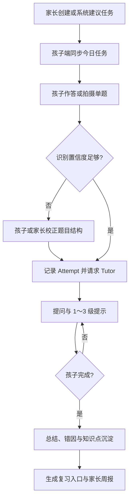

# PRD.md — 家庭 AI 学习助手 P1 MVP

## 文档信息

- PRD ID：`PRD-001`
- 状态：`DRAFT（来源为 v1.0 设计稿，待产品 Owner 审批）`
- Owner：`TBD（项目发起人/家长代表确认）`
- 技术负责人：`TBD`
- 创建/更新：`2026-07-12`
- 关联任务：`TODO-003`（P0 家庭/孩子/设备纵向切片）；P1 业务实施任务尚未创建
- 设计来源：`家庭AI学习助手_架构设计_v1.0.docx`

## 1. 摘要

为小学阶段家庭构建可复用现有设备、可自托管、模型可替换的 AI 学习助手。P1 先服务数学作业与日常复习，让孩子能够独立完成一次“任务 → 作答 → 分步提示 → 错题沉淀”的学习会话，并让家长在一周后通过可追溯周报看懂投入、完成率和薄弱点。

## 2. 问题与证据

### 用户问题

- 孩子使用通用 AI 时容易直接获得答案，缺少逐步思考、错因记录和复习闭环。
- 家长难以把多设备上的任务、练习过程和长期变化组织成可理解的反馈。
- 专用学习机有新增硬件成本、封闭内容/模型和数据控制不足的问题。
- 家庭网络和设备条件不稳定，学习记录不能依赖持续在线。

### 当前证据

- 产品/技术设计明确了四类现有设备、P0/P1/P2 分工、核心领域和发布门槛。
- 家庭已有 iPad mini 6、Windows 笔记本、iPhone 11 和华为 nova 9，可用于真实设备验证。
- 竞品方向参考设计稿列出的好未来公开材料；具体在售型号、价格和能力在正式竞品结论前仍需复核。
- 尚无用户研究样本、可运行原型或行为数据。MVP 的产品假设需通过家庭试用验证，不能把设计稿当作已验证需求。

## 3. 目标与非目标

### 目标

- 孩子在 iPad 主端独立完成一次数学学习会话，必要时获得 1～3 级渐进提示而不是直接答案。
- 家长通过 Web/手机创建或调整任务，并查看可追溯的周报、错因和复习建议。
- 单题拍照支持裁切、本地 OCR、结构化和低置信度人工校正；默认不向外部服务发送图片。
- 断网时会话、作答和上传队列不丢失，恢复联网后安全、幂等同步。
- AI、Prompt/Policy、延迟、成本和关键结果可审计，模型供应商可替换。
- 家庭可以导出和删除数据，儿童图片采用最短必要保留。

### 非目标

- 不做全学段课程、直播课、完整排课、多学校/教师组织架构或海量版权题库。
- 不做整页作业全自动批改或全科 OCR。
- 不提供无限自由聊天、直接代写答案、公开排名、社交榜单或儿童实时监控。
- P1 不交付 Windows 原生客户端、语文/英语插件、语音或 Python 游戏化模块。
- 不承诺专用学习机的护眼、手写硬件或商业内容生态能力。

## 4. 用户与场景

| 用户角色 | 触发条件 | 期望行为 | 成功结果 |
| --- | --- | --- | --- |
| 小学生 | 开始今日数学任务 | 查看单一当前任务、作答、拍题或请求提示 | 能独立完成会话，过程和结果不因断网丢失 |
| 小学生 | OCR 或 AI 置信度不足 | 看见清晰的校正提示并修改题目结构 | 校正后继续学习，错误内容不静默入库 |
| 家长/监护人 | 安排本周学习 | 创建/调整任务、教材版本、科目、目标和可用时段 | 任务同步到孩子主端且权限仅限本家庭 |
| 家长/监护人 | 每周复盘 | 查看投入时间、完成率、薄弱点、复习建议和异常 | 能从周报追溯到会话、作答、错因和知识点 |
| 内容维护者 | 家庭导入内容或维护映射 | 管理教材版本、知识点和内容映射 | 不引入未授权内容，不越过家庭空间 |

## 5. 用户故事

- 作为孩子，当我不会一道数学题时，我希望先获得问题引导和逐级提示，以便自己完成推理而不是抄答案。
- 作为孩子，当网络中断时，我希望当前任务和作答仍能保存，以便恢复网络后继续而不重做。
- 作为家长，我希望在多个现有设备上使用同一个家庭空间，以便不购买专用硬件也能安排和了解学习。
- 作为家长，我希望周报能解释薄弱点依据和异常，以便做出下一周任务调整。
- 作为家庭数据管理员，我希望导出和删除孩子数据，以便控制数据生命周期。

## 6. 核心用户流程

离线分支：端侧 SQLite 保存任务、会话、Attempt 和上传队列；重连后使用幂等键和服务端版本合并，失败保留可重试状态并向用户解释。

## 7. 功能需求

| ID | 需求 | 优先级 | 规则/边界 | 验收证据 |
| --- | --- | --- | --- | --- |
| FR-001 | 家庭、家长、孩子档案和设备管理 | Must | 家长拥有家庭空间；孩子使用 PIN/设备令牌，不强制手机号；档案含年级、教材版本、科目、目标、可用时段 | 授权正反向测试；iPad 与 Windows Web 共享孩子档案 |
| FR-002 | 每日任务 | Must | 家长创建 + 系统建议；支持完成、跳过、补做；不做完整课程排课 | API/客户端集成测试；状态迁移测试 |
| FR-003 | 学习会话和作答 | Must | 会话关联任务；Attempt 追加写，不覆盖历史 | 断网、重连、重复提交和并发测试 |
| FR-004 | 数学单题拍照 | Must | 单题拍照、裁切、OCR、结构化和人工校正；不做整页全自动批改 | 四端权限测试；固定题型集；低置信度校正测试 |
| FR-005 | AI 分步提示 | Must | 识别已知条件 → 提问 → 1～3 级提示 → 总结；固定 JSON Schema；禁止直接代写 | Tutor Policy 单元测试、Schema 契约测试、AI eval |
| FR-006 | 自动错题本 | Must | 保存错因标签、知识点和复习入口；模型答案不能直接成为标准答案 | 数据追溯测试；错误模型输出测试 |
| FR-007 | 家长周报 | Must | 展示投入时间、完成率、薄弱点、复习建议和异常说明；可追溯到源记录 | 周报 E2E、数据对账和人工验收 |
| FR-008 | 离线队列与同步 | Must | SQLite 缓存今日任务/会话/上传；写操作幂等；任务状态按服务端版本合并 | 飞行模式、弱网、重复重试和冲突测试 |
| FR-009 | 数据导出与删除 | Must | 家庭级授权；删除范围和图片保留按批准策略执行 | 导出/删除演练和审计记录 |
| FR-010 | AI/系统审计 | Must | 记录模型、Prompt/Policy、Schema、摘要/指纹、延迟、成本、置信度和结果状态，不记录原始敏感内容 | 结构化日志测试、脱敏测试、成本告警演练 |
| FR-011 | 内容与知识点维护 | Should | 支持家庭导入、教材版本与知识点映射；禁止未授权内容进入仓库或公共服务 | 授权与内容来源检查 |
| FR-012 | 提醒 | Should | 华为设备不依赖 GMS；通过 HMS 适配器或应用内提醒 | 华为设备回归与降级测试 |

## 8. 非功能需求

| ID | 类别 | 要求 | 目标/阈值 | 验证方式 |
| --- | --- | --- | --- | --- |
| NFR-001 | 可靠性 | 断网不丢学习记录，重复请求不产生重复副作用 | P1 核心离线/重连 E2E 全通过；具体同步时延 `TBD` | 故障注入、幂等、冲突和恢复测试 |
| NFR-002 | 安全/隐私 | 家庭隔离、最小采集、短期图片、导出/删除、日志脱敏 | 未批准的跨家庭访问为 0；正式保留周期 `TBD` | 授权反向测试、删除演练、日志扫描 |
| NFR-003 | AI 安全 | 先提示后讲解，结构化输出，低置信度校正，可追溯可回滚 | 固定 eval 的阻断阈值 `TBD（P0/P1 基线后批准）` | 固定评测集和版本对比 |
| NFR-004 | 兼容性 | 覆盖 iPad mini 6、Windows Web/PWA、iPhone 11、华为 nova 9 | 四类设备职责内弱网/横竖屏/权限回归全通过 | 真实设备矩阵 |
| NFR-005 | 性能 | 核心交互和 AI 提示有明确预算与降级 | 延迟、吞吐和峰值负载 `TBD（原型基线后确定）` | OpenTelemetry、负载与端到端测量 |
| NFR-006 | 成本 | 模型路由、单次/家庭成本可观测并有上限 | 预算和告警阈值 `TBD（Owner 确认）` | 成本仪表盘和告警演练 |
| NFR-007 | 可访问性 | Web 支持键盘、语义结构和清晰错误恢复；移动端支持平台辅助功能 | 目标标准 `TBD（建议在 P0 决定是否采用 WCAG 2.2 AA）` | 自动检查 + 真实设备人工检查 |
| NFR-008 | 可维护性 | 契约优先、模型可替换、模块化单体、依赖锁定 | SDK 生成后无未提交差异；质量门槛全通过 | 契约差异、静态检查和 CI |

## 9. 数据、接口与权限影响

- 核心实体：Household、User、ChildProfile、Device、Subject、KnowledgePoint、StudyPlan、Task、StudySession、Attempt、Capture、TutorTurn、MistakeRecord、ReviewSchedule、MasterySnapshot、WeeklyReport、AuditEvent。
- API 目标前缀：`/auth`、`/children`、`/plans`、`/tasks`、`/sessions`、`/captures`、`/tutor/hints`、`/mistakes`、`/reviews`、`/reports`、`/content`、`/devices`、`/admin`。
- `packages/contracts` 作为 OpenAPI 与 AI JSON Schema 的唯一契约源；当前已包含健康和家庭 Profile/Device 合同，SDK 生成器尚未批准。
- 家长对家庭空间拥有管理权；孩子设备令牌只获得完成学习所需的最小权限；内容维护和管理操作必须单独授权并审计。
- 图片通过私有本地 MinIO 的短期签名 URL 上传；客户端不持有存储密钥。原图默认 24 小时、OCR 失败最多 7 天、裁剪题目默认 30 天；家长可保存或立即删除，删除孩子档案时级联删除相关图片。备份擦除和真实儿童数据法域仍为 production 前置项。
- P0/P1 尚无旧数据，首个 schema 可直接建立；后续变化必须使用向前兼容迁移并记录回滚/前滚。

## 10. UX 与内容要求

- 孩子端低干扰，一次只展示一个主要学习目标；提示层级和“继续思考/再给提示”选择清晰。
- iPad 优先横屏；Apple Pencil 可用但不是依赖。手机端不设计为长时间儿童学习入口。
- Windows 首版为响应式 Web/PWA；华为端不能把 GMS 作为核心功能依赖。
- 空状态说明“今天无任务”或“尚无周报”，并提供家长可执行入口；不得用空白页代替。
- OCR、网络、权限、Schema 或模型失败时保留用户进度，提供重试/校正/稍后同步，不暴露内部堆栈或敏感信息。
- 首版界面与内容语言为简体中文；国际化范围 `TBD（P2 前确认）`。
- 教材、题目和相似题必须记录来源/授权状态；未知版权状态不得进入公共内容库。

## 11. 分析与可观测性

| 事件/指标 | 触发条件 | 最小属性 | 用途 |
| --- | --- | --- | --- |
| `study_session_started/completed` | 会话开始/结束 | household/child 的不可逆标识、task/session、设备类型、离线状态、耗时 | 完成率与设备体验 |
| `attempt_recorded` | 保存作答 | session、knowledge point、attempt 序号、结果状态，不含原始敏感题目 | 学习过程与错因追溯 |
| `capture_processed` | OCR/结构化完成 | provider/model、置信度、校正状态、延迟、结果状态 | OCR 质量与人工成本 |
| `tutor_hint_served` | 返回提示 | model、Prompt/Policy/Schema 版本、提示级别、延迟、token/成本、结果状态 | AI 质量、安全和成本 |
| `offline_sync_completed/failed` | 同步批次结束 | 设备、队列长度、成功/冲突/失败数、重试次数 | 离线可靠性 |
| `weekly_report_generated` | 周报生成 | 时间窗口、记录数、异常数、生成版本 | 周报完整性与可追溯性 |
| `data_exported/deletion_requested/completed` | 数据生命周期操作 | actor、scope、状态、审计关联；不含导出内容 | 合规与操作审计 |

事件字段以 `SECURITY.md` 的脱敏和保留规则为准。

## 12. 发布方案

- 发布方式：分阶段。P0 先内部验证家庭/孩子/设备和共享契约；P1 先限定单一家庭/测试用户，再根据质量门槛扩大。
- 功能开关：模型 Provider、Tutor Policy 版本、拍题、周报和通知应能独立关闭或降级；具体开关方案 `TBD（实现任务确定）`。
- 回滚触发：跨家庭越权、学习记录丢失/覆盖、AI 安全阻断失败、删除流程失败、错误率/成本超出批准阈值。
- 回滚方式：回退版本或关闭相关开关；数据库优先向前修复，只有经过验证且无数据损失时才回滚迁移。
- 运营准备：家长须能理解 AI 局限、图片保留、数据导出/删除和离线状态；帮助内容与联系渠道 `TBD`。

## 13. 验收标准

- [ ] P0：iPad 与 Windows Web 使用同一 OpenAPI 契约共享孩子档案。
- [ ] P1：孩子可完整完成任务、作答、分步提示和错题沉淀，家长可查看可追溯周报。
- [ ] P1：四类设备完成职责内的弱网、横竖屏、相机/存储权限和错误恢复回归。
- [ ] 断网期间会话、Attempt 和上传队列不丢失；重连后的重复提交和冲突不会覆盖学习历史。
- [ ] Tutor Policy、固定 JSON Schema、低置信度校正、直接代答阻断和成本上限通过固定评测。
- [ ] 家庭权限正反向测试、图片保留、数据导出/删除和审计演练均有记录。
- [ ] 契约测试、迁移回滚/前滚、成本告警、备份恢复和核心 E2E 全部通过。

## 14. 开放问题与决策

| 项目 | Owner | 截止条件 | 状态/结论 |
| --- | --- | --- | --- |
| 项目 Owner、技术负责人和仓库远程地址 | 项目发起人 | 首个 P0 任务开始前 | `TBD`；影响审批、责任和协作 |
| 开源许可证是否采用设计建议的 Apache-2.0 | 项目 Owner | 首次公开仓库前 | `TBD`；需 ADR/法律确认 |
| Flutter/Node/Next.js/数据库等精确版本与锁定方式 | 技术负责人 | P0 脚手架合并前 | `TBD`；需 ADR 或工具链决策 |
| 儿童数据适用法域、图片/日志/备份保留周期 | 安全/法务 Owner | 任何真实儿童数据进入系统前 | `TBD`；生产阻塞项 |
| AI 供应商、预算、阻断阈值和降级模型 | 产品 + 技术 Owner | P1 Tutor 实现前 | `TBD`；影响成本与安全 |
| 性能 SLO、RPO/RTO 和支持渠道 | 技术/运维 Owner | staging 建立前 | `TBD`；需基线测量 |
| 首轮家庭试用的成功标准和反馈方式 | 产品 Owner | P1 Beta 前 | `TBD`；用于验证产品假设 |
