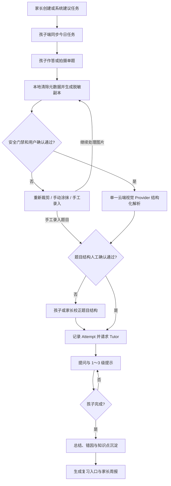

# PRD.md — 家庭 AI 学习助手 P1 MVP

## 文档信息

- PRD ID：`PRD-001`
- 状态：`DRAFT（来源为 v1.0 设计稿，待产品 Owner 审批）`
- Owner：`TBD（项目发起人/家长代表确认）`
- 技术负责人：`TBD`
- 创建/更新：`2026-07-15`
- 关联任务：`TODO-003`（P0 家庭/孩子/设备纵向切片）、`TODO-012` / `PLAN-0007`（账号密码认证，代码实现进行环境验收）；P1 其他业务实施任务尚未创建
- 设计来源：`家庭AI学习助手_架构设计_v1.0.docx`

## 1. 摘要

为小学阶段家庭构建可复用现有设备、可自托管、模型可替换的 AI 学习助手。P1 先服务数学作业与日常复习，让孩子能够独立完成一次“任务 → 作答 → 分步提示 → 错题沉淀”的学习会话，并让家长在一周后通过可追溯周报看懂投入、完成率和薄弱点。

## 2. 问题与证据

### 用户问题

- 孩子使用通用 AI 时容易直接获得答案，缺少逐步思考、错因记录和复习闭环。
- 家长难以把多设备上的任务、练习过程和长期变化组织成可理解的反馈。
- 专用学习机有新增硬件成本、封闭内容/模型和数据控制不足的问题。
- 家庭网络和设备条件不稳定，学习记录不能依赖持续在线。

### 当前证据

- 产品/技术设计明确了四类现有设备、P0/P1/P2 分工、核心领域和发布门槛。
- 家庭已有 iPad mini 6、Windows 笔记本、iPhone 11 和华为 nova 9，可用于真实设备验证。
- 竞品方向参考设计稿列出的好未来公开材料；具体在售型号、价格和能力在正式竞品结论前仍需复核。
- 尚无用户研究样本、可运行原型或行为数据。MVP 的产品假设需通过家庭试用验证，不能把设计稿当作已验证需求。

## 3. 目标与非目标

### 目标

- 孩子在 iPad 主端独立完成一次数学学习会话，必要时获得 1～3 级渐进提示而不是直接答案。
- 家长通过 Web/手机创建或调整任务，并查看可追溯的周报、错因和复习建议。
- 家长通过本地账号密码登录 Web，首次使用必须修改初始化密码，并可为每个孩子创建、禁用或重置独立账号。
- 孩子端在登录前可配置并持久化自托管服务端地址；更换地址不得复用旧服务端会话。
- 单题拍照支持裁切、本地隐私脱敏、用户确认和云端多模态结构化解析；原图不外发，只有不可逆脱敏副本可发送给单一获批 Provider，解析结果必须人工确认。
- 断网时会话、作答和上传队列不丢失，恢复联网后安全、幂等同步。
- AI、Prompt/Policy、延迟、成本和关键结果可审计，模型供应商可替换。
- 家庭可以导出和删除数据，儿童图片采用最短必要保留。

### 非目标

- 不做全学段课程、直播课、完整排课、多学校/教师组织架构或海量版权题库。
- 不做整页作业全自动批改或全科 OCR。
- 不提供无限自由聊天、直接代写答案、公开排名、社交榜单或儿童实时监控。
- P1 不交付 Windows 原生客户端、语文/英语插件、语音或 Python 游戏化模块。
- 不承诺专用学习机的护眼、手写硬件或商业内容生态能力。
- 单家庭自用阶段不接入短信、邮箱、社交登录、OIDC 或 MFA，也不提供公网自助注册/找回密码。

## 4. 用户与场景

| 用户角色 | 触发条件 | 期望行为 | 成功结果 |
| --- | --- | --- | --- |
| 小学生 | 开始今日数学任务 | 查看单一当前任务、作答、拍题或请求提示 | 能独立完成会话，过程和结果不因断网丢失 |
| 小学生 | 家长已分配孩子账号 | 用账号密码登录孩子端并在会话失效时重新登录 | 只看到绑定给自己的任务和记录 |
| 小学生 | 脱敏或云端解析置信度不足 | 重新裁剪/手动涂抹敏感区域，或修改题目结构 | 安全确认后继续学习，敏感图片和错误内容不静默外发/入库 |
| 家长/监护人 | 首次打开自用 Web | 使用一次性管理员账号登录并立即修改密码 | 默认密码失效，改密前没有家庭数据暴露 |
| 家长/监护人 | 新增或调整孩子使用权限 | 创建、停用、启用或重置绑定 ChildProfile 的孩子账号 | 每个孩子有独立、可撤销且不能越权的登录身份 |
| 家长/监护人 | 安排本周学习 | 创建/调整任务、教材版本、科目、目标和可用时段 | 任务同步到孩子主端且权限仅限本家庭 |
| 家长/监护人 | 每周复盘 | 查看投入时间、完成率、薄弱点、复习建议和异常 | 能从周报追溯到会话、作答、错因和知识点 |
| 内容维护者 | 家庭导入内容或维护映射 | 管理教材版本、知识点和内容映射 | 不引入未授权内容，不越过家庭空间 |

## 5. 用户故事

- 作为孩子，当我不会一道数学题时，我希望先获得问题引导和逐级提示，以便自己完成推理而不是抄答案。
- 作为孩子，当网络中断时，我希望当前任务和作答仍能保存，以便恢复网络后继续而不重做。
- 作为家长，我希望在多个现有设备上使用同一个家庭空间，以便不购买专用硬件也能安排和了解学习。
- 作为家长，我希望用自己的管理员账号登录并管理孩子账号，以便不再共享长期家庭 Token。
- 作为孩子，我希望用家长分配的账号密码登录自己的学习桌，以便只能看到属于我的任务和记录。
- 作为家长，我希望周报能解释薄弱点依据和异常，以便做出下一周任务调整。
- 作为家庭数据管理员，我希望导出和删除孩子数据，以便控制数据生命周期。

## 6. 核心用户流程

离线分支：端侧 SQLite 保存任务、会话、Attempt 和上传队列；重连后使用幂等键和服务端版本合并，失败保留可重试状态并向用户解释。

## 7. 功能需求

| ID | 需求 | 优先级 | 规则/边界 | 验收证据 |
| --- | --- | --- | --- | --- |
| FR-001 | 家庭、家长、孩子档案和设备管理 | Must | 家长管理员拥有家庭空间；孩子账号绑定一个 ChildProfile，不强制手机号/邮箱；档案含年级、教材版本、科目、目标、可用时段 | 授权正反向测试；iPad 与 Windows Web 共享孩子档案 |
| FR-002 | 每日任务 | Must | 家长创建 + 系统建议；支持完成、跳过、补做；不做完整课程排课 | API/客户端集成测试；状态迁移测试 |
| FR-003 | 学习会话和作答 | Must | 会话关联任务；Attempt 追加写，不覆盖历史 | 断网、重连、重复提交和并发测试 |
| FR-004 | 数学单题拍照 | Must | 单题拍照/裁切；本地 OCR 仅参与敏感标签定位，并结合规则、人脸/二维码检测、元数据清除和实色遮挡生成脱敏副本；用户确认后由单一获批云视觉 Provider 输出结构化题目，结果再次人工确认；不做整页全自动批改 | 四端权限/裁切/手动涂抹测试；脱敏漏检/误遮挡固定集；云视觉固定题型集；低置信度/Schema/单 Provider/删除测试 |
| FR-005 | AI 分步提示 | Must | 识别已知条件 → 提问 → 1～3 级提示 → 总结；固定 JSON Schema；禁止直接代写 | Tutor Policy 单元测试、Schema 契约测试、AI eval |
| FR-006 | 自动错题本 | Must | 保存错因标签、知识点和复习入口；模型答案不能直接成为标准答案 | 数据追溯测试；错误模型输出测试 |
| FR-007 | 家长周报 | Must | 展示投入时间、完成率、薄弱点、复习建议和异常说明；可追溯到源记录 | 周报 E2E、数据对账和人工验收 |
| FR-008 | 离线队列与同步 | Must | SQLite 缓存今日任务/会话/上传；写操作幂等；任务状态按服务端版本合并 | 飞行模式、弱网、重复重试和冲突测试 |
| FR-009 | 数据导出与删除 | Must | 家庭级授权；删除范围和图片保留按批准策略执行 | 导出/删除演练和审计记录 |
| FR-010 | AI/系统审计 | Must | 记录模型、Prompt/Policy、Schema、摘要/指纹、延迟、成本、置信度和结果状态，不记录原始敏感内容 | 结构化日志测试、脱敏测试、成本告警演练 |
| FR-011 | 内容与知识点维护 | Should | 支持家庭导入、教材版本与知识点映射；禁止未授权内容进入仓库或公共服务 | 授权与内容来源检查 |
| FR-012 | 提醒 | Should | 华为设备不依赖 GMS；通过 HMS 适配器或应用内提醒 | 华为设备回归与降级测试 |
| FR-013 | 自用账号密码认证 | Must | 运行时只保留用户名/密码登录和可撤销会话，无 HMAC/Demo/免登录旁路；空库初始化一次性 `admin/admin123456`，首次登录强制改密且改密前不能访问家庭数据；家长可管理孩子账号；密码 Argon2id 哈希；不接入短信/邮箱/MFA | 初始化/并发/强制改密、登录锁定、Cookie/CSRF、会话撤销、家长/孩子/跨家庭 E2E、旧认证 Header 拒绝 |
| FR-014 | 孩子端服务端地址 | Must | Flutter 在登录表单中先配置完整 HTTP(S) 基础地址；拒绝 user-info、查询、片段和非根路径；地址持久化，变更时清除旧会话 | URL 单测、登录请求目标服务器测试、跨服务端会话清理 Widget/真实设备回归 |

## 8. 非功能需求

| ID | 类别 | 要求 | 目标/阈值 | 验证方式 |
| --- | --- | --- | --- | --- |
| NFR-001 | 可靠性 | 断网不丢学习记录，重复请求不产生重复副作用 | P1 核心离线/重连 E2E 全通过；具体同步时延 `TBD` | 故障注入、幂等、冲突和恢复测试 |
| NFR-002 | 安全/隐私 | 家庭隔离、Argon2id 密码、可撤销会话、登录限速、Cookie/CSRF、最小采集、原图不外发、脱敏三层门禁、单 Provider、短期图片、导出/删除和日志脱敏 | 明文密码/原始会话、未批准跨家庭访问或原图外发为 0；未确认/低置信度脱敏外发为 0；正式保留周期 `TBD` | 认证/授权反向测试、凭据扫描、synthetic 脱敏泄漏测试、Provider 请求检查、删除演练、日志扫描 |
| NFR-003 | AI 安全 | 先提示后讲解，结构化输出，低置信度校正，可追溯可回滚 | 固定 eval 的阻断阈值 `TBD（P0/P1 基线后批准）` | 固定评测集和版本对比 |
| NFR-004 | 兼容性 | 覆盖 iPad mini 6、Windows Web/PWA、iPhone 11、华为 nova 9 | 四类设备职责内弱网/横竖屏/权限回归全通过 | 真实设备矩阵 |
| NFR-005 | 性能 | 核心交互和 AI 提示有明确预算与降级 | 延迟、吞吐和峰值负载 `TBD（原型基线后确定）` | OpenTelemetry、负载与端到端测量 |
| NFR-006 | 成本 | 模型路由、单次/家庭成本可观测并有上限 | 预算和告警阈值 `TBD（Owner 确认）` | 成本仪表盘和告警演练 |
| NFR-007 | 可访问性 | Web 支持键盘、语义结构和清晰错误恢复；移动端支持平台辅助功能 | 目标标准 `TBD（建议在 P0 决定是否采用 WCAG 2.2 AA）` | 自动检查 + 真实设备人工检查 |
| NFR-008 | 可维护性 | 契约优先、模型可替换、模块化单体、依赖锁定 | SDK 生成后无未提交差异；质量门槛全通过 | 契约差异、静态检查和 CI |

## 9. 数据、接口与权限影响

- 核心实体：Household、Account、AuthSession、ChildProfile、Device、Subject、KnowledgePoint、StudyPlan、Task、StudySession、Attempt、Capture、TutorTurn、MistakeRecord、ReviewSchedule、MasterySnapshot、WeeklyReport、AuditEvent。
- API 目标前缀：`/auth`、`/children`、`/plans`、`/tasks`、`/sessions`、`/captures`、`/tutor/hints`、`/mistakes`、`/reviews`、`/reports`、`/content`、`/devices`、`/admin`。
- `packages/contracts` 作为 OpenAPI 与 AI JSON Schema 的唯一契约源；当前已包含健康和家庭 Profile/Device 合同，SDK 生成器尚未批准。
- 家长管理员对家庭空间和孩子账号拥有管理权；孩子账号/会话只获得绑定 ChildProfile 完成学习所需的最小权限；内容维护和管理操作必须单独授权并审计。
- 图片通过私有本地 MinIO 的短期签名 URL 上传；客户端不持有存储密钥。原图默认 24 小时、旧 OCR/后续脱敏处理失败最多 7 天、裁剪题目默认 30 天；家长可保存或立即删除。临时脱敏副本在云端响应后立即删除，失败时最多 24 小时且不可长期保存。原图、MinIO URL 和对象键不得发给 Provider；删除孩子档案时级联删除相关图片。备份擦除、云 Provider 条款和真实儿童数据法域仍为 production 前置项。
- P0/P1 尚无旧数据，首个 schema 可直接建立；后续变化必须使用向前兼容迁移并记录回滚/前滚。

## 10. UX 与内容要求

- 孩子端低干扰，一次只展示一个主要学习目标；提示层级和“继续思考/再给提示”选择清晰。
- iPad 优先横屏；Apple Pencil 可用但不是依赖。手机端不设计为长时间儿童学习入口。
- Windows 首版为响应式 Web/PWA；华为端不能把 GMS 作为核心功能依赖。
- 空状态说明“今天无任务”或“尚无周报”，并提供家长可执行入口；不得用空白页代替。
- 家长 Web 必须提供登录、首次强制改密、退出和孩子账号管理；孩子端必须在登录表单上方提供服务端地址配置，并提供登录/退出和会话过期恢复。认证错误不得泄露用户名是否存在，改密前页面不得渲染家庭数据。
- 脱敏、网络、权限、Schema 或模型失败时保留用户进度，提供重新裁剪、手动涂抹、手工录入、校正或稍后重试；不得以失败为由发送原图、静默切换 Provider，或暴露内部堆栈/敏感信息。
- 首版界面与内容语言为简体中文；国际化范围 `TBD（P2 前确认）`。
- 教材、题目和相似题必须记录来源/授权状态；未知版权状态不得进入公共内容库。

## 11. 分析与可观测性

| 事件/指标 | 触发条件 | 最小属性 | 用途 |
| --- | --- | --- | --- |
| `study_session_started/completed` | 会话开始/结束 | household/child 的不可逆标识、task/session、设备类型、离线状态、耗时 | 完成率与设备体验 |
| `attempt_recorded` | 保存作答 | session、knowledge point、attempt 序号、结果状态，不含原始敏感题目 | 学习过程与错因追溯 |
| `capture_sanitized/image_analysis_completed` | 本地脱敏或云视觉结构化完成 | sanitizer/rule/schema、检测类型枚举/数量、用户确认、脱敏副本指纹/删除状态；provider/model、置信度、校正状态、延迟/token/成本、结果状态 | 脱敏漏检/误遮挡、云视觉质量、人工成本与外发审计；不含图片/敏感 OCR 文本/完整题目 |
| `tutor_hint_served` | 返回提示 | model、Prompt/Policy/Schema 版本、提示级别、延迟、token/成本、结果状态 | AI 质量、安全和成本 |
| `offline_sync_completed/failed` | 同步批次结束 | 设备、队列长度、成功/冲突/失败数、重试次数 | 离线可靠性 |
| `weekly_report_generated` | 周报生成 | 时间窗口、记录数、异常数、生成版本 | 周报完整性与可追溯性 |
| `data_exported/deletion_requested/completed` | 数据生命周期操作 | actor、scope、状态、审计关联；不含导出内容 | 合规与操作审计 |

事件字段以 `SECURITY.md` 的脱敏和保留规则为准。

## 12. 发布方案

- 发布方式：分阶段。P0 先内部验证家庭/孩子/设备和共享契约；P1 先限定单一家庭/测试用户，再根据质量门槛扩大。
- 功能开关：模型 Provider、Tutor Policy 版本、拍题、周报和通知应能独立关闭或降级；具体开关方案 `TBD（实现任务确定）`。
- 回滚触发：跨家庭越权、学习记录丢失/覆盖、AI 安全阻断失败、删除流程失败、错误率/成本超出批准阈值。
- 回滚方式：回退版本或关闭相关开关；数据库优先向前修复，只有经过验证且无数据损失时才回滚迁移。
- 运营准备：家长须能理解 AI 局限、图片保留、数据导出/删除和离线状态；帮助内容与联系渠道 `TBD`。

## 13. 验收标准

- [ ] P0：iPad 与 Windows Web 使用同一 OpenAPI 契约共享孩子档案。
- [ ] P1：孩子可完整完成任务、作答、分步提示和错题沉淀，家长可查看可追溯周报。
- [ ] P1：四类设备完成职责内的弱网、横竖屏、相机/存储权限和错误恢复回归。
- [ ] 断网期间会话、Attempt 和上传队列不丢失；重连后的重复提交和冲突不会覆盖学习历史。
- [ ] Tutor Policy、固定 JSON Schema、低置信度校正、直接代答阻断和成本上限通过固定评测。
- [ ] 家庭权限正反向测试、图片保留、数据导出/删除和审计演练均有记录。
- [ ] 契约测试、迁移回滚/前滚、成本告警、备份恢复和核心 E2E 全部通过。

## 14. 开放问题与决策

| 项目 | Owner | 截止条件 | 状态/结论 |
| --- | --- | --- | --- |
| 项目 Owner、技术负责人和仓库远程地址 | 项目发起人 | 首个 P0 任务开始前 | `TBD`；影响审批、责任和协作 |
| 开源许可证是否采用设计建议的 Apache-2.0 | 项目 Owner | 首次公开仓库前 | `TBD`；需 ADR/法律确认 |
| Flutter/Node/Next.js/数据库等精确版本与锁定方式 | 技术负责人 | P0 脚手架合并前 | `TBD`；需 ADR 或工具链决策 |
| 儿童数据适用法域、图片/日志/备份保留周期 | 安全/法务 Owner | 任何真实儿童数据进入系统前 | `TBD`；生产阻塞项 |
| 云视觉/Tutor 供应商、数据条款、区域、预算、阻断阈值和降级模型 | 产品 + 技术 + 安全/法务 Owner | 任何真实脱敏图片外发或 P1 Tutor 实现前 | `TBD`；ADR-0015 只批准职责/数据流，不批准具体 Provider 或真实数据 |
| 性能 SLO、RPO/RTO 和支持渠道 | 技术/运维 Owner | staging 建立前 | `TBD`；需基线测量 |
| 首轮家庭试用的成功标准和反馈方式 | 产品 Owner | P1 Beta 前 | `TBD`；用于验证产品假设 |

## 15. 当前开发完成后的优化候选

> 来源：项目 Owner 于 2026-07-14 提供的产品设想。`OPT-002` 中“单题脱敏副本由云端视觉解析”已于 2026-07-15 被 Owner 提前提升并由 ADR-0015 接受；本轮只更新架构文档，不修改 OpenAPI、迁移或现有 Worker。其余候选及“多题画面分割”仍需当前开发序列完成或 Owner 再次明确提升后才进入实现。

| 候选 ID | 优化方向 | Owner 设想 | 与当前基线的关系 | 进入实施前必须确认 |
| --- | --- | --- | --- | --- |
| OPT-001 | 教材/课程文档生成任务 | 后台录入本学期教材和课程文档，系统据此生成对应学习任务 | 扩展 FR-011；当前只有教材版本/知识点映射，没有文档解析、内容治理或自动任务生成 | 文档格式、章节/知识点映射、生成规则、人工审核、版权来源、版本更新和错误回滚 |
| OPT-002 | 多题画面分割 | 拍摄时允许一张图片包含多道题，由模型检测题目区域后让用户选择/确认 | 单题脱敏副本的云视觉解析已由 ADR-0015 接受；“一次多题、整页分割”仍超出 P1 单题边界 | 多题脱敏范围、题目分割 Schema、人工选题/纠正、成本/延迟、整页隐私风险和 ADR-0015 增量评审 |
| OPT-003 | 答错后的完整讲解 | 孩子答错后优先提供视频讲解；没有合适视频时提供详细解题过程 | 调整 FR-005/Tutor Policy 的讲解尺度，但仍保留“先作答、先提示、不在尝试前直接代答” | 视频来源/版权/年龄适配、题目与视频匹配置信度、详细解法正确性、家长策略、可访问性、云成本和固定 eval |
| OPT-004 | 完成任务后的即时家长提醒 | 孩子完成任务后立即通知家长 | 扩展 FR-012；这是事件型提醒，不等同于儿童实时监控 | 家长订阅/免打扰、多个孩子的消息归属、去重、失败重试、HMS/iOS/应用内降级、通知内容最小化 |
| OPT-005 | Tutor 仅使用云端模型 | 当前家庭硬件不足以承载本地 Tutor 模型，Tutor 使用云端模型 | 与 Provider Adapter 兼容；ADR-0015 已把云视觉图片解析与 Tutor 明确拆为两次调用，选择视觉 Provider 不等于自动批准 Tutor Provider/模型 | Tutor Provider、模型、数据条款、预算、超时/重试、内容安全、可用性降级和 ADR-0004 的实现参数 |
| OPT-006 | 在线优先、不提供离线体验 | 主要能力依赖网络，后续不把完整离线作为产品目标 | 与 FR-008、ADR-0003、现有待同步队列和项目不变量冲突；当前实现保持不变 | 新 ADR 的替代关系、已实现离线代码的保留/迁移/删除策略、断网错误体验、未提交作答保护和兼容回滚 |
| OPT-007 | 一个家庭支持多个孩子 | 家长可在同一 Household 下管理多个孩子 | `GET /children` 和合成仓储已允许多个 ChildProfile，但真实持久化、孩子切换、任务/通知/周报隔离尚未完成 | 数量上限、家长权限、设备与孩子绑定/切换、每孩子教材/计划、通知归属、删除和跨孩子数据隔离测试 |

Owner 的第 4 条原始输入为“可以先略过”，没有形成独立需求，因此不创建候选或任务。上述候选统一排在当前 P1 开发序列之后；记录它们不代表已批准范围、已接受架构决策或已交付能力。
