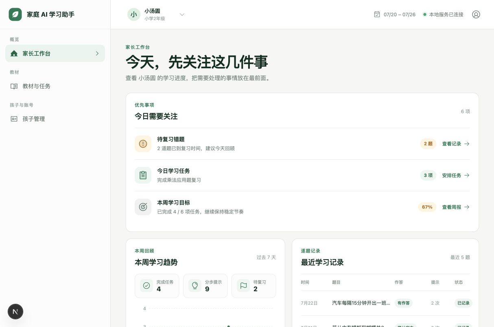

# AIStudy

给家人使用的学习助手。

孩子可以在 iPad 或手机上学习，家长可以在电脑上管理孩子、教材和学习记录。

> 这是一个适合家庭自己部署的项目，不是公开在线服务，也不能代替老师和家长的判断。

## 能做什么

### 孩子端

- 数学：拍题、分步提示、错题复习和今日任务
- 语文：古诗抽查和看图写话引导
- 断网时可以继续完成部分学习操作，联网后再同步
- 英语入口目前暂未开放

### 家长端

- 创建和管理孩子账号
- 添加教材，审核后再用于学习
- 查看学习记录，按需要导出或删除家庭数据

## 界面预览

## 开始使用

AIStudy 需要一台家庭自己的 Ubuntu 服务器。孩子端使用 iPad 或手机，家长端使用浏览器。

第一次安装请看[家庭部署指南](docs/DEPLOYMENT.md)。日常更新、备份和恢复请看 [RUNBOOK.md](RUNBOOK.md)。

## 使用前请注意

- 只上传家庭有权使用的教材，不要上传包含孩子姓名、联系方式或个人批注的资料。
- 不要把密码、密钥、孩子照片或学习记录提交到 GitHub。
- 图片和学习记录属于家庭自己的数据，请按需要备份和删除。

## 文档

- [家庭部署指南](docs/DEPLOYMENT.md)
- [安全说明](SECURITY.md)
- [开发与测试](TESTING.md)
- [更新记录](CHANGELOG.md)

## 许可证

本项目代码和文档使用 [Apache License 2.0](LICENSE)。
