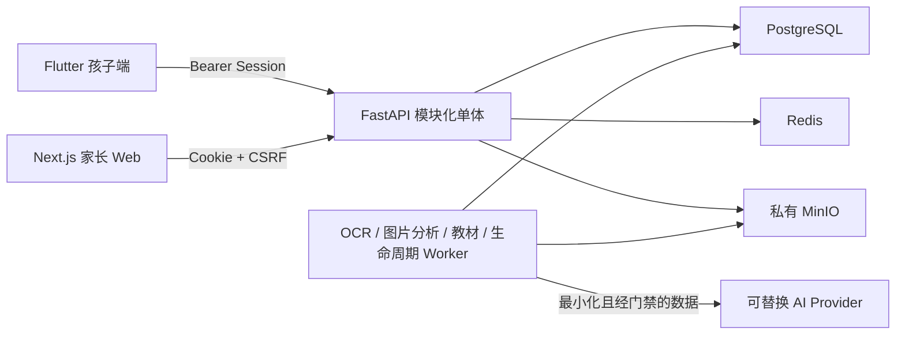

# AIStudy — 家庭 AI 学习助手

AIStudy 是一个面向家庭自托管的开源学习助手。当前以小学数学和受控语文活动为主线，把家庭教材范围、错题采集、分步讲解、错题沉淀、到期复习和家长反馈组织成可追溯的学习闭环。

项目强调家庭数据隔离、人工确认、来源可追溯和可替换 AI Provider，不把模型输出直接当作标准答案或永久掌握度事实。

## 当前状态

当前仓库版本为 API/OpenAPI `0.16.0`，数据库迁移头为 `0035_chinese_poem_skill`。Ubuntu 单家庭自用 Compose 的已发布状态以 [TESTING.md](TESTING.md) 为准；自用部署不等同于公网或商业生产发布。

| 能力 | 状态 |
| --- | --- |
| 家长 Web | 账号登录、孩子/账号管理、教材上传与审核、学习记录、导出与删除已实现 |
| 孩子 Flutter | iOS/Android 登录、数学学习桌、古诗抽查、看图写话引导、拍题、题目确认、分级提示、错题与复习已实现 |
| 语文活动 | 已审核教材逐行古诗自动生成“下一句”选择题；看图写话只提供观察、提问、句式与细节支架 |
| 数学教材 | PDF 私有存储、页级理解、知识图谱、家长批准和来源受限推荐已实现 |
| 图片安全 | Session 鉴权的 API 流式上传、私有 MinIO、元数据清除和人工外发确认已实现；自动视觉检测器仍未完成 |
| 英语口语 | 孩子端入口和三个有界情景框架已实现，但真实语音 Provider 未接入，默认锁定 |
| 发布验证 | 自动化和部分设备验证已完成；登录态浏览器 E2E、真实教材质量和完整设备回归仍待完成 |

英语功能只保留供应商中立的孩子练习框架、家长逐孩子设置、PCM16/WebSocket 合同、隐私最小化摘要和测试 Provider。仓库不包含 Gemini Adapter、Gemini API Key 或家长本人英语练习入口。

## 核心原则

- Household 是授权和数据隔离边界，所有孩子数据都必须重新校验家庭、角色和孩子绑定。
- 拍题图片先在家庭边界内处理；只有用户确认的脱敏副本可交给单一获批 Provider。
- 云端识别结果必须人工确认后形成 `VerifiedQuestion`，才能进入 Tutor 和错题闭环。
- 看图写话与数学题目提取完全分离：只读取用户确认的脱敏派生图，Provider 不生成范文、不评分、不推断身份或敏感属性。
- 古诗抽查只使用家长审核发布的教材逐行提取结果；错答显示正确下一句并进入确定性复习，不由 AI 判分。
- 学习提示按级别逐步披露；普通练习先作答，错题讲解只使用已确认题目和作答证据。
- PostgreSQL 保存业务事实，Redis 只做缓存/队列，MinIO 保存私有文件，端侧 SQLite 保存离线队列。
- 不提交真实密钥、儿童资料、学习图片、教材文件、数据库转储或 Provider 原始消息。

## 系统结构



客户端不会获得对象存储凭据或 AI Provider 密钥。MinIO 默认不向宿主机或局域网发布 `9000` 端口。

## 仓库结构

```text
apps/child_flutter   Flutter iOS/Android 孩子端
apps/web             Next.js 家长 Web/PWA
services/api         FastAPI API、领域模块、迁移和 Worker
packages/contracts   OpenAPI 与 AI JSON Schema 唯一契约源
evals                合成 OCR、隐私、Tutor 和英语安全评测
infra/compose        PostgreSQL/Redis/MinIO/API/Web/Worker 自托管编排
docs/adr             架构决策记录
```

项目事实和执行入口分别记录在 [AI_CONTEXT.md](AI_CONTEXT.md)、[PROJECT.md](PROJECT.md)、[TASK.md](TASK.md)、[TESTING.md](TESTING.md) 和 [SECURITY.md](SECURITY.md)。

## 快速启动

目标 GitHub 仓库：`git@github.com:yubinhong/AIStudy.git`

```bash
git clone git@github.com:yubinhong/AIStudy.git
cd AIStudy
cp infra/compose/.env.example infra/compose/.env
```

编辑 `infra/compose/.env`，至少替换 PostgreSQL、MinIO 和 Session Secret。初次启动应保持所有外部 Provider 开关关闭。

```bash
docker compose -f infra/compose/compose.yml config
docker compose -f infra/compose/compose.yml up -d --build
docker compose -f infra/compose/compose.yml ps

curl -fsS http://127.0.0.1:8000/healthz
curl -fsS http://127.0.0.1:3000/healthz
```

空数据库会创建一次性 `admin/admin123456` 引导账号。只应在受信本机或家庭局域网首次登录，并立即修改密码；改密前家庭数据接口会被阻断。不要把默认账号暴露到公网。

完整配置、Apple Silicon 限制、NewAPI 接入、备份与恢复步骤见 [infra/compose/README.md](infra/compose/README.md) 和 [RUNBOOK.md](RUNBOOK.md)。

## Android APK 与部署

仓库提供 `Build Android APK` GitHub Actions：手动运行时生成保留 14 天的 Actions Artifact；推送 `v*` 标签时还会自动创建对应 GitHub Release，并上传三个 ABI APK、SHA-256 摘要和构建信息。工作流使用固定 Flutter `3.44.6`，发布 Job 才获得最小 `contents: write` 权限。

未配置 Android 签名 Secrets 时，产物使用 runner 的 debug 证书，只适合家庭侧载验证；稳定升级和正式分发必须配置受控签名密钥并更换当前示例 application ID。GitHub Actions 操作、签名配置、APK 安装、Compose 服务端部署、升级和回滚见 [构建与自托管部署指南](docs/DEPLOYMENT.md)。

## 电子教材

项目可配合独立的 [tchMaterial-parser](https://github.com/happycola233/tchMaterial-parser) 获取国家中小学智慧教育平台电子课本 PDF。该工具不是 AIStudy 依赖，AIStudy 不接收其 Access Token，也不包含或分发下载的教材。请只下载和导入自己有权使用的资料，并遵守平台条款、教材版权和当地法律；完整安全导入步骤见 [部署指南的教材章节](docs/DEPLOYMENT.md#7-获取和导入电子教材)。

## 本地开发与验证

API：

```bash
cd services/api
uv sync --locked
uv run ruff format --check .
uv run ruff check .
uv run mypy src
uv run pytest -m "not integration"
```

Web：

```bash
cd apps/web
pnpm install --frozen-lockfile
pnpm format:check
pnpm lint
pnpm typecheck
pnpm test
pnpm build
```

Flutter：

```bash
cd apps/child_flutter
flutter pub get
dart format --output=none --set-exit-if-changed .
flutter analyze
flutter test
```

具体已验证结果、已知全仓失败和设备门槛以 [TESTING.md](TESTING.md) 为准；不要仅因单元测试通过就宣称真实 Provider、真实教材或生产发布已验收。

## 数据、内容与第三方组件

Apache-2.0 只授权本仓库贡献者拥有权利的代码和文档，不自动授权以下内容：

- 用户上传的教材、题库、作业图片、学习记录或其他家庭数据；
- AI/OCR 模型权重、模型服务、API Key 或外部 Provider 输出；
- 第三方依赖、字体、图标和原生库，这些内容继续适用各自许可证；
- 项目名称、标识或第三方商标超出合理来源说明的使用。

Flutter 直接依赖与原生音频组件的通知见 [apps/child_flutter/THIRD_PARTY_NOTICES.md](apps/child_flutter/THIRD_PARTY_NOTICES.md)。其他依赖版本和来源以各子项目锁文件为准。

## 贡献与安全

提交代码前请先阅读 [AGENTS.md](AGENTS.md) 的长期边界和 [TESTING.md](TESTING.md) 的验证要求。变更公共 API、数据库、安全边界或 AI Provider 时，需要同步 OpenAPI/Schema、迁移、测试和相关 ADR。

安全问题不要附带真实密钥、儿童数据、图片、教材或数据库转储。处理和报告要求见 [SECURITY.md](SECURITY.md)。

## 许可证

本仓库自有代码和文档采用 [Apache License 2.0](LICENSE)。该协议允许使用、修改和分发，并包含明确的贡献者专利授权；分发时须保留许可证、NOTICE 和适用的归属声明。
