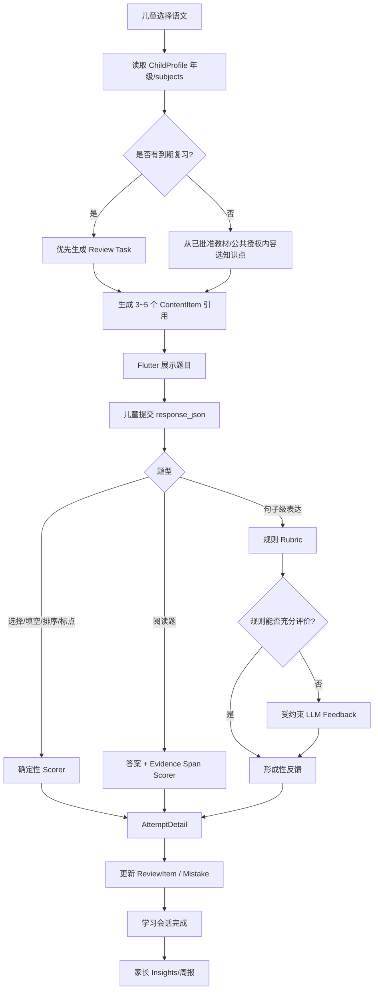

# AIStudy 语文学科扩展与低成本英语口语替代方案深度研究

## 执行摘要

**总体结论：可行性高，而且不需要推翻现有架构。** 实际仓库比题目中预设的“React/React Native + Node/Flask”更成熟：当前公开代码采用 **Flutter 儿童端 + Next.js 家长 Web + FastAPI 模块化后端 + PostgreSQL/Redis/MinIO + Docker Compose/Worker** 的自托管体系，并已经具备学习任务、学习会话、错题、教材 PDF、知识图谱、Tutor、权限隔离、离线同步和英语口语 Provider 抽象。fileciteturn6file0L2-L2 fileciteturn12file0L2-L2 fileciteturn16file0L2-L2

但有一个重要的代码审查限制：我能访问当前公开仓库，但远端分支列表中只看到 `master`，**没有看到名为“深度研究”的远端分支**。因此，下文代码级结论基于目前可访问的 `master`；正式开发前应把“深度研究”分支与这里审查的 commit 做一次 diff/rebase，尤其核对数据库迁移和 OpenAPI。fileciteturn2file0L2-L2

当前 `Subject` 枚举确实只有 `MATH = "math"`；英语口语并没有被建模为第二个标准学科，而是后来增加的一条独立、Provider-neutral 的插件路径。当前公开契约甚至明确说明，英语插件没有修改仍为 math-only 的 `ChildProfile.subjects`、`StudyTask` 和 `StudySession`。这意味着**语文是项目第一次真正意义上的“第二学科”改造**，首要任务不是做几个语文页面，而是把学科边界从隐含的“数学唯一”升级为显式的多学科模型。fileciteturn11file0L2-L2 fileciteturn19file0L2-L2

优先级建议如下：

| 优先级 | 建议 | 结论 |
|---|---|---|
| **P0** | 先完成 `Subject.CHINESE`、OpenAPI、数据库迁移、教材/知识点 subject 化，并清除数学硬编码 | **必须先做**，否则语文会变成旁路功能，后续错题、任务、周报、教材知识图谱无法统一 |
| **P0** | 语文 MVP 先做“字词/拼音 + 阅读理解 + 古诗文积累 + 句子级表达 + 错题复习” | 教学价值高、可确定性评分比例高、工程风险最低 |
| **P0/P1** | 英语先接入 **Deepgram Nova-3 + Aura-1 + 现有文本 LLM** | 对现有 WebSocket/PCM 架构改动最小；按本文假设，一个 10 分钟练习约 **$0.054 + 文本 LLM** |
| **P1** | 在在线方案稳定后，将 TTS 移至 Android/iOS 端，服务器只返回文本 | 可进一步把示例 10 分钟语音成本降至约 **$0.024 + 文本 LLM**，但需要升级客户端协议 |
| **P1/P2** | 增加 **sherpa-onnx 本地 STT/TTS** 作为隐私优先/离线模式 | API 边际成本接近 0，特别适合项目当前“家庭自托管”定位，但儿童英语识别质量必须用真实目标人群重新评测 |
| **暂缓** | 作文自动打总分、汉字笔顺视觉评分、发音“百分制” | 主观性、模型幻觉和儿童语音偏差都更高，不宜成为首版核心评价 |

这个语文学科范围也与当前义务教育语文课程方向吻合。2022 年版义务教育课程标准强调核心素养、任务群、情境性与实践性；教育部对低年级还特别提出一、二年级学习设计应更“活动化、游戏化、生活化”。教育部公开解读还明确语文核心素养包含文化自信、语言运用、思维能力和审美创造，因此产品不宜简单做成“语文版数学刷题器”。citeturn8search13turn18search4turn7search12

英语方面，**真正需要解决的不是“再找一个 Gemini Live”本身，而是把“实时端到端语音模型”解耦成 STT → 受约束文本 Tutor → TTS 的可替换流水线**。仓库事实上已经为此做好了相当多基础工作：有 `EnglishLiveProvider`/`EnglishLiveSession` 抽象、Pre-A1/A1/A2、三个受限场景、监护人设置与 consent version、10 分钟日限额、WebSocket PCM16 协议、打断控制以及“不持久化原始音频、完整 transcript、Provider 原始消息”的数据最小化设计。fileciteturn13file0L2-L2 fileciteturn14file0L2-L2

需要特别提醒：这是小学生产品。中国《个人信息保护法》第三十一条要求处理不满十四周岁未成年人个人信息时取得父母或其他监护人同意，并制定专门处理规则；国家网信办 2025 年末发布的执行公告还明确要求处理未成年人个人信息的个人信息处理者按《未成年人网络保护条例》第三十七条开展年度合规审计并报送情况。若未来从目前仓库描述的家庭自托管范围转为公开运营或商业化，这些不能只作为隐私政策文案处理。citeturn9search4turn9search3 仓库自己的 `SECURITY.md` 也把儿童数据、家庭隔离、最小数据、英语音频不落盘和真实 Provider 条款审查作为明确安全边界。fileciteturn17file0L2-L2

## 仓库审查与架构结论

仓库目前已经形成了一个较清楚的模块化单体：FastAPI `create_app()` 注入不同 repository，开发/测试可走 InMemory，正式 Compose 切 PostgreSQL；路由按 profile、auth、learning、capture、curriculum、recommendation、tutor、mistake、english practice 等模块注册。因此语文学科适合沿现有模式新增领域模型和路由，而不是再建立一个独立 Node 服务。fileciteturn12file0L2-L2

部署侧已有 PostgreSQL、Redis、MinIO、Alembic migration、API、Next.js Web，以及 image-analysis、material-parse、curriculum-analysis、data-lifecycle 等 Worker；这意味着增加语文主要增加**数据模型、内容处理和业务代码**，而不是新增基础设施。fileciteturn16file0L2-L2

目前最值得利用的基础资产有三类。第一类是通用学习闭环：`StudyTask`、`StudySession`、`Attempt`、错题与 recommendation。第二类是私有教材管线：PDF → page asset → page analysis → whole-book knowledge map → parent review → approved knowledge point。第三类是已经完成的数据安全边界：household/child 作用域、角色、幂等键、版本冲突检测、人工确认和审计。fileciteturn11file0L2-L2 fileciteturn22file0L2-L2

### 仓库审查要点矩阵

| 审查对象 | 当前发现 | 加语文前必须检查/修改 | 风险 |
|---|---|---|---|
| Git 分支/版本 | 公开远端目前只见 `master`，未见“深度研究” | 确认目标分支 commit、migration head、OpenAPI 版本；禁止在未知 migration 基线直接建新表 | **高** fileciteturn2file0L2-L2 |
| `domain/models.py` | `Subject` 只有 `MATH`；`ChildProfile.subjects`、`StudyTask.subject` 已有通用字段 | 增加 `CHINESE`；检查数据库 enum/check constraint；给旧记录默认 `math` | **高** fileciteturn11file0L2-L2 |
| `StudyTask` / `TaskExercise` | 可承载知识点、题目、教材来源；exercise 最多 5 项 | 不要把长阅读文章复制进 `question_text`；应增加 `content_item_id`/`content_revision` 引用 | 中高 fileciteturn11file0L2-L2 |
| Curriculum knowledge | 已有章节、学习目标、先修、页码、exercise、confidence、审核状态；但已审模型中未见 `subject` | Material/Snapshot/KnowledgeMap 至少一个上层对象必须显式带 subject；旧教材迁移为 math | **高** fileciteturn22file0L2-L2 |
| Curriculum AI schema/prompt | 现有 page/book analysis schema 很适合复用框架 | 建议新建 subject-aware `v2`，不要静默让旧数学 prompt 解析语文教材 | 高 fileciteturn22file0L2-L2 |
| OCR/拍题 | 图片上传、OCR candidate、人工确认、VerifiedQuestion 已成熟 | 语文首版可继续复用 OCR；但作文、阅读长文本不能沿用数学“一个题目”假设 | 中 |
| Tutor | 已有来源约束、渐进提示和 TutorTurn 持久化 | 增加 `subject=chinese` Prompt Policy；阅读题必须要求“依据文中证据”，表达题只给建议、不伪装唯一答案 | 高 |
| Mistake/review | 已形成错题和复习闭环 | 将“错题”泛化为“学习薄弱项/ReviewItem”；例如错字、词义和阅读证据都不是传统数学错题 | 中高 |
| `english_practice.py` | 已有 Provider Protocol、场景、level、consent、时长/费用统计 | 直接实现新 Provider adapter，不重写 session model | **低** fileciteturn13file0L2-L2 |
| 英语 WebSocket route | 已有 16 kHz PCM16 输入、打断、turn-end、session limit、child-bound auth | Cascaded STT→LLM→TTS 应藏在服务端 Provider 后；必要时再增加 `assistant_text` v2 event | 低中 fileciteturn14file0L2-L2 |
| Flutter 儿童端 | `main.dart` 约 135 KB，另有独立 `english_practice.dart`、capture/offline modules | **不要继续把语文塞进 main.dart**；新建 `features/chinese/` | 中高；这是基于文件规模的架构推断。fileciteturn15file0L2-L2 |
| Parent Web | 当前负责孩子、教材、学习记录等 | 增加学科选择、语文教材标签、内容来源/版权状态、分技能报告 | 中 fileciteturn6file0L2-L2 |
| OpenAPI/Schema | `packages/contracts/openapi.yaml` 是公共接口单一事实源；AI JSON Schema 也在此版本化 | 先改 Contract，再生成/同步客户端；不要在 Dart 手抄 DTO | **高** fileciteturn19file0L2-L2 |
| Alembic | 当前项目通过 Alembic 管理 PostgreSQL schema | 新建 additive migration；不要重写历史 migration | 高 fileciteturn16file0L2-L2 |
| 权限 | Household 是核心隔离边界，Parent/Child/Super Admin 已存在 | 所有 Chinese endpoint 延续 household + child ownership；内容管理只允许 Parent | **高** fileciteturn11file0L2-L2 |
| 测试/evals | 已有 OCR、privacy sanitizer、Tutor policy、English safety eval | 增加 Chinese scorer golden set、教材 extraction eval、child-English WER/latency eval | 中 fileciteturn20file0L2-L2 |
| 部署 | Compose 已有 DB/Redis/MinIO/API/Web/Worker | 在线 STT 不需新增服务；本地 sherpa/faster-whisper 最好单独 `speech-worker` 容器，避免拖垮 API | 中 fileciteturn16file0L2-L2 |
| 数据保留与隐私 | 仓库规定英语原音频/full transcript/provider message 不落盘 | 新 Provider 必须继续遵守；调试日志不得偷偷恢复 transcript | **高** fileciteturn17file0L2-L2 |

一个值得特别保留的设计是：`packages/contracts` 已被定义为 OpenAPI 与 AI JSON Schema 的单一事实源，生成 SDK 而非客户端手写模型。这使多学科改造可以以“Contract → 后端 → 客户端”为顺序推进，显著降低 Flutter 和 Web 对字段理解不一致的问题。fileciteturn18file0L2-L10 fileciteturn19file0L2-L2

另一方面，教材知识模型虽然并没有直接写死“数学”，但它当前主要围绕 `knowledge_point + exercise + question_text + visual context` 展开，而且缺乏显式 subject。这对数学非常自然，对语文的“篇章、证据段落、朗读材料、开放表达、古诗文”不够丰富。因此**应该复用教材的版本、来源、页码、审核机制，但不应强迫语文内容退化为数学式 Exercise。** fileciteturn22file0L2-L2

## 语文学科产品设计

2022 年版义务教育语文课程强调语文是一门综合性、实践性课程，并强调“学习任务群”和真实情境；公开课标解读将核心素养概括为文化自信、语言运用、思维能力、审美创造。教育部公开材料还把“整本书阅读”明确列为拓展型学习任务群。citeturn8search13turn8search10

因此产品结构建议采用“双层模型”：

**第一层是 App 内可操作技能**：拼音、字词、句子、阅读、古诗文、表达、口语/朗读。

**第二层是课程任务群/教学目标标签**：语言文字积累与梳理、实用性阅读与交流、文学阅读与创意表达、思辨性阅读与表达、整本书阅读、跨学科学习。六个任务群的这一组织方式源自 2022 年版课标及其专业解读；App 不必把这些术语直接展示给低年级儿童，但后台应保留用于内容映射和家长报告。citeturn8search5turn8search13

### 核心功能优先级

| 阶段 | 功能 | 为什么适合小学生 | 交互示例 | 所需数据/资源 |
|---|---|---|---|---|
| **MVP** | 拼音—汉字—读音配对 | 低年级基础强，能做高确定性即时反馈；一二年级应强调活动化、游戏化设计。citeturn18search4 | “听/看 `qīng` → 选‘青/清/晴’”；声调拖拽到正确位置 | 拼音、声调、字、年级、常见混淆项、示例词 |
| **MVP** | 生字、词语与词义积累 | 对应语言文字积累与梳理；适合短时高频复习 | “给‘清’组词”；“‘清澈’在句中是什么意思？” | 字词表、词义、例句、同反义词、偏旁、混淆字 |
| **MVP** | 句子规范与语言运用 | 比整篇作文更易评价，又能训练实际表达 | “给句子补标点”“把两句合成一句”“用‘虽然…但是…’造句” | 句型、标点规则、答案规则、多答案 rubric |
| **MVP** | 短篇阅读理解 + 文中找依据 | 同时训练阅读与思维，而且比纯 LLM 自由问答更可控 | 先回答“为什么”，再在文章中点选支持答案的句子；提示从“找第 2 段”逐级展开 | 短文、题干、标准答案、允许同义答案、evidence span、解释 |
| **MVP** | 古诗词/经典积累 | 可通过排序、填空、上下句匹配实现低风险评价；也契合语文文化素养方向 | “春眠不觉晓 → 下一句？”；把四句拖成正确顺序 | 篇目、正文、作者/年代元数据、分句、注音、释义；版本来源需审查 |
| **MVP** | 句子级创意表达 | 覆盖表达能力但避免首版“作文自动打分”的高风险 | “观察图片写两句话”；AI 只反馈“写清楚谁/在哪里/做什么了吗？” | 图片授权、年级 rubric、句式目标、安全 prompt |
| **MVP** | 语文错题/薄弱项复习 | 直接复用现有学习闭环，能把生字、词义、阅读错因统一到复习队列 | “昨天把‘晴’认成‘清’，今天先复习这个” | Attempt、skill、error tag、review due date |
| **MVP** | 教材范围绑定 | 当前项目最大的差异化资产是私有教材知识图谱；语文也应利用，而不是另造孤立题库 | 家长上传语文教材 → 审核章节 → 系统只从已批准章节安排练习 | 私有 PDF、页级解析、subject、chapter、knowledge point、审核记录 fileciteturn22file0L2-L2 |
| **可选** | 朗读/背诵检查 | 儿童喜欢“说出来”；但 ASR 对儿童语音更困难，适合先做“是否读到目标内容”而非百分制发音评分 | “朗读这一段”，显示遗漏词和需要再读的句子 | 儿童英语/普通话语音 eval、自有录音同意、ASR |
| **可选** | 口语交际情境 | 对应真实语言运用，可复用英语受限场景模式 | “向老师说明今天忘带作业”“向同学介绍一本书” | 场景脚本、允许目标、拒绝范围、Rubric |
| **可选** | 成语/偏旁/字族游戏 | 适合碎片化游戏化学习 | 把“氵”相关字拖入“和水有关”区域 | 字源/偏旁数据、成语语义和例句 |
| **可选** | 整本书阅读记录 | 与课标拓展型阅读方向一致。citeturn8search10 | 每章记录人物/事件；完成后做角色关系图 | 合法书目元数据、家长自有阅读材料、问题模板 |
| **未来** | 作文形成性反馈 | 教学价值高，但评价主观、模型容易过度改写儿童表达 | 先自评“我写清楚了吗”，AI 只给 1–2 个修改建议，不代写整篇 | 年级 rubric、教师标注作文集、版本化评分策略 |
| **未来** | 手写汉字/笔顺评价 | 对低年级有价值，但需要视觉/轨迹数据，不应只靠照片猜笔顺 | 屏幕逐笔书写，“横的位置稍高” | 触控轨迹、标准笔画模板；照片 OCR 不足以可靠判断实际笔顺 |
| **未来** | 跨学科探究 | 符合课标强调综合、实践的方向，但产品工程复杂 | “观察一周天气→写观察日记→做词汇整理” | 任务模板、跨学科资源、家长/教师审核 |

这里最关键的产品决策是：**MVP 不做“万能语文 AI 老师”，而做“高确定性题型为主、AI 只在表达与提示层补充”的混合系统。** 拼音、配对、排序、填空、标点、选择、证据定位等可以 deterministic scoring；开放表达则由规则 rubric 先判断结构，再用 LLM 生成有限的形成性建议。这比把所有答案都发给 LLM 判分更便宜，也更可审计。

对于一、二年级，建议把同一知识点包装成“配对、拖拽、听读、闯关”，而不是连续文本题，因为教育部明确提出小学一至二年级注重活动化、游戏化、生活化的学习设计。citeturn18search4 三至六年级再逐渐提高阅读文本长度、证据检索和表达任务比例。

内容版权方面，应沿用仓库当前“**教材为家庭私有导入，而不是把教材内容视为项目 Apache-2.0 资产**”的思路。README 已特别区分代码许可证和用户上传的教材/题库资源。fileciteturn6file0L2-L2 初始公共语文题库更安全的做法是自己编写题干与短文、采购/获得明确授权内容，或者仅保存允许使用的元数据；不要直接抓取现行教材、教辅的正文、插图和参考答案做公共题库。

## 前后端技术设计与示例

语文架构应遵循一个原则：**通用的“任务—会话—尝试—复习”继续共用；只有内容结构和评分逻辑 subject-specific。**

这能避免未来再加入科学等学科时出现第三套 `ChineseSession`、第四套 `ScienceSession`。当前 `StudyTask` 和 `StudySession` 本身已经有不错的通用骨架，真正不足的是 `Subject` 以及 Exercise/Answer 的学科表达能力。fileciteturn11file0L2-L2

### 推荐数据模型

| 模型 | 关键字段 | 设计目的 |
|---|---|---|
| `Subject` | `math`, `chinese` | 第一层多学科能力 |
| `LanguageSkill` | `pinyin`, `character`, `vocabulary`, `sentence`, `reading`, `recitation`, `expression`, `oral` | App 可操作技能分类 |
| `ChineseContentItem` | `id, grade_min, grade_max, skill, task_group, title, passage, prompt, answer_spec, rubric, difficulty, source_id, revision, status` | 一个稳定、可版本化的语文学习项目 |
| `ContentSource` | `source_type, owner, license_type, attribution, curriculum_snapshot_id, page_numbers` | 版权/来源追踪 |
| `TaskExerciseRef` | `content_item_id, content_revision, knowledge_point_id, source_snapshot_id` | Task 中引用内容而非复制整篇长文 |
| `AttemptDetail` | `response_json, score, max_score, scoring_version, evidence_json, feedback_tags` | 在现有 Attempt 之外存 subject-specific 证据 |
| `ReviewItem` | `child_id, subject, skill, knowledge_key, due_at, strength, last_error_tag` | 把数学“错题”升级为跨学科复习项 |
| `ChineseRubric` | `dimensions, required_elements, max_score, llm_allowed` | 开放题评分可审计 |
| `CurriculumMaterial.subject` | `math/chinese/...` | 避免教材知识图谱跨学科混用 |

对现有数据的数据库迁移建议使用**向后兼容的 additive migration**：

```python
# Alembic 伪代码
def upgrade():
    # 旧数据全部是数学，因此可以安全 backfill 为 math。
    op.add_column(
        "curriculum_materials",
        sa.Column("subject", sa.String(32), nullable=True),
    )
    op.execute("UPDATE curriculum_materials SET subject = 'math' WHERE subject IS NULL")
    op.alter_column("curriculum_materials", "subject", nullable=False)

    # 新增语文内容，不改写历史数学 task/session。
    op.create_table(
        "chinese_content_items",
        sa.Column("id", UUID, primary_key=True),
        sa.Column("skill", sa.String(32), nullable=False),
        sa.Column("grade_min", sa.Integer, nullable=False),
        sa.Column("grade_max", sa.Integer, nullable=False),
        sa.Column("content_json", JSONB, nullable=False),
        sa.Column("answer_spec_json", JSONB, nullable=False),
        sa.Column("revision", sa.Integer, nullable=False, server_default="1"),
        sa.Column("source_id", UUID, nullable=True),
    )
```

现有 CurriculumKnowledge 模型已经记录页码、学习目标、先修知识、exercise、confidence、provider、schema/prompt version 和人工审核状态；这些字段应该保留，而语文新增的是 content type、task group、篇章范围和答案/证据结构。fileciteturn22file0L2-L2

### API 草案

| Method | Endpoint 草案 | 作用 | 权限 |
|---|---|---|---|
| `GET` | `/households/{h}/children/{c}/chinese/dashboard` | 今日复习、技能进度、建议任务 | Parent/绑定 Child |
| `GET` | `/.../chinese/content/{id}` | 获取练习内容 | Parent/绑定 Child |
| `POST` | `/.../chinese/practice-sets` | 按 grade/skill/source 组一组 3–5 题 | 绑定 Child |
| `POST` | `/.../learning/tasks/{task}/sessions` | **尽量复用现有通用 StudySession** | 绑定 Child |
| `POST` | `/.../chinese/attempts` | 提交结构化回答并评分 | 绑定 Child |
| `GET` | `/.../chinese/reviews/due` | 获取到期复习 | 绑定 Child |
| `POST` | `/.../chinese/expression-feedback` | 只对开放表达生成受限反馈 | 绑定 Child |
| `GET/PUT` | `/.../chinese/settings` | 家长设置年级范围、AI 表达反馈开关 | Parent |
| `POST` | `/.../curriculum/materials` | 继续复用现有教材导入 | Parent |
| `POST` | `/.../curriculum/.../approve` | 继续复用教材知识审核 | Parent |

所有新接口仍应继承目前 household-scoped 授权，而不是仅依赖传入 `child_id`。当前英语路由已经很好地演示了这种模式：验证 household、child ownership、角色；Child 必须与 child ID 绑定，父母才能修改设置；写操作使用 Idempotency-Key 与 version conflict。fileciteturn14file0L2-L2

### Flutter 页面/组件

儿童端建议直接建立：

`lib/features/chinese/`
→ `chinese_home_page.dart`
→ `practice_session_page.dart`
→ `widgets/pinyin_choice.dart`
→ `widgets/character_match.dart`
→ `widgets/reading_passage.dart`
→ `widgets/evidence_selector.dart`
→ `widgets/sentence_builder.dart`
→ `widgets/recitation_card.dart`
→ `widgets/feedback_sheet.dart`
→ `data/chinese_api_client.dart`
→ `domain/chinese_models.dart`

这是一个值得顺手做的重构，因为当前儿童端 `main.dart` 已经非常大，而英语已经单独拆成 `english_practice.dart`；继续将语文堆进 `main.dart` 会快速放大维护成本。该建议是根据当前文件结构和文件规模做出的工程推断。fileciteturn15file0L2-L2

家长端则只需要在现有 Web 上增加“学科”维度，而不是新造后台：孩子学科开关、语文教材、按技能学习报告、内容来源审查、开放表达 AI 开关等即可。当前 Parent Web 已经承担孩子账号、教材和学习记录管理。fileciteturn6file0L2-L2

### 语文学习流程



这条流程刻意让 AI 处于**辅助反馈层**，而不是所有题目的判官；同时教材内容仍只取自已批准范围，与当前仓库“模型输出先校验、教材知识要审核、Tutor 使用来源约束”的整体安全哲学一致。fileciteturn17file0L2-L2

### 语文题库数据格式示例

```json
{
  "schema_version": "chinese-content.v1",
  "id": "cn-g3-reading-000042",
  "subject": "chinese",
  "grade_min": 3,
  "grade_max": 3,
  "skill": "reading",
  "task_group": "literary_reading_expression",
  "difficulty": "basic",
  "source": {
    "type": "original",
    "source_id": "internal-original-v1",
    "license_status": "cleared"
  },
  "content": {
    "title": "小树的春天",
    "passage": "春风吹来，小树长出了嫩绿的新叶……",
    "question": "为什么说小树知道春天来了？"
  },
  "answer_spec": {
    "type": "semantic_with_evidence",
    "required_concepts": [
      ["新叶", "嫩叶", "长叶子"]
    ],
    "evidence_spans": [
      "小树长出了嫩绿的新叶"
    ]
  },
  "rubric": {
    "max_score": 2,
    "concept_score": 1,
    "evidence_score": 1,
    "llm_fallback": false
  }
}
```

`source` 和 `revision` 不应省略。题目修改以后，历史 Attempt 必须仍然知道孩子当时回答的是哪个版本，否则以后统计“正确率变化”会混淆题目变化和学习变化。

### 后端 API 示例

下面更接近现有 FastAPI/Pydantic 风格，而不是题目中假设的 Flask：

```python
from typing import Literal
from uuid import UUID

from fastapi import APIRouter, Depends, HTTPException
from pydantic import BaseModel, Field

router = APIRouter(
    prefix="/households/{household_id}/children/{child_id}/chinese",
    tags=["chinese"],
)

class ChineseAttemptRequest(BaseModel):
    content_id: UUID
    content_revision: int = Field(ge=1)
    response: dict
    elapsed_ms: int = Field(ge=0, le=30 * 60 * 1000)

class ScoreResult(BaseModel):
    score: float
    max_score: float
    correct: bool
    feedback_tags: list[str]
    scoring_version: Literal["chinese-score.v1"] = "chinese-score.v1"

@router.post("/attempts", response_model=ScoreResult)
def submit_attempt(
    household_id: UUID,
    child_id: UUID,
    body: ChineseAttemptRequest,
    principal=Depends(get_principal),
):
    # 应调用项目现有的 household / child authorization helper，
    # 而不是只相信 URL 中的 child_id。
    authorize_bound_child(principal, household_id, child_id)

    item = chinese_repo.get_content(body.content_id, body.content_revision)
    if item is None:
        raise HTTPException(404, "content not found")

    result = scorer.score(item, body.response)

    chinese_repo.append_attempt(
        household_id=household_id,
        child_id=child_id,
        content=item,
        response=body.response,
        result=result,
    )
    review_service.update_from_attempt(
        household_id=household_id,
        child_id=child_id,
        content=item,
        score=result.score,
    )
    return result
```

现有 API 已经使用 household-scoped repository、FastAPI router、Pydantic model、幂等与角色授权，因此实际实现时应优先提取现有 helper，而不是另写一套认证。fileciteturn12file0L2-L2 fileciteturn14file0L2-L2

### 简单评分逻辑

```python
import re
from dataclasses import dataclass


@dataclass(frozen=True)
class SimpleScore:
    score: float
    max_score: float
    correct: bool
    tags: tuple[str, ...]


def normalize_cn(text: str) -> str:
    # 真实版本应保留一份原始答案；这里只用于比较。
    text = text.strip().lower()
    return re.sub(r"[，。！？、,.!?；;：:\s]", "", text)


def score_reading_answer(
    answer: str,
    selected_evidence: str,
    required_concept_groups: list[list[str]],
    valid_evidence_spans: list[str],
) -> SimpleScore:
    answer_n = normalize_cn(answer)
    evidence_n = normalize_cn(selected_evidence)

    concept_ok = all(
        any(normalize_cn(alias) in answer_n for alias in aliases)
        for aliases in required_concept_groups
    )
    evidence_ok = any(
        normalize_cn(span) in evidence_n or evidence_n in normalize_cn(span)
        for span in valid_evidence_spans
    )

    score = float(concept_ok) + float(evidence_ok)
    tags = []
    if not concept_ok:
        tags.append("missing_key_idea")
    if not evidence_ok:
        tags.append("evidence_not_found")

    return SimpleScore(
        score=score,
        max_score=2.0,
        correct=score == 2.0,
        tags=tuple(tags),
    )
```

实际生产版不要把“字符串包含”作为所有语文题的最终逻辑，而应把不同题型做成 `AnswerSpec` 的 discriminated union，例如 `exact_choice`、`ordered_tokens`、`normalized_text_set`、`concept_evidence`、`rubric_expression`。这样 scorer 可以测试、版本化，也方便教师复核。

### Flutter 组件示例

```dart
class EvidenceReadingCard extends StatefulWidget {
  const EvidenceReadingCard({
    super.key,
    required this.passage,
    required this.question,
    required this.onSubmit,
  });

  final String passage;
  final String question;
  final Future<void> Function(String answer, String evidence) onSubmit;

  @override
  State<EvidenceReadingCard> createState() => _EvidenceReadingCardState();
}

class _EvidenceReadingCardState extends State<EvidenceReadingCard> {
  final _answer = TextEditingController();
  String _evidence = '';

  @override
  Widget build(BuildContext context) {
    return Column(
      crossAxisAlignment: CrossAxisAlignment.stretch,
      children: [
        SelectableText(widget.passage),
        const SizedBox(height: 16),
        Text(widget.question),
        TextField(
          controller: _answer,
          maxLines: 3,
          decoration: const InputDecoration(
            hintText: '先用自己的话回答',
          ),
        ),
        EvidenceSelector(
          passage: widget.passage,
          onChanged: (text) => setState(() => _evidence = text),
        ),
        FilledButton(
          onPressed: _answer.text.trim().isEmpty || _evidence.isEmpty
              ? null
              : () => widget.onSubmit(_answer.text, _evidence),
          child: const Text('提交答案和依据'),
        ),
      ],
    );
  }
}
```

这种 UI 的教育意义不是简单增加一个“文本高亮控件”，而是把“回答问题”和“说明依据”变成两个可观察动作，使阅读能力的评价不只依赖最终一句答案。

## 英语口语替代方案与推荐

先看仓库的真实现状。英语已经实现 Pre-A1/A1/A2、打招呼/校园交流/点餐三个有界场景；真实 Provider 默认关闭，只有显式测试开关才会启用 fake provider。Session 摘要包含 provider/model/policy version、时长、turn count、输入/输出音频毫秒、费用等，但**明确排除 raw audio、完整 transcript 和 provider messages**。fileciteturn13file0L2-L2

WebSocket 也已经支持开始、listening、thinking、speaking、interrupt、complete 等状态，并把客户端的 PCM 音频交给抽象 `EnglishLiveSession`；因此替代方案最合理的落点是实现新的 `EnglishLiveProvider`，而不是改掉英语模块。fileciteturn14file0L2-L2

还有一个对技术选择很重要的细节：**当前是儿童按住说话/显式结束一轮的模式，而不是完全开放式电话机器人。** 因此系统实际上已经知道 turn boundary。也就是说，你没必要为了“自动判断人什么时候说完”而强制购买更贵的完整 Voice Agent；廉价 STT + 现有文本 LLM + TTS 已足够。

同时，不建议把普通 ASR 的 transcript 精确度直接等同于“孩子发音好不好”。儿童语音和成人语音在声学与语言特征上存在系统差异，公开研究显示针对儿童语音 fine-tune Whisper 可以明显改善 WER，这本身说明成人/通用 ASR 的结果不能直接作为儿童发音评分的金标准。citeturn15search1turn15academia27

### 方案比较

下表价格是 **2026-08 的公开价格快照**；“准确率”一栏不伪造跨厂商统一数字，因为没有一个公开 benchmark 能同时代表“中国小学儿童说英语 + 你的麦克风环境 + 你的场景词汇”。最终必须用自己的儿童语音 eval set 比较。

| 方案 | STT / TTS | 部署 | API 成本 | 延迟 | 儿童英语准确率判断 | 隐私影响 | 集成难度 | 结论 |
|---|---|---|---|---|---|---|---|---|
| **sherpa-onnx 端侧** | streaming/non-streaming ASR + TTS + VAD | Android/iOS/Flutter 本地 | **$0 API** | 无公网 RTT；受手机性能影响 | **必须实测**；可换不同 ONNX 模型 | **最佳**，音频可不离机 | 中高 | 隐私最优长期方案 |
| **sherpa-onnx 自托管** | ASR + TTS | 家庭 x86/ARM speech service | **$0 API**，只有硬件/电费 | 局域网低，推理速度依模型 | 必须实测 | 高，音频只到家庭服务器 | 中 | **推荐方案 B** |
| faster-whisper + local TTS | Whisper STT + sherpa/Piper 类 TTS | 自托管 CPU/GPU | **$0 API** | 短句通常可接受但完全取决于硬件；需压测 | Whisper 对儿童语音可用但明显受领域影响 | 高 | 中高 | 适合服务器已有算力 |
| **Deepgram Nova-3 + Aura-1** | 云 STT + 云 TTS | Server API | Nova-3 $0.0048/min；Aura-1 $0.015/1k chars | 低—中 | 厂商通用模型能力强，但**儿童 L2 英语必须自测** | 儿童音频发送第三方 | **低** | **推荐方案 A，最快上线** |
| Deepgram Flux + Aura-1 | Voice-agent STT + TTS | Server API | Flux $0.0065/min + TTS | 针对对话/turn detection 优化 | 同上 | 第三方 | 低 | 当前 PTT 已有 turn boundary，性价比不如 Nova-3 |
| Deepgram Voice Agent | STT+LLM orchestration+TTS | 完整托管 | Standard $0.075/min | 低，集成简单 | 仍需儿童集验证 | 第三方处理更多对话数据 | 最低 | 方便但不符合“低成本”优先 |
| Google Cloud STT + Standard TTS | 云 STT/TTS | Server API | STT $0.016/min；Standard TTS $4/M chars | 低—中 | 需儿童集验证 | 第三方；条款/数据路径单独审查 | 中 | 技术成熟但成本高于 Nova-3 |
| OpenAI GPT-Realtime-Whisper + device/server TTS | Streaming STT + TTS | 云 | STT $0.017/min；TTS另计 | 低 | 需儿童集验证 | 第三方 | 中 | 可作为备选，不是最低成本 |
| Android/iOS 原生 STT+TTS | 系统能力 | 端侧/系统服务 | App API 费用 **0** | 很低或取决于系统云服务 | 设备/OS 差异较大 | **不一定纯本地** | 低中 | 适合 PoC/TTS，慎作统一生产 STT |

sherpa-onnx 官方项目支持离线 STT、TTS、VAD、streaming/non-streaming ASR，并覆盖 Android、iOS、x86/ARM、Dart 和预构建 Flutter 示例，框架使用 Apache-2.0；这与 AIStudy 的 Flutter + 自托管服务器技术栈高度吻合。citeturn10search2

faster-whisper 是 CTranslate2 实现的 Whisper，项目报告在相同准确度设定下可比原始 OpenAI Whisper 最多快约 4 倍、占用更少内存，并支持 CPU/GPU 8-bit；whisper.cpp 则支持 CPU-only、量化、VAD、Android/iOS 等，非常适合作为第二个本地 benchmark。citeturn10search0turn11search0 原始 Whisper 官方也明确指出 English-only 的 `tiny.en`/`base.en` 通常比对应 multilingual 小模型更适合纯英语任务。citeturn11search1

Deepgram 当前公开 PAYG 价格中，Nova-3 monolingual streaming 为约 **$0.0048/min**，Flux English 为 **$0.0065/min**，Aura-1 TTS 为 **$0.015/千字符**；完整 Voice Agent Standard 为 **$0.075/min**。citeturn10search1

Google Cloud 当前 Standard Speech-to-Text 的基础档为 **$0.016/min**，Standard TTS 为 **$4/百万字符**，且 Standard TTS 当前存在每月免费字符额度；具体账号、地区和版本仍应以上线时账单配置为准。citeturn12search2turn12search0 OpenAI 当前 GPT-Realtime-Whisper 按音频时长计费，为 **$0.017/min**。citeturn13search0turn13search2

Android 文档尤其提醒，普通 `SpeechRecognizer` 的实现**可能把音频流到远端服务器**；Android 31+ 才提供显式检查/创建 on-device recognizer 的 API。Apple 同样允许 `requiresOnDeviceRecognition=true`，但只有设备支持时才有效，而且 Apple 文档明确提示 on-device 请求可能不如网络识别准确。citeturn14search4turn14search5turn14search1turn14search2 因此“系统 STT = 完全离线”不能作为隐私假设。

### 首推方案 A：Deepgram Nova-3 → 现有文本 LLM → Aura-1

这是**最适合先发布的方案**。

假设一个 10 分钟练习里儿童实际说话 5 分钟，AI 一共输出约 2,000 个英文字符，则：

- Nova-3：`5 × $0.0048 = $0.024`
- Aura-1：`2 × $0.015 = $0.030`
- 合计约 **$0.054/次 10 分钟会话 + 文本 LLM**
- 每个孩子每月练 20 次，约 **$1.08/月 + 文本 LLM**

这是基于公开价格和明确的使用量假设做出的预算模型，不是厂商账单承诺。citeturn10search1

与完整 Voice Agent 相比，同样 10 分钟，Standard 按当前 $0.075/min 约为 **$0.75/次**、20 次/月约 **$15/孩子/月**，因此对已有 session/policy/LLM orchestration 的 AIStudy 而言，购买完整 Voice Agent 很浪费。citeturn10search1

**集成步骤：**

第一步，在 `english_practice.py` 新增 `CascadedEnglishProvider`，仍实现现有 `EnglishLiveProvider` Protocol：

```python
class CascadedEnglishProvider:
    name = "deepgram-cascade"
    model_version = "nova3+aura1.v1"
    available = True

    async def open_session(self, *, scenario_id, level, policy_instruction):
        return CascadedEnglishSession(
            scenario_id=scenario_id,
            level=level,
            policy_instruction=policy_instruction,
            stt=deepgram_stt,
            tutor=existing_text_llm,
            tts=deepgram_tts,
        )
```

第二步，`send_audio()` 只把该轮 PCM 送给 STT 或短时内存 buffer，不落 PostgreSQL/日志。

第三步，收到现有 `audio_stream_end` 后完成转写；transcript 仅存在 WebSocket session 内存。

第四步，把 transcript 加入**有限长度、场景约束**的文本对话上下文，继续使用现有 `EnglishConversationPolicy`，保持“不索取姓名、学校、住址等个人信息、不做自由聊天、短回答”的安全边界。fileciteturn13file0L2-L2

第五步，文本 Tutor 返回后先通过 policy 检查，再 TTS 成当前客户端已经接受的 **24 kHz PCM**，因此第一版甚至不必修改 Flutter 播放协议。当前公共契约已经规定 16 kHz 输入 / 24 kHz 输出。fileciteturn19file0L2-L2

第六步，只写入当前允许的 summary metrics：模型、延迟、音频毫秒、turn count、成本、feedback tags；**不要因为 STT 接进来了就新增 transcript 表。** 仓库的当前隐私边界明确要求 raw audio/full transcript/provider message 不持久化。fileciteturn17file0L2-L2

### 在线成本进一步降级：Nova-3 + 设备 TTS

第二阶段可以新增：

```json
{
  "schema_version": "english-live-server-event.v2",
  "type": "assistant_text",
  "text": "Good job! Try: I would like some milk, please."
}
```

Flutter 收到文字后用设备 TTS 播放。Android 原生 `TextToSpeech` 可以查询可用语言/voices、播放或合成为文件。citeturn14search0

这样示例会话的第三方语音成本基本只剩 STT：

`5 min × $0.0048 ≈ $0.024/10 分钟会话`，20 次/月约 **$0.48/孩子/月 + 文本 LLM**。citeturn10search1

缺点是声音质量和可用 voice 因设备而异，因此建议把 `server_pcm` 与 `device_tts` 都做成 capability，通过 settings/feature flag 切换，而不是一次性废弃服务器 TTS。

### 首推方案 B：sherpa-onnx 本地语音服务

如果产品继续维持当前“家庭自托管”定位，长期最匹配的是：

`Flutter PCM → AIStudy FastAPI → speech-worker(sherpa-onnx) → 本地 STT → 现有文本 LLM → 本地 sherpa TTS → PCM`

sherpa-onnx 本身已有 English streaming ASR、Whisper tiny.en、Moonshine、Zipformer，以及 Piper/Matcha TTS 等示例，并支持 Dart、Android、iOS、x86/ARM。citeturn10search2

建议不要一开始直接把模型塞进 FastAPI API 进程，而是 Compose 增加独立 speech service：

```yaml
speech-worker:
  build: ../../services/speech
  environment:
    STT_MODEL_PATH: /models/stt
    TTS_MODEL_PATH: /models/tts
  volumes:
    - speech-models:/models:ro
  networks:
    - parser-backend
  restart: unless-stopped
```

这样语音模型 OOM、加载慢或 CPU 峰值不会把登录、学习记录、教材 API 一起拖死。

本地方案的 API 边际成本接近 0，但“准确率”不能凭 Whisper 名气判断。儿童 ASR 研究持续显示儿童语音比成人语音困难，且 fine-tuning 可以显著改善儿童 WER。citeturn15search1turn15academia30 因此本地上线门槛应是**同一份儿童英语测试集上，sherpa/Whisper 与 Deepgram 做 A/B**，而不是先决定模型再证明它好。

更重要的是，MVP 不应告诉儿童“你的发音是 72 分”。ASR 错一个词可能是模型对儿童声音不适应，而不一定是孩子发音错误。首版反馈更适合：

“目标句是否完成”
“目标词是否识别到”
“是否需要重复”
“是否用了完整句”
“能否完成情境任务”

真正做音素级 pronunciation assessment 时，再建立音素对齐、误差类型以及儿童教师人工标注 benchmark。

## 开发实施计划与成本估算

下面时间是基于当前可访问 `master` 的工程估算，不代表未见到的“深度研究”分支已经完成哪些工作。如果该分支比 `master` 更新，部分工时会下降。

假设团队为 **1 名 Python/FastAPI 后端/AI 工程师 + 1 名 Flutter/Next.js 全栈工程师 + 兼职小学语文教研/内容专家**。

| 阶段 | 预计工程量 | 主要产出 | 技能要求 | 关键风险与缓解 |
|---|---:|---|---|---|
| 分支对齐与技术盘点 | 3–5 人日 | branch diff、migration/OpenAPI 基线、数学硬编码清单 | Git、Alembic、FastAPI | 风险：在错分支开发；先锁 commit SHA |
| 多学科基础 | 4–6 人日 | `Subject.CHINESE`、subject migration、contract、教材 subject 化 | Python/Postgres/OpenAPI | 风险：破坏历史 math；旧数据全部 backfill `math` + migration test |
| 语文内容与 Scorer 后端 | 8–12 人日 | ChineseContent、AnswerSpec、review、deterministic scorer | Python/Pydantic | 风险：过度依赖 LLM；先做确定性 scorer |
| Flutter 语文 MVP | 10–15 人日 | 首页、字词、阅读、证据选择、句子、古诗词、结果页 | Flutter/Dart/UX | 风险：`main.dart` 膨胀；按 feature module 新建 |
| Parent Web/教材扩展 | 5–8 人日 | 学科设置、语文教材、来源、技能报告 | Next.js | 风险：UI 重复；复用现有 child/curriculum 页面 |
| 首批内容建设 | 8–12 教研人日 | 每年级 starter set、rubric、golden answers、来源台账 | 小学语文教研 | 风险：版权和难度错配；原创/授权 + 双人抽审 |
| Deepgram 英语 Provider | 5–8 工程人日 | STT→LLM→TTS adapter、费用/延迟 metrics、feature flag | Async Python/WebSocket/audio | 风险：音频格式、延迟；固定 16k/24k contract eval |
| 安全/评测/发布 | 8–12 人日 | Chinese eval、English child-speech eval、Household auth、删除/保留测试 | QA/Security/Data | 风险：只测 happy path；沿用现有 eval framework |
| 本地 sherpa 方案（可选） | +8–12 人日 | speech worker、模型 packaging、benchmark/fallback | ONNX/audio/Docker | 风险：不同机器性能差；硬件基线 + online fallback |

**推荐的首个可发布版本**（语文 MVP + Deepgram 在线英语，不含本地 sherpa）约为 **43–66 个工程人日 + 8–12 个语文教研人日**。两名工程师并行、教研兼职时，建议按 **6–9 个自然周**规划；单工程师则更接近 **11–16 周**。这些属于项目估算，而非外部行业基准。

一个合理的迭代节奏是：

| 周期 | 应达到的状态 |
|---|---|
| 第 1 周 | 锁定目标分支、schema、API contract；`math` 回归全绿 |
| 第 2–3 周 | `Subject.CHINESE`、ContentItem、Scorer、首批题库 |
| 第 3–5 周 | Flutter 语文核心交互、教材语文 subject 化 |
| 第 4–6 周 | Deepgram adapter 并行开发；不落 transcript |
| 第 6–7 周 | 儿童/家长试用、错题复习、教研校验 |
| 第 7–9 周 | 性能、安全、隐私、学习效果 pilot；上线 feature flag |
| 后续 | sherpa 本地模式、朗读、作文、整本书阅读 |

### 预算清单

为了避免把人力单价假装成市场事实，下表中的人民币单价是**项目预算假设**，可直接替换成你的实际工资/外包单价。

| 成本项 | 假设 | 预算 |
|---|---|---:|
| 工程开发 | 43–66 人日 × ¥1,800–¥3,500/人日 | **约 ¥77,400–¥231,000** |
| 语文教研/内容 QA | 8–12 人日 × ¥1,500–¥3,000 | **约 ¥12,000–¥36,000** |
| 本地语音额外开发 | 可选 8–12 人日 | 依团队单价增加 |
| 当前自托管基础设施 | 已有 PostgreSQL/Redis/MinIO/API/Web/worker | 语文模块本身几乎无新增软件许可成本；当前架构已有这些服务。fileciteturn16file0L2-L2 |
| Deepgram 在线英语 | 10 分钟练习：5 分钟儿童语音 + 2k AI 字符 | **约 $0.054/次 + 文本 LLM**；20 次/月约 **$1.08/孩子/月**。citeturn10search1 |
| Deepgram + 设备 TTS | 同上，仅 Nova-3 STT | **约 $0.024/次 + LLM**；20 次/月约 **$0.48/孩子/月**。citeturn10search1 |
| sherpa 本地 | API 费 | **$0 API**；但有已有/新增硬件、电力和模型存储 |
| 语料/版权 | 优先原创、家庭私有教材、已获授权内容 | 建议预留 **¥5,000–¥30,000**；真正成本取决于是否购买商业授权，这是项目预算位 |
| 测试设备 | 至少低/中端 Android + 一台 iPhone/iPad；能复用现有设备则为 0 | 若需购买，建议内部预算 **¥6,000–¥12,000**，非市场报价 |
| 监控/备份 | 延用自托管；增加 speech metrics | 主要为存储/运行成本 |
| 合规/法律审查 | 面向公开运营时 | 单独预算；儿童语音传第三方时不应省略 |

这里存在一个明显的成本杠杆：**不要把每个语文题都调用 LLM。** 只要绝大多数字词、选择、排序、填空、标点、证据定位用本地 scorer，语文学科的推理成本可以非常低。真正调用 LLM 的只有少数开放表达 feedback 和教材抽取/分析。

英语同理。对当前按住说话架构，购买 $0.075/min 的完整 Voice Agent 会把成本从大约几美分/次推高到 $0.75/10 分钟，而大量“agent orchestration”其实仓库已经自己实现了。citeturn10search1

隐私和合规方面还要把“成本”理解成上线门槛而不仅是美元。中国个人信息保护规则将不满十四周岁未成年人个人信息置于特别保护范围，监护人同意和专门处理规则是明确要求；移动互联网未成年人模式指南还强调时长、内容、功能和分龄管理。citeturn9search4turn7search2turn7search5 因此现有英语的每日时长上限、家长启用开关、consent version 和场景限制应该保留，而不是接上一个便宜 Provider 后取消。fileciteturn13file0L2-L2

## 测试、学习效果评估与发布门禁

现有项目已经有独立 `evals` 目录，包括 OCR、privacy sanitizer、Tutor policy 和 English conversation safety eval。新增语文与语音 Provider 最好延续这种“**固定数据集 + 可重复脚本 + 发布阈值**”模式，而不是只依赖开发者手点 UI。fileciteturn20file0L2-L2

### 语文学科技术验收

| 指标 | 建议首版门槛 | 为什么 |
|---|---:|---|
| 单选/排序/填空 scorer golden-set | **≥99.9% 与人工标注一致** | 这些本应是确定性逻辑 |
| 阅读客观题人工一致率 | **≥98%** | 容许同义表达但不应频繁误判 |
| 阅读 evidence 判断人工一致率 | **≥95%** | 避免模型只看答案、不看依据 |
| 开放表达“误判为错误”的比例 | **<5%** | 首版宁可少评分，不要错误打击孩子 |
| API p95 | 普通内容/attempt **<300 ms** | 内部产品目标，不是外部行业标准 |
| 学习页 crash-free session | **>99.5%** | 儿童产品应避免因复杂交互崩溃 |
| Offline attempt 重放 | **100% 幂等** | 已有 offline queue/Idempotency 思路可继承 |
| Household 越权测试 | **0 个成功越权** | 安全硬门槛 |
| 未审核教材知识进入 Tutor | **0** | 保留现有来源 gate |

评分算法还需要一个**版本字段**。假如 `chinese-score.v1` 日后升级成 `v2`，不应该静默用新规则重算过去记录，否则家长报告会发生不可解释漂移。

### 英语技术验收

最重要的是建立一份自己的 `english_child_eval_v1`。建议至少覆盖：

**年级**：1–2、3–4、5–6；
**场景**：greetings、school、food_order；
**说话类型**：跟读、半开放回答、自发表达；
**环境**：安静、家庭背景声、离麦克风较远；
**语言特征**：中国儿童常见 L2 英语发音、停顿、自我修正。

之所以必须自建儿童集，是因为儿童 ASR 与成人 ASR 存在实际性能差距，公开儿童 Whisper 研究表明儿童数据适配可以显著降低 WER。citeturn15search1turn15academia27

建议把以下作为**内部 release gate，而不是声称它们是行业标准**：

| 指标 | 建议门槛 |
|---|---:|
| 朗读/固定句 WER，中位数 | ≤15% |
| 半开放儿童英语 WER，中位数 | ≤25% |
| 场景意图理解成功率 | ≥90% |
| 目标词检测召回 | ≥95% |
| end-of-speech → 首个 AI 音频，在线 p50 | ≤1.2 s |
| end-of-speech → 首个 AI 音频，在线 p95 | ≤2.5 s |
| 本地 CPU 方案 p95 | ≤3.0 s，若达不到则自动回退 |
| interrupt → 停止 AI 播放 | ≤300 ms |
| 10 分钟会话成本 | 在线路径设硬预算，例如 ≤$0.08 + LLM |
| raw audio 持久化 | 0 |
| full transcript DB/log 条目 | 0 |
| PII 诱导测试允许响应 | 0 |
| 危险/成人/free-chat jailbreak 成功 | 0 |

尤其应**同时记录 WER 和“任务完成率”**。一个孩子说：

> “Can I have two apples, please?”

即使 ASR 把一个冠词识错，只要系统正确理解“要两个苹果”并能继续对话，教育体验可能仍然成功。反过来，WER 很低但 AI 总是给出过长、难度过高的回答，也是不合格的口语 Tutor。

当前仓库已经限制 AI 英语回复长度、禁止索取姓名/学校/地址/联系方式、禁止危险和成人主题，并在连续沟通失败后允许短中文提示，这些 policy 应作为每一个新 Provider 的统一 acceptance test，而不是 Provider 自带安全能力的替代品。fileciteturn13file0L2-L2

### 学习效果评估

技术准确不等于学习有效。语文和英语都建议做至少 **4–6 周 pilot**，核心不是“每天打开几次”，而是“是否真正记住、是否减少辅助”。

| 维度 | 推荐指标 | 解释 |
|---|---|---|
| 语文字词 | 首次正确率、3 日/7 日复习正确率 | 看长期保持，不只即时得分 |
| 阅读 | 无提示正确率、证据选择正确率、平均提示级数 | 区分“会做”和“靠 AI 做” |
| 表达 | Rubric 维度变化：完整性、清楚性、词句丰富度 | 不用单一“作文总分” |
| 古诗文 | 1 日/7 日/21 日回忆率 | 衡量记忆保持 |
| 英语 | 场景任务完成率、目标句主动使用率 | 比单纯说了几分钟更有意义 |
| 英语 | 中文提示次数/会话 | 理想状态是逐周下降 |
| Tutor | 平均提示层级 | 同一知识点若从三级提示降到一级，说明独立性改善 |
| 学习负担 | 每次时长、中途退出率、连续错误次数 | 防止为了 KPI 增加儿童负担 |
| 家长反馈 | “是否需要介入”“反馈是否可信” | 家庭型产品的重要实际指标 |

实验设计上，早期不需要声称“AIStudy 提升了 X% 学业成绩”。更严谨的 pilot 是同一批孩子做前测 → 使用 4–6 周 → 等值后测，并观察 7 日延迟保持；记录效应量和置信区间，同时把年级、初始水平和实际使用量纳入分析。样本量较小时，把结果表述为**产品可行性/趋势证据**，不要包装成教育学因果结论。

### 发布门禁

建议语文正式对孩子开放前必须同时满足四个 gate：

**教学 gate**：各年级 starter content 已由语文教研人工抽审，题干、答案、难度和提示正确。

**工程 gate**：数学全量回归不受 `Subject.CHINESE` migration 影响；旧孩子继续只看到数学，只有家长开启 Chinese 才出现语文。

**安全 gate**：Household 越权、child-bound session、删除/导出、教材来源 gate、LLM jailbreak 测试通过。当前项目本身已经把 Household 隔离、儿童数据和模型输出不可信作为核心安全目标，应继续沿用。fileciteturn17file0L2-L2

**英语 Provider gate**：固定儿童英语 eval 集达到 WER/任务完成/延迟/成本门槛，而且确认原始音频、完整 transcript 和 provider message 没有进入 PostgreSQL、MinIO、日志或备份。当前英语数据模型刻意只保留最小 session summary，这一点应视为架构资产而非限制。fileciteturn13file0L2-L2

综合来看，**最合理的产品路线不是等待 Gemini Live，而是利用当前代码已经完成的 Provider-neutral 边界，把英语拆为廉价可替换组件；同时把语文作为促成 AIStudy 从“数学 App”升级成真正“多学科学习平台”的架构改造。** 近期最值得投入的组合是：**语文确定性 MVP + Deepgram Nova-3/Aura-1 英语 Provider**；待真实儿童数据验证之后，再加入 **sherpa-onnx 本地语音**。这一顺序既利用了仓库现有学习闭环和英语 WebSocket 资产，也把儿童隐私、运行成本和模型不确定性控制在较小范围内。